# Граф зависимостей: Ext

## Диаграмма

```mermaid
graph TD
    subgraph "Модуль"
        Процедура_ПриСозданииНаСервере[Процедура ПриСозданииНаСервере]
        Процедура_ПриЧтенииНаСервере[Процедура ПриЧтенииНаСервере]
        Процедура_ПриОткрытии[Процедура ПриОткрытии]
        Процедура_ПередЗаписью[Процедура ПередЗаписью]
        Процедура_ПередЗаписьюНаСервере[Процедура ПередЗаписьюНаСервере]
        Процедура_ПослеЗаписиНаСервере[Процедура ПослеЗаписиНаСервере]
        Процедура_ПослеЗаписи[Процедура ПослеЗаписи]
        Процедура_АнализПриИзменении[Процедура АнализПриИзменении]
        Процедура_АлгоритмПриИзменении[Процедура АлгоритмПриИзменении]
        Процедура_НакладныеПослеУдаления[Процедура НакладныеПослеУдаления]
        Процедура_НакладныеПередНачаломДобавления[Процедура НакладныеПередНачаломДобавления]
        Процедура_НакладныеВыбор[Процедура НакладныеВыбор]
        Процедура_КачественныеПоказателиПослеУдаления[Процедура КачественныеПоказателиПослеУдаления]
        Процедура_КачественныеПоказателиПередНачаломДобавления[Процедура КачественныеПоказателиПередНачаломДобавления]
        Процедура_КачественныеПоказателиЗначениеПриИзменении[Процедура КачественныеПоказателиЗначениеПриИзменении]
        Процедура_КачественныеПоказателиБазисПриИзменении[Процедура КачественныеПоказателиБазисПриИзменении]
        Процедура_ЦенаПриИзменении[Процедура ЦенаПриИзменении]
        Процедура_ТипВесаПриИзменении[Процедура ТипВесаПриИзменении]
        Процедура_УслугиПередНачаломДобавления[Процедура УслугиПередНачаломДобавления]
        Процедура_УслугиЦенаПриИзменении[Процедура УслугиЦенаПриИзменении]
        Процедура_УслугиПослеУдаления[Процедура УслугиПослеУдаления]
        Процедура_УслугиДобавлятьВСтоимостьПриИзменении[Процедура УслугиДобавлятьВСтоимостьПриИзменении]
        Процедура_ОбновитьДанныеРегистраций[Процедура ОбновитьДанныеРегистраций]
        Процедура_ОбновитьДанныеРегистрацийЗавершение[Процедура ОбновитьДанныеРегистрацийЗавершение]
        Процедура_Подключаемый_ВыполнитьКоманду[Процедура Подключаемый_ВыполнитьКоманду]
        Процедура_Подключаемый_ПродолжитьВыполнениеКомандыНаСервере[Процедура Подключаемый_ПродолжитьВыполнениеКомандыНаСервере]
        Процедура_ВыполнитьКомандуНаСервере[Процедура ВыполнитьКомандуНаСервере]
        Процедура_Подключаемый_ОбновитьКоманды[Процедура Подключаемый_ОбновитьКоманды]
        Процедура_Подключаемый_ВыполнитьКомандуИнтеграции[Процедура Подключаемый_ВыполнитьКомандуИнтеграции]
        Процедура_ЗаполнитьДатуРеестра[Процедура ЗаполнитьДатуРеестра]
        Процедура_ОчиститьКачественныеПоказателиИУслуги[Процедура ОчиститьКачественныеПоказателиИУслуги]
        Процедура_ЗаполнитьКачественныеПоказателиИУслугиНаСервере[Процедура ЗаполнитьКачественныеПоказателиИУслугиНаСервере]
        Процедура_ПересчитатьТаблицуПоказателей[Процедура ПересчитатьТаблицуПоказателей]
        Процедура_ТипВесаПриИзмененииНаСервере[Процедура ТипВесаПриИзмененииНаСервере]
        Процедура_ЦенаПриИзмененииНаСервере[Процедура ЦенаПриИзмененииНаСервере]
        Процедура_РассчитатьСуммуШапки[Процедура РассчитатьСуммуШапки]
        Процедура_РассчитатьИтоговуюСуммуШапки[Процедура РассчитатьИтоговуюСуммуШапки]
        Процедура_НакладныеПослеУдаленияНаСервере[Процедура НакладныеПослеУдаленияНаСервере]
        Процедура_КачественныеПоказателиПослеУдаленияНаСервере[Процедура КачественныеПоказателиПослеУдаленияНаСервере]
        Процедура_ПолучитьСкидкиНадбавки[Процедура ПолучитьСкидкиНадбавки]
        Процедура_РассчитатьФизическийЗачетныйВес[Процедура РассчитатьФизическийЗачетныйВес]
        Процедура_РассчитатьКоличествоУслуги[Процедура РассчитатьКоличествоУслуги]
        Процедура_ОбновитьДанныеРегистрацийНаСервере[Процедура ОбновитьДанныеРегистрацийНаСервере]
    end

    subgraph "Общие модули"
        Модуль_Параметры["Модуль Параметры"]
        Модуль_ПодключаемыеКоманды["Модуль ПодключаемыеКоманды"]
        Модуль_ИнтеграцияС1СДокументооборот["Модуль ИнтеграцияС1СДокументооборот"]
        Модуль_Ссылка["Модуль Ссылка"]
        Модуль_ОбщегоНазначения["Модуль ОбщегоНазначения"]
        Модуль_МодульУправлениеДоступом["Модуль МодульУправлениеДоступом"]
        Модуль_ПодключаемыеКомандыКлиентСервер["Модуль ПодключаемыеКомандыКлиентСервер"]
        Модуль_гкс_УправлениеДоступом["Модуль гкс_УправлениеДоступом"]
        Модуль_ПодключаемыеКомандыКлиент["Модуль ПодключаемыеКомандыКлиент"]
        Модуль_ОценкаПроизводительностиКлиент["Модуль ОценкаПроизводительностиКлиент"]
        Модуль_УправлениеДоступом["Модуль УправлениеДоступом"]
        Модуль_гкс_ОбщегоНазначенияПЛККлиентСервер["Модуль гкс_ОбщегоНазначенияПЛККлиентСервер"]
        Модуль_Накладные["Модуль Накладные"]
        Модуль_ИнтеграцияС1СДокументооборотКлиент["Модуль ИнтеграцияС1СДокументооборотКлиент"]
        Модуль_гкс_ЛабораторияИКачество["Модуль гкс_ЛабораторияИКачество"]
        Модуль_КачественныеПоказатели["Модуль КачественныеПоказатели"]
        Модуль_Услуги["Модуль Услуги"]
        Модуль_ОбъектЗначение["Модуль ОбъектЗначение"]
        Модуль_ВременнаяТаблица["Модуль ВременнаяТаблица"]
        Модуль_гкс_ПриемкаНаПЛКСервер["Модуль гкс_ПриемкаНаПЛКСервер"]
    end

    subgraph "Документы"
        Документ_Документ{{Документ Документ}}
    end

    subgraph "Перечисления"
        Перечисление_гкс_ВидВесаНоменклатуры[[Перечисление гкс_ВидВесаНоменклатуры]]
    end

    Процедура_ПриСозданииНаСервере -->|ПриСозданииНаСервере| Модуль_ПодключаемыеКоманды
    Процедура_ПриСозданииНаСервере -->|ПриСозданииНаСервере| Модуль_ИнтеграцияС1СДокументооборот
    Процедура_ПриЧтенииНаСервере -->|ПриЧтенииНаСервере| Модуль_МодульУправлениеДоступом
    Процедура_ПередЗаписьюНаСервере -->|ПередЗаписьюНаСервере| Модуль_ИнтеграцияС1СДокументооборот
    Процедура_ПослеЗаписиНаСервере -->|ПослеЗаписиНаСервере| Модуль_УправлениеДоступом
    Процедура_ПослеЗаписи -->|ПослеЗаписи| Модуль_ПодключаемыеКомандыКлиент
    Процедура_АнализПриИзменении -->|вызов| Модуль_ОбщегоНазначения
    Процедура_АлгоритмПриИзменении -->|вызов| Модуль_ОбщегоНазначения
    Процедура_НакладныеПослеУдаления -->|Очистить, Выгрузить| Модуль_Накладные
    Процедура_НакладныеПередНачаломДобавления -->|Загрузить, Очистить, Выгрузить, Количество, Итог| Модуль_Накладные
    Процедура_НакладныеВыбор -->|вызов| Модуль_Накладные
    Процедура_КачественныеПоказателиПослеУдаления -->|Очистить, Выгрузить| Модуль_КачественныеПоказатели
    Процедура_КачественныеПоказателиПередНачаломДобавления -->|Загрузить, Очистить, Выгрузить| Модуль_КачественныеПоказатели
    Процедура_КачественныеПоказателиЗначениеПриИзменении -->|вызов| Модуль_КачественныеПоказатели
    Процедура_КачественныеПоказателиБазисПриИзменении -->|вызов| Модуль_КачественныеПоказатели
    Процедура_ЦенаПриИзменении -->|вызов| Модуль_Накладные
    Процедура_ТипВесаПриИзменении -->|вызов| Модуль_Накладные
    Процедура_УслугиПередНачаломДобавления -->|Загрузить, Очистить, Выгрузить| Модуль_Услуги
    Процедура_УслугиЦенаПриИзменении -->|вызов| Модуль_Услуги
    Процедура_УслугиПослеУдаления -->|Очистить, Выгрузить| Модуль_Услуги
    Процедура_УслугиДобавлятьВСтоимостьПриИзменении -->|вызов| Модуль_Услуги
    Процедура_ОбновитьДанныеРегистраций -->|вызов| Модуль_ОбщегоНазначения
    Процедура_ОбновитьДанныеРегистрацийЗавершение -->|вызов| Модуль_ПодключаемыеКомандыКлиентСервер
    Процедура_Подключаемый_ВыполнитьКоманду -->|ВыполнитьКоманду| Модуль_ПодключаемыеКоманды
    Процедура_Подключаемый_ПродолжитьВыполнениеКомандыНаСервере -->|вызов| Модуль_ПодключаемыеКомандыКлиентСервер
    Процедура_ВыполнитьКомандуНаСервере -->|вызов| Модуль_ПодключаемыеКомандыКлиент
    Процедура_Подключаемый_ОбновитьКоманды -->|ОбновитьКоманды| Модуль_ПодключаемыеКомандыКлиентСервер
    Процедура_Подключаемый_ВыполнитьКомандуИнтеграции -->|ВыполнитьПодключаемуюКомандуИнтеграции| Модуль_ИнтеграцияС1СДокументооборотКлиент
    Процедура_ЗаполнитьДатуРеестра -->|ДатаРеестраНакладных| Модуль_гкс_ЛабораторияИКачество
    Процедура_ОчиститьКачественныеПоказателиИУслуги -->|Очистить| Модуль_КачественныеПоказатели
    Процедура_ОчиститьКачественныеПоказателиИУслуги -->|Очистить| Модуль_Услуги
    Процедура_ЗаполнитьКачественныеПоказателиИУслугиНаСервере -->|ЗаполнитьКачественныеПоказателиИУслуги| Модуль_ОбъектЗначение
    Процедура_ПересчитатьТаблицуПоказателей -->|ПересчитатьТаблицуПоказателей| Модуль_ОбъектЗначение
    Процедура_ТипВесаПриИзмененииНаСервере -->|вызов| Модуль_Накладные
    Процедура_ЦенаПриИзмененииНаСервере -->|вызов| Модуль_Накладные
    Процедура_РассчитатьСуммуШапки -->|РассчитатьСуммуНДС| Модуль_гкс_ОбщегоНазначенияПЛККлиентСервер
    Процедура_РассчитатьИтоговуюСуммуШапки -->|вызов| Модуль_ВременнаяТаблица
    Процедура_НакладныеПослеУдаленияНаСервере -->|вызов| Модуль_Накладные
    Процедура_КачественныеПоказателиПослеУдаленияНаСервере -->|вызов| Модуль_КачественныеПоказатели
    Процедура_ПолучитьСкидкиНадбавки -->|вызов| Модуль_Накладные
    Процедура_РассчитатьФизическийЗачетныйВес -->|ПоказанияВесовДляСпискаРегистраций| Модуль_гкс_ПриемкаНаПЛКСервер
    Процедура_РассчитатьКоличествоУслуги -->|Количество| Модуль_Услуги
    Процедура_ОбновитьДанныеРегистрацийНаСервере -->|вызов| Модуль_ОбщегоНазначения

    Процедура_ПриСозданииНаСервере -->|вызов| Модуль_ОценкаПроизводительностиКлиент
    Процедура_ПриЧтенииНаСервере -->|вызов| Модуль_ОценкаПроизводительностиКлиент
    Процедура_ПередЗаписьюНаСервере -->|вызов| Модуль_ОценкаПроизводительностиКлиент
    Процедура_ПослеЗаписиНаСервере -->|вызов| Модуль_ОценкаПроизводительностиКлиент
    Процедура_ПослеЗаписи -->|вызов| Модуль_ОценкаПроизводительностиКлиент

    Процедура_ПриСозданииНаСервере -->|вызов| Модуль_Параметры
    Процедура_ПриСозданииНаСервере -->|вызов| Модуль_Ссылка
    Процедура_ПриСозданииНаСервере -->|вызов| Модуль_гкс_УправлениеДоступом

    Процедура_ПриЧтенииНаСервере -->|вызов| Модуль_Ссылка
    Процедура_ПриЧтенииНаСервере -->|вызов| Модуль_гкс_УправлениеДоступом

    Процедура_ПередЗаписью -->|вызов| Модуль_Ссылка
    Процедура_ПередЗаписью -->|вызов| Модуль_гкс_УправлениеДоступом

    Процедура_ПередЗаписьюНаСервере -->|вызов| Модуль_Ссылка
    Процедура_ПередЗаписьюНаСервере -->|вызов| Модуль_гкс_УправлениеДоступом

    Процедура_ПослеЗаписиНаСервере -->|вызов| Модуль_Ссылка
    Процедура_ПослеЗаписиНаСервере -->|вызов| Модуль_гкс_УправлениеДоступом

    Процедура_ПослеЗаписи -->|вызов| Модуль_Ссылка

    Процедура_АнализПриИзменении -->|вызов| Модуль_Ссылка
    Процедура_АлгоритмПриИзменении -->|вызов| Модуль_Ссылка

    Процедура_НакладныеПослеУдаления -->|вызов| Модуль_Ссылка
    Процедура_Наклад
```

## Статистика

- **Процедур/функций:** 43
- **Экспортируемых:** 2
- **Внешних зависимостей:** 22
- **Внутренних вызовов:** 43

## Детали зависимостей

| Тип | Имя | Использований | Тип использования | Методы |
|-----|-----|---------------|-------------------|--------|
| module | Параметры | 1 | call | Свойство |
| module | ПодключаемыеКоманды | 2 | call | ПриСозданииНаСервере, ВыполнитьКоманду |
| module | ИнтеграцияС1СДокументооборот | 2 | call | ПриСозданииНаСервере, ПередЗаписьюНаСервере |
| module | Ссылка | 1 | call | Пустая |
| module | ОбщегоНазначения | 2 | call | ПодсистемаСуществует, ОбщийМодуль |
| module | МодульУправлениеДоступом | 1 | call | ПриЧтенииНаСервере |
| module | ПодключаемыеКомандыКлиентСервер | 2 | call | ОбновитьКоманды |
| module | гкс_УправлениеДоступом | 1 | call | ОпределитьДоступностьВозможностьИзмененияДокументаПоРеестру |
| module | ПодключаемыеКомандыКлиент | 3 | call | НачатьОбновлениеКоманд, ПослеЗаписи, НачатьВыполнениеКоманды |
| module | ОценкаПроизводительностиКлиент | 2 | call | ЗамерВремени, УстановитьПризнакОшибкиЗамера |
| module | УправлениеДоступом | 1 | call | ПослеЗаписиНаСервере |
| document | Документ | 1 | reference | Пустая |
| module | гкс_ОбщегоНазначенияПЛККлиентСервер | 3 | call | РассчитатьСуммуНДС |
| module | Накладные | 5 | call | Количество, Итог, Выгрузить, Очистить, Загрузить |
| module | ИнтеграцияС1СДокументооборотКлиент | 1 | call | ВыполнитьПодключаемуюКомандуИнтеграции |
| module | гкс_ЛабораторияИКачество | 1 | call | ДатаРеестраНакладных |
| module | КачественныеПоказатели | 3 | call | Очистить, Выгрузить |
| module | Услуги | 2 | call | Очистить, Выгрузить |
| module | ОбъектЗначение | 2 | call | ЗаполнитьКачественныеПоказателиИУслуги, ПересчитатьТаблицуПоказателей |
| module | ВременнаяТаблица | 2 | call | Итог |
| module | гкс_ПриемкаНаПЛКСервер | 1 | call | ПоказанияВесовДляСпискаРегистраций |
| enum | гкс_ВидВесаНоменклатуры | 1 | reference | - |

---
*Сгенерировано автоматически: 2026-03-09T01:57:37.770Z*
