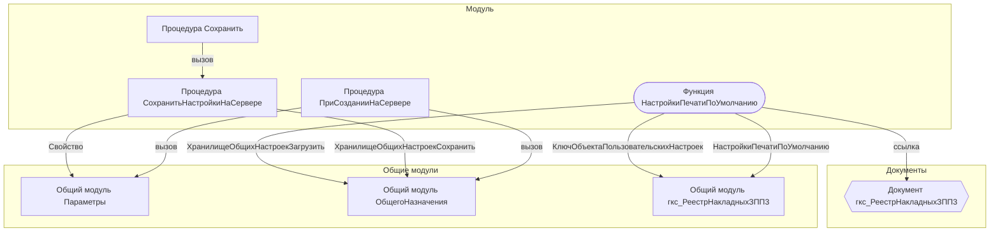

# Граф зависимостей: гкс_НастройкаПечати_ПФЗПП3

## Диаграмма

## Статистика

- **Процедур/функций:** 4
- **Экспортируемых:** 0
- **Внешних зависимостей:** 4
- **Внутренних вызовов:** 4

## Детали зависимостей

| Тип | Имя | Использований | Тип использования | Методы |
|-----|-----|---------------|-------------------|--------|
| module | Параметры | 3 | call | Свойство |
| module | гкс_РеестрНакладныхЗПП3 | 2 | call | КлючОбъектаПользовательскихНастроек, НастройкиПечатиПоУмолчанию |
| module | ОбщегоНазначения | 2 | call | ХранилищеОбщихНастроекЗагрузить, ХранилищеОбщихНастроекСохранить |
| document | гкс_РеестрНакладныхЗПП3 | 2 | reference | - |

---
*Сгенерировано автоматически: 2026-03-09T01:59:46.216Z*
