# Граф зависимостей: Ext

## Диаграмма

```mermaid
graph TD
    subgraph module["Модуль"]
        Модуль_Ext["Модуль Ext"]
        Функция_ПолучитьСсылкуПоИдентификаторуОтправки_Экспорт(["Функция ПолучитьСсылкуПоИдентификаторуОтправки Экспорт"])
        Функция_ИнициализацияПравилКонвертацийСвойств_Экспорт(["Функция ИнициализацияПравилКонвертацийСвойств Экспорт"])
        Процедура_ВыполнитьПроцедуруОбработчикаЗаполнения_Экспорт["Процедура ВыполнитьПроцедуруОбработчикаЗаполнения Экспорт"]
        Процедура_ЗарегистрироватьУчетныеМеханизмы_Экспорт["Процедура ЗарегистрироватьУчетныеМеханизмы Экспорт"]
        Функция_ДанныеДокументаДляПроведения_Экспорт(["Функция ДанныеДокументаДляПроведения Экспорт"])
        Процедура_ПриЗаполненииОграниченияДоступа_Экспорт["Процедура ПриЗаполненииОграниченияДоступа Экспорт"]
        Процедура_ЗаполнитьПараметрыИнициализации["Процедура ЗаполнитьПараметрыИнициализации"]
        Процедура_ПКС_ТипОперацииСВагоном["Процедура ПКС_ТипОперацииСВагоном"]
        Процедура_ПКС_ДатаДокумента["Процедура ПКС_ДатаДокумента"]
        Процедура_ПКС_Весы["Процедура ПКС_Весы"]
        Процедура_ПКС_ТочкаМаршрута["Процедура ПКС_ТочкаМаршрута"]
        Процедура_СформироватьДокументПЛКПриНеобходимости_Экспорт["Процедура СформироватьДокументПЛКПриНеобходимости Экспорт"]
        Процедура_ПриКопировании["Процедура ПриКопировании"]
        Процедура_ПередЗаписью["Процедура ПередЗаписью"]
        Процедура_ПриЗаписи["Процедура ПриЗаписи"]
        Процедура_ОбработкаПроведения["Процедура ОбработкаПроведения"]
        Процедура_ОбработкаУдаленияПроведения["Процедура ОбработкаУдаленияПроведения"]
        Процедура_ОтразитьСтатусыОформленияВагонов["Процедура ОтразитьСтатусыОформленияВагонов"]
        Функция_ЭтоЗавершеннаяПеревескаОтгрузки(["Функция ЭтоЗавершеннаяПеревескаОтгрузки"])
        Функция_ОформленыДокументыПЛК(["Функция ОформленыДокументыПЛК"])
        Функция_СтатусыВагонаКОтражению(["Функция СтатусыВагонаКОтражению"])
        Функция_ВесТарыЗаполнен(["Функция ВесТарыЗаполнен"])
        Функция_ВесБруттоЗаполнен(["Функция ВесБруттоЗаполнен"])
        Функция_ОформленыДокументыПЛКСУчетомВременныхОграничений(["Функция ОформленыДокументыПЛКСУчетомВременныхОграничений"])
        Функция_РеестрЗПП3Оформлен(["Функция РеестрЗПП3Оформлен"])
        Функция_СтатусУбылПрисвоен(["Функция СтатусУбылПрисвоен"])
        Функция_СтатусПроведенияОформлен(["Функция СтатусПроведенияОформлен"])
        Функция_ПолучитьТекстОшибкиБлокировки(["Функция ПолучитьТекстОшибкиБлокировки"])
        Функция_ПолучитьДатуОперации(["Функция ПолучитьДатуОперации"])
        Процедура_ДобавитьСообщениеОбОшибкеВДополнительныеСвойства["Процедура ДобавитьСообщениеОбОшибкеВДополнительныеСвойства"]
    end
    subgraph module["Общие модули"]
        Модуль_Запрос["Модуль Запрос"]
        Модуль_РезультатЗапроса["Модуль РезультатЗапроса"]
        Модуль_Выборка["Модуль Выборка"]
        Модуль_гкс_ИнтеграцияСРПВ["Модуль гкс_ИнтеграцияСРПВ"]
        Модуль_ПолученныеДанные["Модуль ПолученныеДанные"]
        Модуль_ДанныеЗаполнения["Модуль ДанныеЗаполнения"]
        Модуль_МеханизмыДокумента["Модуль МеханизмыДокумента"]
        Модуль_гкс_ПроведениеДокументов["Модуль гкс_ПроведениеДокументов"]
        Модуль_Результат["Модуль Результат"]
        Модуль_Реквизиты["Модуль Реквизиты"]
        Модуль_гкс_ТочкиМаршрута["Модуль гкс_ТочкиМаршрута"]
        Модуль_ЗначенияЗаполнения["Модуль ЗначенияЗаполнения"]
        Модуль_гкс_СоответствияОбъектовСРПВ["Модуль гкс_СоответствияОбъектовСРПВ"]
        Модуль_гкс_УчетВагоновСРПВ["Модуль гкс_УчетВагоновСРПВ"]
        Модуль_ДанныеОформленияРегистрации["Модуль ДанныеОформленияРегистрации"]
        Модуль_ОбщегоНазначения["Модуль ОбщегоНазначения"]
        Модуль_гкс_Взвешивание["Модуль гкс_Взвешивание"]
        Модуль_гкс_АвтоматическоеВзвешивание["Модуль гкс_АвтоматическоеВзвешивание"]
        Модуль_гкс_ОснованиеДляДвиженияЗапасов["Модуль гкс_ОснованиеДляДвиженияЗапасов"]
        Модуль_гкс_ПриемкаТранспорта["Модуль гкс_ПриемкаТранспорта"]
        Модуль_гкс_КлючиАналитикиСРПВ["Модуль гкс_КлючиАналитикиСРПВ"]
        Модуль_ДополнительныеСвойства["Модуль ДополнительныеСвойства"]
        Модуль_МенеджерРегистра["Модуль МенеджерРегистра"]
        Модуль_Статусы["Модуль Статусы"]
        Модуль_СообщенияОбОшибках["Модуль СообщенияОбОшибках"]
    end
    subgraph catalog["Справочники"]
        Справочник_гкс_ТочкиМаршрута[(Справочник гкс_ТочкиМаршрута)]
        Справочник_гкс_КлючиАналитикиСРПВ[(Справочник гкс_КлючиАналитикиСРПВ)]
    end
    subgraph enum["Перечисления"]
        Перечисление_гкс_СРПВТипыОперацийСВагоном(["Перечисление гкс_СРПВТипыОперацийСВагоном"])
        Перечисление_гкс_СРПВСтатусыВагонов(["Перечисление гкс_СРПВСтатусыВагонов"])
        Перечисление_гкс_ТипыВзвешивания(["Перечисление гкс_ТипыВзвешивания"])
        Перечисление_гкс_СостоянияРегистрации(["Перечисление гкс_СостоянияРегистрации"])
    end
    subgraph register["Регистры"]
        Регистр_гкс_СоответствияОбъектовСРПВ[(Регистр гкс_СоответствияОбъектовСРПВ)]
        Регистр_гкс_СРПВСтатусыОформленияВагонов[(Регистр гкс_СРПВСтатусыОформленияВагонов)]
    end
    subgraph document["Документы"]
        Документ_гкс_Взвешивание{{Документ гкс_Взвешивание}}
        Документ_гкс_ОснованиеДляДвиженияЗапасов{{Документ гкс_ОснованиеДляДвиженияЗапасов}}
    end
    Модуль_Ext -->|УстановитьПараметр, Выполнить| Модуль_Запрос
    Модуль_Ext -->|Пустой, Выбрать| Модуль_РезультатЗапроса
    Модуль_Ext -->|Следующий| Модуль_Выборка
    Модуль_Ext -->|ИнициализацияПравилКонвертацийСвойств, ДобавитьПКС| Модуль_гкс_ИнтеграцияСРПВ
    Модуль_Ext -->|Свойство| Модуль_ПолученныеДанные
    Модуль_Ext -->|Вставить| Модуль_ДанныеЗаполнения
    Модуль_Ext -->|Добавить| Модуль_МеханизмыДокумента
    Модуль_Ext -->|ДопПараметрыИнициализироватьДанныеДокументаДляПроведения, ИнициализироватьДанныеДокументаДляПроведения, ПередЗаписьюДокумента...| Модуль_гкс_ПроведениеДокументов
    Модуль_Ext -->|Выбрать| Модуль_Результат
    Модуль_Ext -->|Следующий| Модуль_Реквизиты
    Модуль_Ext -->|ПолучитьМестнуюДатуПоТочкеМаршрута| Модуль_гкс_ТочкиМаршрута
    Модуль_Ext -->|Вставить, Получить| Модуль_ЗначенияЗаполнения
    Модуль_Ext -->|ВесыПоИдентификаторуСРПВ, ТочкаМаршрутаПоИдентификаторуСРПВ| Модуль_гкс_СоответствияОбъектовСРПВ
    Модуль_Ext -->|НаСтатусОформленДокументОперации, ДанныеОформленногоДокументаОперацииПоСтатусу, ДанныеЗаполненияОснованияДляДвиженияЗапасов...| Модуль_гкс_УчетВагоновСРПВ
    Модуль_Ext -->|Свойство| Модуль_ДанныеОформленияРегистрации
    Модуль_Ext -->|ЗначенияРеквизитовОбъекта, СообщитьПользователю, ЗначениеРеквизитаОбъекта| Модуль_ОбщегоНазначения
    Модуль_Ext -->|ПоРегистрацииИТипуВзвешивания| Модуль_гкс_Взвешивание
    Модуль_Ext -->|ЗаполнитьДокументВзвешивание| Модуль_гкс_АвтоматическоеВзвешивание
    Модуль_Ext -->|СформироватьДокументПоНеобходимости| Модуль_гкс_ОснованиеДляДвиженияЗапасов
    Модуль_Ext -->|ЗарегистрироватьНовоеСостояние, ТекущиеПроизводственныеСуткиПрошли, СтатусУбылПрисвоенДляДокумента| Модуль_гкс_ПриемкаТранспорта
    Модуль_Ext -->|ПустаяСсылка| Модуль_гкс_КлючиАналитикиСРПВ
    Модуль_Ext -->|Вставить, Свойство| Модуль_ДополнительныеСвойства
    Модуль_Ext -->|ЗначенияПоУмолчанию, ВыполнитьЗаписьВРегистр| Модуль_МенеджерРегистра
    Модуль_Ext -->|Добавить| Модуль_Статусы
    Модуль_Ext -->|Добавить| Модуль_СообщенияОбОшибках
    Модуль_Ext -->|ссылка| Справочник_гкс_ТочкиМаршрута
    Модуль_Ext -->|ссылка| Справочник_гкс_КлючиАналитикиСРПВ
    Модуль_Ext -->|ссылка| Перечисление_гкс_СРПВТипыОперацийСВагоном
    Модуль_Ext -->|ссылка| Перечисление_гкс_СРПВСтатусыВагонов
    Модуль_Ext -->|ссылка| Перечисление_гкс_ТипыВзвешивания
    Модуль_Ext -->|ссылка| Перечисление_гкс_СостоянияРегистрации
    Модуль_Ext -->|ссылка| Регистр_гкс_СоответствияОбъектовСРПВ
    Модуль_Ext -->|ссылка| Регистр_гкс_СРПВСтатусыОформленияВагонов
    Модуль_Ext -->|ссылка| Документ_гкс_Взвешивание
    Модуль_Ext -->|ссылка| Документ_гкс_ОснованиеДляДвиженияЗапасов
```

## Статистика

- **Процедур/функций:** 30
- **Экспортируемых:** 7
- **Внешних зависимостей:** 35
- **Внутренних вызовов:** 30

## Детали зависимостей

| Тип | Имя | Использований | Тип использования | Методы |
|-----|-----|---------------|-------------------|--------|
| module | Запрос | 6 | call | УстановитьПараметр, Выполнить |
| module | РезультатЗапроса | 2 | call | Пустой, Выбрать |
| module | Выборка | 1 | call | Следующий |
| module | гкс_ИнтеграцияСРПВ | 14 | call | ИнициализацияПравилКонвертацийСвойств, ДобавитьПКС |
| module | ПолученныеДанные | 1 | call | Свойство |
| module | ДанныеЗаполнения | 9 | call | Вставить |
| module | МеханизмыДокумента | 1 | call | Добавить |
| module | гкс_ПроведениеДокументов | 6 | call | ДопПараметрыИнициализироватьДанныеДокументаДляПроведения, ИнициализироватьДанныеДокументаДляПроведения, ПередЗаписьюДокумента, ПриЗаписиДокумента, ОбработкаПроведенияДокумента... |
| module | Результат | 1 | call | Выбрать |
| module | Реквизиты | 1 | call | Следующий |
| module | гкс_ТочкиМаршрута | 3 | call | ПолучитьМестнуюДатуПоТочкеМаршрута |
| module | ЗначенияЗаполнения | 3 | call | Вставить, Получить |
| module | гкс_СоответствияОбъектовСРПВ | 2 | call | ВесыПоИдентификаторуСРПВ, ТочкаМаршрутаПоИдентификаторуСРПВ |
| catalog | гкс_ТочкиМаршрута | 3 | reference | - |
| enum | гкс_СРПВТипыОперацийСВагоном | 16 | reference | - |
| register | гкс_СоответствияОбъектовСРПВ | 2 | reference | - |
| module | гкс_УчетВагоновСРПВ | 11 | call | НаСтатусОформленДокументОперации, ДанныеОформленногоДокументаОперацииПоСтатусу, ДанныеЗаполненияОснованияДляДвиженияЗапасов, АктуализироватьСвязанныеВзвешивания, РеестрЗПП3ОформленДляДокумента |
| module | ДанныеОформленияРегистрации | 2 | call | Свойство |
| module | ОбщегоНазначения | 3 | call | ЗначенияРеквизитовОбъекта, СообщитьПользователю, ЗначениеРеквизитаОбъекта |
| module | гкс_Взвешивание | 1 | call | ПоРегистрацииИТипуВзвешивания |
| module | гкс_АвтоматическоеВзвешивание | 1 | call | ЗаполнитьДокументВзвешивание |
| module | гкс_ОснованиеДляДвиженияЗапасов | 1 | call | СформироватьДокументПоНеобходимости |
| module | гкс_ПриемкаТранспорта | 4 | call | ЗарегистрироватьНовоеСостояние, ТекущиеПроизводственныеСуткиПрошли, СтатусУбылПрисвоенДляДокумента |
| module | гкс_КлючиАналитикиСРПВ | 1 | call | ПустаяСсылка |
| module | ДополнительныеСвойства | 3 | call | Вставить, Свойство |
| module | МенеджерРегистра | 2 | call | ЗначенияПоУмолчанию, ВыполнитьЗаписьВРегистр |
| module | Статусы | 2 | call | Добавить |
| module | СообщенияОбОшибках | 1 | call | Добавить |
| enum | гкс_СРПВСтатусыВагонов | 16 | reference | - |
| enum | гкс_ТипыВзвешивания | 3 | reference | - |
| document | гкс_Взвешивание | 1 | reference | - |
| document | гкс_ОснованиеДляДвиженияЗапасов | 1 | reference | - |
| enum | гкс_СостоянияРегистрации | 1 | reference | - |
| catalog | гкс_КлючиАналитикиСРПВ | 1 | reference | - |
| register | гкс_СРПВСтатусыОформленияВагонов | 1 | reference | - |

---
*Сгенерировано автоматически: 2026-03-09T02:01:15.213Z*
