# Граф зависимостей: Ext

## Диаграмма

```mermaid
graph TD
    subgraph Модуль
        Процедура_ПриСозданииНаСервере[Процедура ПриСозданииНаСервере]
        Процедура_ПриЧтенииНаСервере[Процедура ПриЧтенииНаСервере]
        Процедура_ПриОткрытии[Процедура ПриОткрытии]
        Процедура_ПослеЗаписи[Процедура ПослеЗаписи]
        Процедура_ПослеЗаписиНаСервере[Процедура ПослеЗаписиНаСервере]
        Процедура_Подключаемый_ВыполнитьКоманду[Процедура Подключаемый_ВыполнитьКоманду]
        Процедура_Подключаемый_ПродолжитьВыполнениеКомандыНаСервере[Процедура Подключаемый_ПродолжитьВыполнениеКомандыНаСервере]
        Процедура_ВыполнитьКомандуНаСервере[Процедура ВыполнитьКомандуНаСервере]
        Процедура_Подключаемый_ОбновитьКоманды[Процедура Подключаемый_ОбновитьКоманды]
    end

    subgraph Общие модули
        Модуль_ПодключаемыеКоманды["Общий модуль ПодключаемыеКоманды"]
        Модуль_ОбщегоНазначения["Общий модуль ОбщегоНазначения"]
        Модуль_МодульУправлениеДоступом["Общий модуль МодульУправлениеДоступом"]
        Модуль_ПодключаемыеКомандыКлиентСервер["Общий модуль ПодключаемыеКомандыКлиентСервер"]
        Модуль_ПодключаемыеКомандыКлиент["Общий модуль ПодключаемыеКомандыКлиент"]
        Модуль_ОбщегоНазначенияКлиент["Общий модуль ОбщегоНазначенияКлиент"]
        Модуль_МодульПодключаемыеКомандыКлиент["Общий модуль МодульПодключаемыеКомандыКлиент"]
        Модуль_УправлениеДоступом["Общий модуль УправлениеДоступом"]
    end

    Процедура_ПриСозданииНаСервере -->|ПриСозданииНаСервере, ВыполнитьКоманду| Модуль_ПодключаемыеКоманды
    Процедура_ПриЧтенииНаСервере -->|ПриЧтенииНаСервере| Модуль_МодульУправлениеДоступом
    Процедура_ПослеЗаписи -->|ПослеЗаписи| Модуль_МодульПодключаемыеКомандыКлиент
    Процедура_ПослеЗаписиНаСервере -->|ПослеЗаписиНаСервере| Модуль_УправлениеДоступом
    Процедура_Подключаемый_ВыполнитьКоманду -->|ВыполнитьКоманду| Модуль_ПодключаемыеКоманды
    Процедура_Подключаемый_ПродолжитьВыполнениеКомандыНаСервере -->|НачатьВыполнениеКоманды| Модуль_ПодключаемыеКомандыКлиент
    Процедура_ВыполнитьКомандуНаСервере -->|НачатьОбновлениеКоманд| Модуль_ПодключаемыеКомандыКлиент
    Процедура_Подключаемый_ОбновитьКоманды -->|ОбновитьКоманды| Модуль_ПодключаемыеКомандыКлиентСервер

    Процедура_ПриСозданииНаСервере -->|ПодсистемаСуществует, ОбщийМодуль| Модуль_ОбщегоНазначения
    Процедура_ПриЧтенииНаСервере -->|ПодсистемаСуществует, ОбщийМодуль| Модуль_ОбщегоНазначения
    Процедура_ПриОткрытии -->|ПодсистемаСуществует, ОбщийМодуль| Модуль_ОбщегоНазначения
    Процедура_ПослеЗаписи -->|ПодсистемаСуществует, ОбщийМодуль| Модуль_ОбщегоНазначения
    Процедура_ПослеЗаписиНаСервере -->|ПодсистемаСуществует, ОбщийМодуль| Модуль_ОбщегоНазначения
    Процедура_Подключаемый_ВыполнитьКоманду -->|ПодсистемаСуществует, ОбщийМодуль| Модуль_ОбщегоНазначения
    Процедура_Подключаемый_ПродолжитьВыполнениеКомандыНаСервере -->|ПодсистемаСуществует, ОбщийМодуль| Модуль_ОбщегоНазначения
    Процедура_ВыполнитьКомандуНаСервере -->|ПодсистемаСуществует, ОбщийМодуль| Модуль_ОбщегоНазначения
    Процедура_Подключаемый_ОбновитьКоманды -->|ПодсистемаСуществует, ОбщийМодуль| Модуль_ОбщегоНазначения

    Процедура_ПриСозданииНаСервере -->|ПодсистемаСуществует, ОбщийМодуль| Модуль_ОбщегоНазначенияКлиент
    Процедура_ПриЧтенииНаСервере -->|ПодсистемаСуществует, ОбщийМодуль| Модуль_ОбщегоНазначенияКлиент
    Процедура_ПриОткрытии -->|ПодсистемаСуществует, ОбщийМодуль| Модуль_ОбщегоНазначенияКлиент
    Процедура_ПослеЗаписи -->|ПодсистемаСуществует, ОбщийМодуль| Модуль_ОбщегоНазначенияКлиент
    Процедура_ПослеЗаписиНаСервере -->|ПодсистемаСуществует, ОбщийМодуль| Модуль_ОбщегоНазначенияКлиент
    Процедура_Подключаемый_ВыполнитьКоманду -->|ПодсистемаСуществует, ОбщийМодуль| Модуль_ОбщегоНазначенияКлиент
    Процедура_Подключаемый_ПродолжитьВыполнениеКомандыНаСервере -->|ПодсистемаСуществует, ОбщийМодуль| Модуль_ОбщегоНазначенияКлиент
    Процедура_ВыполнитьКомандуНаСервере -->|ПодсистемаСуществует, ОбщийМодуль| Модуль_ОбщегоНазначенияКлиент
    Процедура_Подключаемый_ОбновитьКоманды -->|ПодсистемаСуществует, ОбщийМодуль| Модуль_ОбщегоНазначенияКлиент
```

## Статистика

- **Процедур/функций:** 9
- **Экспортируемых:** 1
- **Внешних зависимостей:** 8
- **Внутренних вызовов:** 9

## Детали зависимостей

| Тип | Имя | Использований | Тип использования | Методы |
|-----|-----|---------------|-------------------|--------|
| module | ПодключаемыеКоманды | 2 | call | ПриСозданииНаСервере, ВыполнитьКоманду |
| module | ОбщегоНазначения | 2 | call | ПодсистемаСуществует, ОбщийМодуль |
| module | МодульУправлениеДоступом | 1 | call | ПриЧтенииНаСервере |
| module | ПодключаемыеКомандыКлиентСервер | 2 | call | ОбновитьКоманды |
| module | ПодключаемыеКомандыКлиент | 2 | call | НачатьОбновлениеКоманд, НачатьВыполнениеКоманды |
| module | ОбщегоНазначенияКлиент | 2 | call | ПодсистемаСуществует, ОбщийМодуль |
| module | МодульПодключаемыеКомандыКлиент | 1 | call | ПослеЗаписи |
| module | УправлениеДоступом | 1 | call | ПослеЗаписиНаСервере |

---
*Сгенерировано автоматически: 2026-03-09T01:57:45.593Z*
