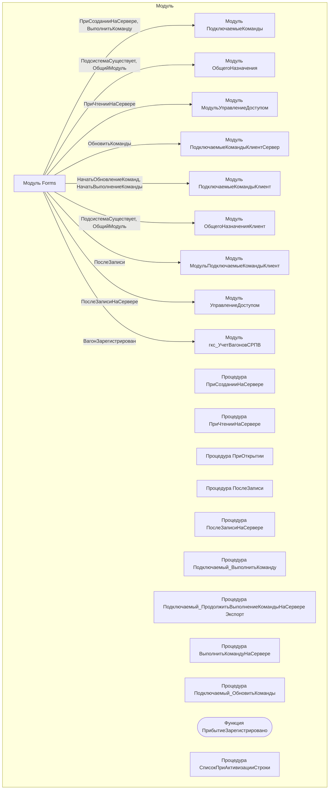

# Граф зависимостей: Forms

## Диаграмма

## Статистика

- **Процедур/функций:** 16
- **Экспортируемых:** 2
- **Внешних зависимостей:** 9
- **Внутренних вызовов:** 11

## Детали зависимостей

| Тип | Имя | Использований | Тип использования | Методы |
|-----|-----|---------------|-------------------|--------|
| module | ПодключаемыеКоманды | 4 | call | ПриСозданииНаСервере, ВыполнитьКоманду |
| module | ОбщегоНазначения | 2 | call | ПодсистемаСуществует, ОбщийМодуль |
| module | МодульУправлениеДоступом | 1 | call | ПриЧтенииНаСервере |
| module | ПодключаемыеКомандыКлиентСервер | 3 | call | ОбновитьКоманды |
| module | ПодключаемыеКомандыКлиент | 4 | call | НачатьОбновлениеКоманд, НачатьВыполнениеКоманды |
| module | ОбщегоНазначенияКлиент | 2 | call | ПодсистемаСуществует, ОбщийМодуль |
| module | МодульПодключаемыеКомандыКлиент | 1 | call | ПослеЗаписи |
| module | УправлениеДоступом | 1 | call | ПослеЗаписиНаСервере |
| module | гкс_УчетВагоновСРПВ | 1 | call | ВагонЗарегистрирован |

---
*Сгенерировано автоматически: 2026-03-09T02:01:17.402Z*
