# Граф зависимостей: гкс_СРПВПрибытиеНаПуть

## Диаграмма

```mermaid
graph TD
    subgraph module["Модуль"]
        Модуль_гкс_СРПВПрибытиеНаПуть["Модуль гкс_СРПВПрибытиеНаПуть"]
        Функция_ПолучитьСсылкуПоИдентификаторуОтправки_Экспорт(["Функция ПолучитьСсылкуПоИдентификаторуОтправки Экспорт"])
        Функция_ИнициализацияПравилКонвертацийСвойств_Экспорт(["Функция ИнициализацияПравилКонвертацийСвойств Экспорт"])
        Процедура_ВыполнитьПроцедуруОбработчикаЗаполнения_Экспорт["Процедура ВыполнитьПроцедуруОбработчикаЗаполнения Экспорт"]
        Процедура_ЗарегистрироватьУчетныеМеханизмы_Экспорт["Процедура ЗарегистрироватьУчетныеМеханизмы Экспорт"]
        Функция_ДанныеДокументаДляПроведения_Экспорт(["Функция ДанныеДокументаДляПроведения Экспорт"])
        Процедура_ПриЗаполненииОграниченияДоступа_Экспорт["Процедура ПриЗаполненииОграниченияДоступа Экспорт"]
        Процедура_ЗаполнитьПараметрыИнициализации["Процедура ЗаполнитьПараметрыИнициализации"]
        Процедура_ТекстЗапросаТаблицаСРПВСтатусыОформленияВагонов["Процедура ТекстЗапросаТаблицаСРПВСтатусыОформленияВагонов"]
        Процедура_ТекстЗапросаТаблицаТранспортныеДокументыЖДПолученные["Процедура ТекстЗапросаТаблицаТранспортныеДокументыЖДПолученные"]
        Процедура_ПКС_ТочкаМаршрута["Процедура ПКС_ТочкаМаршрута"]
        Процедура_СформироватьДокументПЛКПриНеобходимости_Экспорт["Процедура СформироватьДокументПЛКПриНеобходимости Экспорт"]
        Процедура_ПриКопировании["Процедура ПриКопировании"]
        Процедура_ПередЗаписью["Процедура ПередЗаписью"]
        Процедура_ПриЗаписи["Процедура ПриЗаписи"]
        Процедура_ОбработкаПроведения["Процедура ОбработкаПроведения"]
        Процедура_ОбработкаУдаленияПроведения["Процедура ОбработкаУдаленияПроведения"]
        Процедура_ИнициализироватьДопПараметры["Процедура ИнициализироватьДопПараметры"]
        Процедура_ПриСозданииНаСервере["Процедура ПриСозданииНаСервере"]
        Процедура_ПриЧтенииНаСервере["Процедура ПриЧтенииНаСервере"]
        Процедура_ПриОткрытии["Процедура ПриОткрытии"]
        Процедура_ПослеЗаписи["Процедура ПослеЗаписи"]
        Процедура_ПослеЗаписиНаСервере["Процедура ПослеЗаписиНаСервере"]
        Процедура_Подключаемый_ВыполнитьКоманду["Процедура Подключаемый_ВыполнитьКоманду"]
        Процедура_Подключаемый_ПродолжитьВыполнениеКомандыНаСервере_Экспорт["Процедура Подключаемый_ПродолжитьВыполнениеКомандыНаСервере Экспорт"]
        Процедура_ВыполнитьКомандуНаСервере["Процедура ВыполнитьКомандуНаСервере"]
        Процедура_Подключаемый_ОбновитьКоманды["Процедура Подключаемый_ОбновитьКоманды"]
        Функция_ПрибытиеЗарегистрировано(["Функция ПрибытиеЗарегистрировано"])
        Процедура_ПриСозданииНаСервере["Процедура ПриСозданииНаСервере"]
        Процедура_СписокПриАктивизацииСтроки["Процедура СписокПриАктивизацииСтроки"]
        Процедура_Подключаемый_ВыполнитьКоманду["Процедура Подключаемый_ВыполнитьКоманду"]
        Процедура_Подключаемый_ПродолжитьВыполнениеКомандыНаСервере_Экспорт["Процедура Подключаемый_ПродолжитьВыполнениеКомандыНаСервере Экспорт"]
        Процедура_ВыполнитьКомандуНаСервере["Процедура ВыполнитьКомандуНаСервере"]
        Процедура_Подключаемый_ОбновитьКоманды["Процедура Подключаемый_ОбновитьКоманды"]
    end
    subgraph module["Общие модули"]
        Модуль_Запрос["Модуль Запрос"]
        Модуль_РезультатЗапроса["Модуль РезультатЗапроса"]
        Модуль_Выборка["Модуль Выборка"]
        Модуль_гкс_ИнтеграцияСРПВ["Модуль гкс_ИнтеграцияСРПВ"]
        Модуль_ПолученныеДанные["Модуль ПолученныеДанные"]
        Модуль_ДанныеЗаполнения["Модуль ДанныеЗаполнения"]
        Модуль_МеханизмыДокумента["Модуль МеханизмыДокумента"]
        Модуль_гкс_ПроведениеДокументов["Модуль гкс_ПроведениеДокументов"]
        Модуль_Результат["Модуль Результат"]
        Модуль_Реквизиты["Модуль Реквизиты"]
        Модуль_гкс_ТочкиМаршрута["Модуль гкс_ТочкиМаршрута"]
        Модуль_ТекстыЗапроса["Модуль ТекстыЗапроса"]
        Модуль_гкс_СРПВТранспортныеДокументыЖДПолученные["Модуль гкс_СРПВТранспортныеДокументыЖДПолученные"]
        Модуль_гкс_СоответствияОбъектовСРПВ["Модуль гкс_СоответствияОбъектовСРПВ"]
        Модуль_гкс_РегистрацияНаПЛК["Модуль гкс_РегистрацияНаПЛК"]
        Модуль_ПараметрыСвязи["Модуль ПараметрыСвязи"]
        Модуль_ОбщегоНазначения["Модуль ОбщегоНазначения"]
        Модуль_гкс_ПриемкаТранспортаВызовСервера["Модуль гкс_ПриемкаТранспортаВызовСервера"]
        Модуль_гкс_КлючиАналитикиСРПВ["Модуль гкс_КлючиАналитикиСРПВ"]
        Модуль_гкс_УчетВагоновСРПВ["Модуль гкс_УчетВагоновСРПВ"]
        Модуль_ПодключаемыеКоманды["Модуль ПодключаемыеКоманды"]
        Модуль_МодульУправлениеДоступом["Модуль МодульУправлениеДоступом"]
        Модуль_ПодключаемыеКомандыКлиентСервер["Модуль ПодключаемыеКомандыКлиентСервер"]
        Модуль_ПодключаемыеКомандыКлиент["Модуль ПодключаемыеКомандыКлиент"]
        Модуль_ОбщегоНазначенияКлиент["Модуль ОбщегоНазначенияКлиент"]
        Модуль_МодульПодключаемыеКомандыКлиент["Модуль МодульПодключаемыеКомандыКлиент"]
        Модуль_УправлениеДоступом["Модуль УправлениеДоступом"]
    end
    subgraph catalog["Справочники"]
        Справочник_гкс_ТочкиМаршрута[(Справочник гкс_ТочкиМаршрута)]
        Справочник_гкс_УсловияПроезда[(Справочник гкс_УсловияПроезда)]
        Справочник_гкс_КлючиАналитикиСРПВ[(Справочник гкс_КлючиАналитикиСРПВ)]
    end
    subgraph register["Регистры"]
        Регистр_гкс_СРПВТранспортныеДокументыЖДПолученные[(Регистр гкс_СРПВТранспортныеДокументыЖДПолученные)]
        Регистр_гкс_СоответствияОбъектовСРПВ[(Регистр гкс_СоответствияОбъектовСРПВ)]
    end
    subgraph enum["Перечисления"]
        Перечисление_гкс_СРПВСтатусыВагонов(["Перечисление гкс_СРПВСтатусыВагонов"])
        Перечисление_гкс_ТипРегистрации(["Перечисление гкс_ТипРегистрации"])
        Перечисление_гкс_ТипыТранспортныхСредствДоставки(["Перечисление гкс_ТипыТранспортныхСредствДоставки"])
    end
    subgraph document["Документы"]
        Документ_гкс_РегистрацияНаПЛК{{Документ гкс_РегистрацияНаПЛК}}
    end
    Модуль_гкс_СРПВПрибытиеНаПуть -->|УстановитьПараметр, Выполнить| Модуль_Запрос
    Модуль_гкс_СРПВПрибытиеНаПуть -->|Пустой, Выбрать| Модуль_РезультатЗапроса
    Модуль_гкс_СРПВПрибытиеНаПуть -->|Следующий| Модуль_Выборка
    Модуль_гкс_СРПВПрибытиеНаПуть -->|ИнициализацияПравилКонвертацийСвойств, ДобавитьПКС| Модуль_гкс_ИнтеграцияСРПВ
    Модуль_гкс_СРПВПрибытиеНаПуть -->|Свойство| Модуль_ПолученныеДанные
    Модуль_гкс_СРПВПрибытиеНаПуть -->|Вставить| Модуль_ДанныеЗаполнения
    Модуль_гкс_СРПВПрибытиеНаПуть -->|Добавить| Модуль_МеханизмыДокумента
    Модуль_гкс_СРПВПрибытиеНаПуть -->|ДопПараметрыИнициализироватьДанныеДокументаДляПроведения, ИнициализироватьДанныеДокументаДляПроведения, ТребуетсяТаблицаДляДвижений...| Модуль_гкс_ПроведениеДокументов
    Модуль_гкс_СРПВПрибытиеНаПуть -->|Выбрать| Модуль_Результат
    Модуль_гкс_СРПВПрибытиеНаПуть -->|Следующий| Модуль_Реквизиты
    Модуль_гкс_СРПВПрибытиеНаПуть -->|ПолучитьМестнуюДатуПоТочкеМаршрута| Модуль_гкс_ТочкиМаршрута
    Модуль_гкс_СРПВПрибытиеНаПуть -->|Добавить| Модуль_ТекстыЗапроса
    Модуль_гкс_СРПВПрибытиеНаПуть -->|ТекстЗапросаДанныхДокументаДляПроведения, ДанныеЗаписиПоКлючуАналитики| Модуль_гкс_СРПВТранспортныеДокументыЖДПолученные
    Модуль_гкс_СРПВПрибытиеНаПуть -->|ТочкаМаршрутаПоИдентификаторуСРПВ| Модуль_гкс_СоответствияОбъектовСРПВ
    Модуль_гкс_СРПВПрибытиеНаПуть -->|СоздатьДокументНаОсновании| Модуль_гкс_РегистрацияНаПЛК
    Модуль_гкс_СРПВПрибытиеНаПуть -->|Вставить| Модуль_ПараметрыСвязи
    Модуль_гкс_СРПВПрибытиеНаПуть -->|ЗначениеРеквизитаОбъекта, ПодсистемаСуществует, ОбщийМодуль| Модуль_ОбщегоНазначения
    Модуль_гкс_СРПВПрибытиеНаПуть -->|УстановитьСвязьРегистрацииИТранспортногоДокумента| Модуль_гкс_ПриемкаТранспортаВызовСервера
    Модуль_гкс_СРПВПрибытиеНаПуть -->|ПустаяСсылка| Модуль_гкс_КлючиАналитикиСРПВ
    Модуль_гкс_СРПВПрибытиеНаПуть -->|ВагонЗарегистрирован| Модуль_гкс_УчетВагоновСРПВ
    Модуль_гкс_СРПВПрибытиеНаПуть -->|ПриСозданииНаСервере, ВыполнитьКоманду| Модуль_ПодключаемыеКоманды
    Модуль_гкс_СРПВПрибытиеНаПуть -->|ПриЧтенииНаСервере| Модуль_МодульУправлениеДоступом
    Модуль_гкс_СРПВПрибытиеНаПуть -->|ОбновитьКоманды| Модуль_ПодключаемыеКомандыКлиентСервер
    Модуль_гкс_СРПВПрибытиеНаПуть -->|НачатьОбновлениеКоманд, НачатьВыполнениеКоманды| Модуль_ПодключаемыеКомандыКлиент
    Модуль_гкс_СРПВПрибытиеНаПуть -->|ПодсистемаСуществует, ОбщийМодуль| Модуль_ОбщегоНазначенияКлиент
    Модуль_гкс_СРПВПрибытиеНаПуть -->|ПослеЗаписи| Модуль_МодульПодключаемыеКомандыКлиент
    Модуль_гкс_СРПВПрибытиеНаПуть -->|ПослеЗаписиНаСервере| Модуль_УправлениеДоступом
    Модуль_гкс_СРПВПрибытиеНаПуть -->|ссылка| Справочник_гкс_ТочкиМаршрута
    Модуль_гкс_СРПВПрибытиеНаПуть -->|ссылка| Справочник_гкс_УсловияПроезда
    Модуль_гкс_СРПВПрибытиеНаПуть -->|ссылка| Справочник_гкс_КлючиАналитикиСРПВ
    Модуль_гкс_СРПВПрибытиеНаПуть -->|ссылка| Регистр_гкс_СРПВТранспортныеДокументыЖДПолученные
    Модуль_гкс_СРПВПрибытиеНаПуть -->|ссылка| Регистр_гкс_СоответствияОбъектовСРПВ
    Модуль_гкс_СРПВПрибытиеНаПуть -->|ссылка| Перечисление_гкс_СРПВСтатусыВагонов
    Модуль_гкс_СРПВПрибытиеНаПуть -->|ссылка| Перечисление_гкс_ТипРегистрации
    Модуль_гкс_СРПВПрибытиеНаПуть -->|ссылка| Перечисление_гкс_ТипыТранспортныхСредствДоставки
    Модуль_гкс_СРПВПрибытиеНаПуть -->|ссылка| Документ_гкс_РегистрацияНаПЛК
```

## Статистика

- **Процедур/функций:** 33
- **Экспортируемых:** 9
- **Внешних зависимостей:** 36
- **Внутренних вызовов:** 28

## Детали зависимостей

| Тип | Имя | Использований | Тип использования | Методы |
|-----|-----|---------------|-------------------|--------|
| module | Запрос | 6 | call | УстановитьПараметр, Выполнить |
| module | РезультатЗапроса | 2 | call | Пустой, Выбрать |
| module | Выборка | 1 | call | Следующий |
| module | гкс_ИнтеграцияСРПВ | 6 | call | ИнициализацияПравилКонвертацийСвойств, ДобавитьПКС |
| module | ПолученныеДанные | 1 | call | Свойство |
| module | ДанныеЗаполнения | 10 | call | Вставить |
| module | МеханизмыДокумента | 1 | call | Добавить |
| module | гкс_ПроведениеДокументов | 9 | call | ДопПараметрыИнициализироватьДанныеДокументаДляПроведения, ИнициализироватьДанныеДокументаДляПроведения, ТребуетсяТаблицаДляДвижений, ПередЗаписьюДокумента, ПриЗаписиДокумента... |
| module | Результат | 1 | call | Выбрать |
| module | Реквизиты | 1 | call | Следующий |
| module | гкс_ТочкиМаршрута | 1 | call | ПолучитьМестнуюДатуПоТочкеМаршрута |
| module | ТекстыЗапроса | 2 | call | Добавить |
| module | гкс_СРПВТранспортныеДокументыЖДПолученные | 2 | call | ТекстЗапросаДанныхДокументаДляПроведения, ДанныеЗаписиПоКлючуАналитики |
| module | гкс_СоответствияОбъектовСРПВ | 1 | call | ТочкаМаршрутаПоИдентификаторуСРПВ |
| catalog | гкс_ТочкиМаршрута | 1 | reference | - |
| register | гкс_СРПВТранспортныеДокументыЖДПолученные | 2 | reference | - |
| register | гкс_СоответствияОбъектовСРПВ | 1 | reference | - |
| module | гкс_РегистрацияНаПЛК | 1 | call | СоздатьДокументНаОсновании |
| module | ПараметрыСвязи | 3 | call | Вставить |
| module | ОбщегоНазначения | 3 | call | ЗначениеРеквизитаОбъекта, ПодсистемаСуществует, ОбщийМодуль |
| module | гкс_ПриемкаТранспортаВызовСервера | 1 | call | УстановитьСвязьРегистрацииИТранспортногоДокумента |
| module | гкс_КлючиАналитикиСРПВ | 1 | call | ПустаяСсылка |
| module | гкс_УчетВагоновСРПВ | 4 | call | ВагонЗарегистрирован |
| enum | гкс_СРПВСтатусыВагонов | 2 | reference | - |
| enum | гкс_ТипРегистрации | 1 | reference | - |
| enum | гкс_ТипыТранспортныхСредствДоставки | 1 | reference | - |
| catalog | гкс_УсловияПроезда | 1 | reference | - |
| document | гкс_РегистрацияНаПЛК | 1 | reference | - |
| catalog | гкс_КлючиАналитикиСРПВ | 1 | reference | - |
| module | ПодключаемыеКоманды | 4 | call | ПриСозданииНаСервере, ВыполнитьКоманду |
| module | МодульУправлениеДоступом | 1 | call | ПриЧтенииНаСервере |
| module | ПодключаемыеКомандыКлиентСервер | 3 | call | ОбновитьКоманды |
| module | ПодключаемыеКомандыКлиент | 4 | call | НачатьОбновлениеКоманд, НачатьВыполнениеКоманды |
| module | ОбщегоНазначенияКлиент | 2 | call | ПодсистемаСуществует, ОбщийМодуль |
| module | МодульПодключаемыеКомандыКлиент | 1 | call | ПослеЗаписи |
| module | УправлениеДоступом | 1 | call | ПослеЗаписиНаСервере |

---
*Сгенерировано автоматически: 2026-03-09T02:01:29.242Z*
