# Граф зависимостей: гкс_СРПВРегистрацияОперацииСВагоном

## Диаграмма

```mermaid
graph TD
    subgraph module["Модуль"]
        Модуль_гкс_СРПВРегистрацияОперацииСВагоном["Модуль гкс_СРПВРегистрацияОперацииСВагоном"]
        Функция_ПолучитьСсылкуПоИдентификаторуОтправки_Экспорт(["Функция ПолучитьСсылкуПоИдентификаторуОтправки Экспорт"])
        Функция_ИнициализацияПравилКонвертацийСвойств_Экспорт(["Функция ИнициализацияПравилКонвертацийСвойств Экспорт"])
        Процедура_ВыполнитьПроцедуруОбработчикаЗаполнения_Экспорт["Процедура ВыполнитьПроцедуруОбработчикаЗаполнения Экспорт"]
        Процедура_ЗарегистрироватьУчетныеМеханизмы_Экспорт["Процедура ЗарегистрироватьУчетныеМеханизмы Экспорт"]
        Функция_ДанныеДокументаДляПроведения_Экспорт(["Функция ДанныеДокументаДляПроведения Экспорт"])
        Процедура_ПриЗаполненииОграниченияДоступа_Экспорт["Процедура ПриЗаполненииОграниченияДоступа Экспорт"]
        Процедура_ЗаполнитьПараметрыИнициализации["Процедура ЗаполнитьПараметрыИнициализации"]
        Процедура_ТекстЗапросаТаблицаСРПВСтатусыОформленияВагонов["Процедура ТекстЗапросаТаблицаСРПВСтатусыОформленияВагонов"]
        Процедура_ПКС_ТипОперацииСВагоном["Процедура ПКС_ТипОперацииСВагоном"]
        Процедура_ПКС_ТочкаМаршрута["Процедура ПКС_ТочкаМаршрута"]
        Процедура_ПКС_Путь["Процедура ПКС_Путь"]
        Процедура_СформироватьДокументПЛКПриНеобходимости_Экспорт["Процедура СформироватьДокументПЛКПриНеобходимости Экспорт"]
        Процедура_ПриКопировании["Процедура ПриКопировании"]
        Процедура_ПередЗаписью["Процедура ПередЗаписью"]
        Процедура_ПриЗаписи["Процедура ПриЗаписи"]
        Процедура_ОбработкаПроведения["Процедура ОбработкаПроведения"]
        Процедура_ОбработкаУдаленияПроведения["Процедура ОбработкаУдаленияПроведения"]
        Процедура_ИнициализироватьДопПараметры["Процедура ИнициализироватьДопПараметры"]
        Функция_ОперацияПоДокументуОтражена(["Функция ОперацияПоДокументуОтражена"])
        Процедура_ПроверитьЗаполнениеРеквизитовПоТипуОперации["Процедура ПроверитьЗаполнениеРеквизитовПоТипуОперации"]
        Процедура_СформироватьНаправлениеНаРазгрузкуПриНеобходимости["Процедура СформироватьНаправлениеНаРазгрузкуПриНеобходимости"]
        Процедура_ПриСозданииНаСервере["Процедура ПриСозданииНаСервере"]
        Процедура_ПриЧтенииНаСервере["Процедура ПриЧтенииНаСервере"]
        Процедура_ПриОткрытии["Процедура ПриОткрытии"]
        Процедура_ПослеЗаписи["Процедура ПослеЗаписи"]
        Процедура_ПослеЗаписиНаСервере["Процедура ПослеЗаписиНаСервере"]
        Процедура_Подключаемый_ВыполнитьКоманду["Процедура Подключаемый_ВыполнитьКоманду"]
        Процедура_Подключаемый_ПродолжитьВыполнениеКомандыНаСервере_Экспорт["Процедура Подключаемый_ПродолжитьВыполнениеКомандыНаСервере Экспорт"]
        Процедура_ВыполнитьКомандуНаСервере["Процедура ВыполнитьКомандуНаСервере"]
        Процедура_Подключаемый_ОбновитьКоманды["Процедура Подключаемый_ОбновитьКоманды"]
        Функция_ОперацияЗарегистрирована(["Функция ОперацияЗарегистрирована"])
        Процедура_ПриСозданииНаСервере["Процедура ПриСозданииНаСервере"]
        Процедура_СписокПриАктивизацииСтроки["Процедура СписокПриАктивизацииСтроки"]
        Процедура_Подключаемый_ВыполнитьКоманду["Процедура Подключаемый_ВыполнитьКоманду"]
        Процедура_Подключаемый_ПродолжитьВыполнениеКомандыНаСервере_Экспорт["Процедура Подключаемый_ПродолжитьВыполнениеКомандыНаСервере Экспорт"]
        Процедура_ВыполнитьКомандуНаСервере["Процедура ВыполнитьКомандуНаСервере"]
        Процедура_Подключаемый_ОбновитьКоманды["Процедура Подключаемый_ОбновитьКоманды"]
    end
    subgraph module["Общие модули"]
        Модуль_Запрос["Модуль Запрос"]
        Модуль_РезультатЗапроса["Модуль РезультатЗапроса"]
        Модуль_Выборка["Модуль Выборка"]
        Модуль_гкс_ИнтеграцияСРПВ["Модуль гкс_ИнтеграцияСРПВ"]
        Модуль_ПолученныеДанные["Модуль ПолученныеДанные"]
        Модуль_ДанныеЗаполнения["Модуль ДанныеЗаполнения"]
        Модуль_МеханизмыДокумента["Модуль МеханизмыДокумента"]
        Модуль_гкс_ПроведениеДокументов["Модуль гкс_ПроведениеДокументов"]
        Модуль_Результат["Модуль Результат"]
        Модуль_Реквизиты["Модуль Реквизиты"]
        Модуль_гкс_ТочкиМаршрута["Модуль гкс_ТочкиМаршрута"]
        Модуль_ТекстыЗапроса["Модуль ТекстыЗапроса"]
        Модуль_ЗначенияЗаполнения["Модуль ЗначенияЗаполнения"]
        Модуль_гкс_СоответствияОбъектовСРПВ["Модуль гкс_СоответствияОбъектовСРПВ"]
        Модуль_гкс_УчетВагоновСРПВ["Модуль гкс_УчетВагоновСРПВ"]
        Модуль_СостоянияРегистрации["Модуль СостоянияРегистрации"]
        Модуль_гкс_ПриемкаТранспорта["Модуль гкс_ПриемкаТранспорта"]
        Модуль_гкс_СРПВСтатусыОформленияВагонов["Модуль гкс_СРПВСтатусыОформленияВагонов"]
        Модуль_гкс_КлючиАналитикиСРПВ["Модуль гкс_КлючиАналитикиСРПВ"]
        Модуль_Путь["Модуль Путь"]
        Модуль_ОбщегоНазначения["Модуль ОбщегоНазначения"]
        Модуль_ЧастиСообщения["Модуль ЧастиСообщения"]
        Модуль_гкс_НаправлениеНаРазгрузку["Модуль гкс_НаправлениеНаРазгрузку"]
        Модуль_НастройкиРазгрузкиПоЯмеРазгрузки["Модуль НастройкиРазгрузкиПоЯмеРазгрузки"]
        Модуль_ПодключаемыеКоманды["Модуль ПодключаемыеКоманды"]
        Модуль_МодульУправлениеДоступом["Модуль МодульУправлениеДоступом"]
        Модуль_ПодключаемыеКомандыКлиентСервер["Модуль ПодключаемыеКомандыКлиентСервер"]
        Модуль_ПодключаемыеКомандыКлиент["Модуль ПодключаемыеКомандыКлиент"]
        Модуль_ОбщегоНазначенияКлиент["Модуль ОбщегоНазначенияКлиент"]
        Модуль_МодульПодключаемыеКомандыКлиент["Модуль МодульПодключаемыеКомандыКлиент"]
        Модуль_УправлениеДоступом["Модуль УправлениеДоступом"]
    end
    subgraph catalog["Справочники"]
        Справочник_гкс_ТочкиМаршрута[(Справочник гкс_ТочкиМаршрута)]
        Справочник_гкс_КлючиАналитикиСРПВ[(Справочник гкс_КлючиАналитикиСРПВ)]
    end
    subgraph enum["Перечисления"]
        Перечисление_гкс_СРПВТипыОперацийСВагоном(["Перечисление гкс_СРПВТипыОперацийСВагоном"])
        Перечисление_гкс_СРПВСтатусыВагонов(["Перечисление гкс_СРПВСтатусыВагонов"])
        Перечисление_гкс_ТипыТранспортныхСредствДоставки(["Перечисление гкс_ТипыТранспортныхСредствДоставки"])
        Перечисление_гкс_ТипРегистрации(["Перечисление гкс_ТипРегистрации"])
        Перечисление_гкс_СостоянияРегистрации(["Перечисление гкс_СостоянияРегистрации"])
    end
    subgraph register["Регистры"]
        Регистр_гкс_СоответствияОбъектовСРПВ[(Регистр гкс_СоответствияОбъектовСРПВ)]
        Регистр_гкс_СостоянияРегистрации[(Регистр гкс_СостоянияРегистрации)]
        Регистр_гкс_СРПВСтатусыОформленияВагонов[(Регистр гкс_СРПВСтатусыОформленияВагонов)]
    end
    subgraph document["Документы"]
        Документ_гкс_НаправлениеНаРазгрузку{{Документ гкс_НаправлениеНаРазгрузку}}
    end
    Модуль_гкс_СРПВРегистрацияОперацииСВагоном -->|УстановитьПараметр, Выполнить| Модуль_Запрос
    Модуль_гкс_СРПВРегистрацияОперацииСВагоном -->|Пустой, Выбрать| Модуль_РезультатЗапроса
    Модуль_гкс_СРПВРегистрацияОперацииСВагоном -->|Следующий| Модуль_Выборка
    Модуль_гкс_СРПВРегистрацияОперацииСВагоном -->|ИнициализацияПравилКонвертацийСвойств, ДобавитьПКС| Модуль_гкс_ИнтеграцияСРПВ
    Модуль_гкс_СРПВРегистрацияОперацииСВагоном -->|Свойство| Модуль_ПолученныеДанные
    Модуль_гкс_СРПВРегистрацияОперацииСВагоном -->|Вставить| Модуль_ДанныеЗаполнения
    Модуль_гкс_СРПВРегистрацияОперацииСВагоном -->|Добавить| Модуль_МеханизмыДокумента
    Модуль_гкс_СРПВРегистрацияОперацииСВагоном -->|ДопПараметрыИнициализироватьДанныеДокументаДляПроведения, ИнициализироватьДанныеДокументаДляПроведения, ТребуетсяТаблицаДляДвижений...| Модуль_гкс_ПроведениеДокументов
    Модуль_гкс_СРПВРегистрацияОперацииСВагоном -->|Выбрать| Модуль_Результат
    Модуль_гкс_СРПВРегистрацияОперацииСВагоном -->|Следующий| Модуль_Реквизиты
    Модуль_гкс_СРПВРегистрацияОперацииСВагоном -->|ПолучитьМестнуюДатуПоТочкеМаршрута| Модуль_гкс_ТочкиМаршрута
    Модуль_гкс_СРПВРегистрацияОперацииСВагоном -->|Добавить| Модуль_ТекстыЗапроса
    Модуль_гкс_СРПВРегистрацияОперацииСВагоном -->|Вставить, Получить| Модуль_ЗначенияЗаполнения
    Модуль_гкс_СРПВРегистрацияОперацииСВагоном -->|ТочкаМаршрутаПоИдентификаторуСРПВ, ПутьПоИдентификаторуСРПВ| Модуль_гкс_СоответствияОбъектовСРПВ
    Модуль_гкс_СРПВРегистрацияОперацииСВагоном -->|НаСтатусОформленДокументОперации, ДанныеОформленногоДокументаОперацииПоСтатусу, НаВагонОформленДокументОперации| Модуль_гкс_УчетВагоновСРПВ
    Модуль_гкс_СРПВРегистрацияОперацииСВагоном -->|ТекущееСостояниеРегистрации| Модуль_СостоянияРегистрации
    Модуль_гкс_СРПВРегистрацияОперацииСВагоном -->|ЗарегистрироватьНовоеСостояние, НастройкиРазгрузкиПоЯмеРазгрузки| Модуль_гкс_ПриемкаТранспорта
    Модуль_гкс_СРПВРегистрацияОперацииСВагоном -->|ОтразитьСвязьСДокументомСРПВ| Модуль_гкс_СРПВСтатусыОформленияВагонов
    Модуль_гкс_СРПВРегистрацияОперацииСВагоном -->|ПустаяСсылка| Модуль_гкс_КлючиАналитикиСРПВ
    Модуль_гкс_СРПВРегистрацияОперацииСВагоном -->|Пустая| Модуль_Путь
    Модуль_гкс_СРПВРегистрацияОперацииСВагоном -->|ЗначениеРеквизитаОбъекта, ЗначенияРеквизитовОбъекта, ПодсистемаСуществует...| Модуль_ОбщегоНазначения
    Модуль_гкс_СРПВРегистрацияОперацииСВагоном -->|Добавить| Модуль_ЧастиСообщения
    Модуль_гкс_СРПВРегистрацияОперацииСВагоном -->|ПолучитьПоРегистрации, СоздатьИзменитьИзАРМПриемки| Модуль_гкс_НаправлениеНаРазгрузку
    Модуль_гкс_СРПВРегистрацияОперацииСВагоном -->|Количество| Модуль_НастройкиРазгрузкиПоЯмеРазгрузки
    Модуль_гкс_СРПВРегистрацияОперацииСВагоном -->|ПриСозданииНаСервере, ВыполнитьКоманду| Модуль_ПодключаемыеКоманды
    Модуль_гкс_СРПВРегистрацияОперацииСВагоном -->|ПриЧтенииНаСервере| Модуль_МодульУправлениеДоступом
    Модуль_гкс_СРПВРегистрацияОперацииСВагоном -->|ОбновитьКоманды| Модуль_ПодключаемыеКомандыКлиентСервер
    Модуль_гкс_СРПВРегистрацияОперацииСВагоном -->|НачатьОбновлениеКоманд, НачатьВыполнениеКоманды| Модуль_ПодключаемыеКомандыКлиент
    Модуль_гкс_СРПВРегистрацияОперацииСВагоном -->|ПодсистемаСуществует, ОбщийМодуль| Модуль_ОбщегоНазначенияКлиент
    Модуль_гкс_СРПВРегистрацияОперацииСВагоном -->|ПослеЗаписи| Модуль_МодульПодключаемыеКомандыКлиент
    Модуль_гкс_СРПВРегистрацияОперацииСВагоном -->|ПослеЗаписиНаСервере| Модуль_УправлениеДоступом
    Модуль_гкс_СРПВРегистрацияОперацииСВагоном -->|ссылка| Справочник_гкс_ТочкиМаршрута
    Модуль_гкс_СРПВРегистрацияОперацииСВагоном -->|ссылка| Справочник_гкс_КлючиАналитикиСРПВ
    Модуль_гкс_СРПВРегистрацияОперацииСВагоном -->|ссылка| Перечисление_гкс_СРПВТипыОперацийСВагоном
    Модуль_гкс_СРПВРегистрацияОперацииСВагоном -->|ссылка| Перечисление_гкс_СРПВСтатусыВагонов
    Модуль_гкс_СРПВРегистрацияОперацииСВагоном -->|ссылка| Перечисление_гкс_ТипыТранспортныхСредствДоставки
    Модуль_гкс_СРПВРегистрацияОперацииСВагоном -->|ссылка| Перечисление_гкс_ТипРегистрации
    Модуль_гкс_СРПВРегистрацияОперацииСВагоном -->|ссылка| Перечисление_гкс_СостоянияРегистрации
    Модуль_гкс_СРПВРегистрацияОперацииСВагоном -->|ссылка| Регистр_гкс_СоответствияОбъектовСРПВ
    Модуль_гкс_СРПВРегистрацияОперацииСВагоном -->|ссылка| Регистр_гкс_СостоянияРегистрации
    Модуль_гкс_СРПВРегистрацияОперацииСВагоном -->|ссылка| Регистр_гкс_СРПВСтатусыОформленияВагонов
    Модуль_гкс_СРПВРегистрацияОперацииСВагоном -->|ссылка| Документ_гкс_НаправлениеНаРазгрузку
```

## Статистика

- **Процедур/функций:** 37
- **Экспортируемых:** 9
- **Внешних зависимостей:** 42
- **Внутренних вызовов:** 32

## Детали зависимостей

| Тип | Имя | Использований | Тип использования | Методы |
|-----|-----|---------------|-------------------|--------|
| module | Запрос | 6 | call | УстановитьПараметр, Выполнить |
| module | РезультатЗапроса | 2 | call | Пустой, Выбрать |
| module | Выборка | 1 | call | Следующий |
| module | гкс_ИнтеграцияСРПВ | 9 | call | ИнициализацияПравилКонвертацийСвойств, ДобавитьПКС |
| module | ПолученныеДанные | 1 | call | Свойство |
| module | ДанныеЗаполнения | 14 | call | Вставить |
| module | МеханизмыДокумента | 1 | call | Добавить |
| module | гкс_ПроведениеДокументов | 8 | call | ДопПараметрыИнициализироватьДанныеДокументаДляПроведения, ИнициализироватьДанныеДокументаДляПроведения, ТребуетсяТаблицаДляДвижений, ПередЗаписьюДокумента, ПриЗаписиДокумента... |
| module | Результат | 1 | call | Выбрать |
| module | Реквизиты | 1 | call | Следующий |
| module | гкс_ТочкиМаршрута | 2 | call | ПолучитьМестнуюДатуПоТочкеМаршрута |
| module | ТекстыЗапроса | 1 | call | Добавить |
| module | ЗначенияЗаполнения | 3 | call | Вставить, Получить |
| module | гкс_СоответствияОбъектовСРПВ | 2 | call | ТочкаМаршрутаПоИдентификаторуСРПВ, ПутьПоИдентификаторуСРПВ |
| catalog | гкс_ТочкиМаршрута | 2 | reference | - |
| enum | гкс_СРПВТипыОперацийСВагоном | 5 | reference | - |
| register | гкс_СоответствияОбъектовСРПВ | 2 | reference | - |
| module | гкс_УчетВагоновСРПВ | 6 | call | НаСтатусОформленДокументОперации, ДанныеОформленногоДокументаОперацииПоСтатусу, НаВагонОформленДокументОперации |
| module | СостоянияРегистрации | 1 | call | ТекущееСостояниеРегистрации |
| module | гкс_ПриемкаТранспорта | 2 | call | ЗарегистрироватьНовоеСостояние, НастройкиРазгрузкиПоЯмеРазгрузки |
| module | гкс_СРПВСтатусыОформленияВагонов | 1 | call | ОтразитьСвязьСДокументомСРПВ |
| module | гкс_КлючиАналитикиСРПВ | 1 | call | ПустаяСсылка |
| module | Путь | 1 | call | Пустая |
| module | ОбщегоНазначения | 6 | call | ЗначениеРеквизитаОбъекта, ЗначенияРеквизитовОбъекта, ПодсистемаСуществует, ОбщийМодуль |
| module | ЧастиСообщения | 2 | call | Добавить |
| module | гкс_НаправлениеНаРазгрузку | 2 | call | ПолучитьПоРегистрации, СоздатьИзменитьИзАРМПриемки |
| module | НастройкиРазгрузкиПоЯмеРазгрузки | 1 | call | Количество |
| enum | гкс_СРПВСтатусыВагонов | 5 | reference | - |
| register | гкс_СостоянияРегистрации | 1 | reference | - |
| enum | гкс_ТипыТранспортныхСредствДоставки | 1 | reference | - |
| enum | гкс_ТипРегистрации | 1 | reference | - |
| enum | гкс_СостоянияРегистрации | 3 | reference | - |
| register | гкс_СРПВСтатусыОформленияВагонов | 1 | reference | - |
| catalog | гкс_КлючиАналитикиСРПВ | 1 | reference | - |
| document | гкс_НаправлениеНаРазгрузку | 2 | reference | - |
| module | ПодключаемыеКоманды | 4 | call | ПриСозданииНаСервере, ВыполнитьКоманду |
| module | МодульУправлениеДоступом | 1 | call | ПриЧтенииНаСервере |
| module | ПодключаемыеКомандыКлиентСервер | 3 | call | ОбновитьКоманды |
| module | ПодключаемыеКомандыКлиент | 4 | call | НачатьОбновлениеКоманд, НачатьВыполнениеКоманды |
| module | ОбщегоНазначенияКлиент | 2 | call | ПодсистемаСуществует, ОбщийМодуль |
| module | МодульПодключаемыеКомандыКлиент | 1 | call | ПослеЗаписи |
| module | УправлениеДоступом | 1 | call | ПослеЗаписиНаСервере |

---
*Сгенерировано автоматически: 2026-03-09T02:01:31.456Z*
