# Граф зависимостей: Ext

## Диаграмма

```mermaid
graph TD
    subgraph module["Модуль"]
        Модуль_Ext["Модуль Ext"]
        Функция_ПолучитьСуммовыеПоказатели_Экспорт(["Функция ПолучитьСуммовыеПоказатели Экспорт"])
        Процедура_ПриЗаполненииОграниченияДоступа_Экспорт["Процедура ПриЗаполненииОграниченияДоступа Экспорт"]
        Процедура_ДобавитьКомандыОтчетов_Экспорт["Процедура ДобавитьКомандыОтчетов Экспорт"]
        Процедура_ОбработкаПолученияПолейПредставления["Процедура ОбработкаПолученияПолейПредставления"]
        Процедура_ОбработкаПроверкиЗаполнения["Процедура ОбработкаПроверкиЗаполнения"]
        Процедура_ОбработкаПроведения["Процедура ОбработкаПроведения"]
        Процедура_ПередЗаписью["Процедура ПередЗаписью"]
        Процедура_ПриКопировании["Процедура ПриКопировании"]
        Функция_УстановитьСтатус_Экспорт(["Функция УстановитьСтатус Экспорт"])
        Процедура_ПроверкаИдентификаторовСтроки["Процедура ПроверкаИдентификаторовСтроки"]
    end
    subgraph module["Общие модули"]
        Модуль_Запрос["Модуль Запрос"]
        Модуль_ВыборкаДетальныеЗаписи["Модуль ВыборкаДетальныеЗаписи"]
        Модуль_ВариантыОтчетовПереопределяемый["Модуль ВариантыОтчетовПереопределяемый"]
        Модуль_Поля["Модуль Поля"]
        Модуль_МассивНепроверяемыхРеквизитов["Модуль МассивНепроверяемыхРеквизитов"]
        Модуль_ОбщегоНазначения["Модуль ОбщегоНазначения"]
        Модуль_ОбновлениеИнформационнойБазы["Модуль ОбновлениеИнформационнойБазы"]
        Модуль_гкс_ПроведениеДокументов["Модуль гкс_ПроведениеДокументов"]
    end
    subgraph enum["Перечисления"]
        Перечисление_гкс_СтатусыСпецификацийКДоговорамКонтрагентов(["Перечисление гкс_СтатусыСпецификацийКДоговорамКонтрагентов"])
    end
    Модуль_Ext -->|УстановитьПараметр, Выполнить| Модуль_Запрос
    Модуль_Ext -->|Следующий| Модуль_ВыборкаДетальныеЗаписи
    Модуль_Ext -->|ДобавитьКомандуСтруктураПодчиненности| Модуль_ВариантыОтчетовПереопределяемый
    Модуль_Ext -->|Добавить| Модуль_Поля
    Модуль_Ext -->|Добавить| Модуль_МассивНепроверяемыхРеквизитов
    Модуль_Ext -->|УдалитьНепроверяемыеРеквизитыИзМассива| Модуль_ОбщегоНазначения
    Модуль_Ext -->|ПроверитьОбъектОбработан| Модуль_ОбновлениеИнформационнойБазы
    Модуль_Ext -->|ПередЗаписьюДокумента| Модуль_гкс_ПроведениеДокументов
    Модуль_Ext -->|ссылка| Перечисление_гкс_СтатусыСпецификацийКДоговорамКонтрагентов
```

## Статистика

- **Процедур/функций:** 10
- **Экспортируемых:** 4
- **Внешних зависимостей:** 9
- **Внутренних вызовов:** 10

## Детали зависимостей

| Тип | Имя | Использований | Тип использования | Методы |
|-----|-----|---------------|-------------------|--------|
| module | Запрос | 3 | call | УстановитьПараметр, Выполнить |
| module | ВыборкаДетальныеЗаписи | 1 | call | Следующий |
| module | ВариантыОтчетовПереопределяемый | 1 | call | ДобавитьКомандуСтруктураПодчиненности |
| module | Поля | 3 | call | Добавить |
| module | МассивНепроверяемыхРеквизитов | 1 | call | Добавить |
| module | ОбщегоНазначения | 1 | call | УдалитьНепроверяемыеРеквизитыИзМассива |
| module | ОбновлениеИнформационнойБазы | 1 | call | ПроверитьОбъектОбработан |
| module | гкс_ПроведениеДокументов | 1 | call | ПередЗаписьюДокумента |
| enum | гкс_СтатусыСпецификацийКДоговорамКонтрагентов | 5 | reference | - |

---
*Сгенерировано автоматически: 2026-03-09T02:01:15.224Z*
