# Граф зависимостей: Forms

## Диаграмма

```mermaid
graph TD
    subgraph module["Модуль"]
        Модуль_Forms["Модуль Forms"]
        Процедура_ПриСозданииНаСервере["Процедура ПриСозданииНаСервере"]
        Процедура_ПриЧтенииНаСервере["Процедура ПриЧтенииНаСервере"]
        Процедура_ПриОткрытии["Процедура ПриОткрытии"]
        Процедура_ПослеЗаписи["Процедура ПослеЗаписи"]
        Процедура_ПослеЗаписиНаСервере["Процедура ПослеЗаписиНаСервере"]
        Процедура_ТекущаяПозицияТовараПриИзменении["Процедура ТекущаяПозицияТовараПриИзменении"]
        Процедура_ГруппаСтраницыПриСменеСтраницы["Процедура ГруппаСтраницыПриСменеСтраницы"]
        Процедура_ТоварыПриАктивизацииСтроки["Процедура ТоварыПриАктивизацииСтроки"]
        Процедура_ТоварыПриНачалеРедактирования["Процедура ТоварыПриНачалеРедактирования"]
        Процедура_ТоварыНоменклатураПриИзменении["Процедура ТоварыНоменклатураПриИзменении"]
        Процедура_КачественныеПоказателиПриНачалеРедактирования["Процедура КачественныеПоказателиПриНачалеРедактирования"]
        Процедура_УправлениеВидимостьюДоступностью["Процедура УправлениеВидимостьюДоступностью"]
        Процедура_Подключаемый_ВыполнитьКоманду["Процедура Подключаемый_ВыполнитьКоманду"]
        Процедура_Подключаемый_ПродолжитьВыполнениеКомандыНаСервере_Экспорт["Процедура Подключаемый_ПродолжитьВыполнениеКомандыНаСервере Экспорт"]
        Процедура_ВыполнитьКомандуНаСервере["Процедура ВыполнитьКомандуНаСервере"]
        Процедура_Подключаемый_ОбновитьКоманды["Процедура Подключаемый_ОбновитьКоманды"]
        Процедура_ОчиститьСтрокиПоИдентификатору["Процедура ОчиститьСтрокиПоИдентификатору"]
        Процедура_ПриСозданииНаСервере["Процедура ПриСозданииНаСервере"]
        Процедура_ПриЗагрузкеДанныхИзНастроекНаСервере["Процедура ПриЗагрузкеДанныхИзНастроекНаСервере"]
        Процедура_ОтборОрганизацияПриИзменении["Процедура ОтборОрганизацияПриИзменении"]
        Процедура_ОтборСтатусПриИзменении["Процедура ОтборСтатусПриИзменении"]
        Процедура_ОтборКонтрагентПриИзменении["Процедура ОтборКонтрагентПриИзменении"]
        Процедура_СписокПриАктивизацииСтроки["Процедура СписокПриАктивизацииСтроки"]
        Процедура_Подключаемый_ВыполнитьКоманду["Процедура Подключаемый_ВыполнитьКоманду"]
        Процедура_Подключаемый_ПродолжитьВыполнениеКомандыНаСервере_Экспорт["Процедура Подключаемый_ПродолжитьВыполнениеКомандыНаСервере Экспорт"]
        Процедура_ВыполнитьКомандуНаСервере["Процедура ВыполнитьКомандуНаСервере"]
        Процедура_Подключаемый_ОбновитьКоманды["Процедура Подключаемый_ОбновитьКоманды"]
    end
    subgraph module["Общие модули"]
        Модуль_Параметры["Модуль Параметры"]
        Модуль_ОбновлениеИнформационнойБазы["Модуль ОбновлениеИнформационнойБазы"]
        Модуль_ПодключаемыеКоманды["Модуль ПодключаемыеКоманды"]
        Модуль_ОбщегоНазначения["Модуль ОбщегоНазначения"]
        Модуль_МодульУправлениеДоступом["Модуль МодульУправлениеДоступом"]
        Модуль_ДатыЗапретаИзменения["Модуль ДатыЗапретаИзменения"]
        Модуль_ПодключаемыеКомандыКлиентСервер["Модуль ПодключаемыеКомандыКлиентСервер"]
        Модуль_ПодключаемыеКомандыКлиент["Модуль ПодключаемыеКомандыКлиент"]
        Модуль_УправлениеДоступом["Модуль УправлениеДоступом"]
        Модуль_СписокВыбора["Модуль СписокВыбора"]
        Модуль_КачественныеПоказатели["Модуль КачественныеПоказатели"]
        Модуль_ОтборСтрок["Модуль ОтборСтрок"]
        Модуль_Пользователи["Модуль Пользователи"]
        Модуль_ОбщегоНазначенияКлиентСервер["Модуль ОбщегоНазначенияКлиентСервер"]
        Модуль_Отбор["Модуль Отбор"]
        Модуль_Настройки["Модуль Настройки"]
    end
    subgraph document["Документы"]
        Документ_гкс_НормативнаяСертификацияНоменклатуры{{Документ гкс_НормативнаяСертификацияНоменклатуры}}
    end
    Модуль_Forms -->|Свойство| Модуль_Параметры
    Модуль_Forms -->|ПроверитьОбъектОбработан| Модуль_ОбновлениеИнформационнойБазы
    Модуль_Forms -->|ПриСозданииНаСервере, ВыполнитьКоманду| Модуль_ПодключаемыеКоманды
    Модуль_Forms -->|ПодсистемаСуществует, ОбщийМодуль| Модуль_ОбщегоНазначения
    Модуль_Forms -->|ПриЧтенииНаСервере| Модуль_МодульУправлениеДоступом
    Модуль_Forms -->|ОбъектПриЧтенииНаСервере| Модуль_ДатыЗапретаИзменения
    Модуль_Forms -->|ОбновитьКоманды| Модуль_ПодключаемыеКомандыКлиентСервер
    Модуль_Forms -->|НачатьОбновлениеКоманд, ПослеЗаписи, НачатьВыполнениеКоманды| Модуль_ПодключаемыеКомандыКлиент
    Модуль_Forms -->|ПослеЗаписиНаСервере| Модуль_УправлениеДоступом
    Модуль_Forms -->|Очистить, Добавить, Количество| Модуль_СписокВыбора
    Модуль_Forms -->|НайтиСтроки| Модуль_КачественныеПоказатели
    Модуль_Forms -->|Свойство| Модуль_ОтборСтрок
    Модуль_Forms -->|ЭтоПолноправныйПользователь| Модуль_Пользователи
    Модуль_Forms -->|СообщитьПользователю, УстановитьЭлементОтбораДинамическогоСписка| Модуль_ОбщегоНазначенияКлиентСервер
    Модуль_Forms -->|Свойство| Модуль_Отбор
    Модуль_Forms -->|Получить| Модуль_Настройки
    Модуль_Forms -->|ссылка| Документ_гкс_НормативнаяСертификацияНоменклатуры
```

## Статистика

- **Процедур/функций:** 27
- **Экспортируемых:** 2
- **Внешних зависимостей:** 17
- **Внутренних вызовов:** 22

## Детали зависимостей

| Тип | Имя | Использований | Тип использования | Методы |
|-----|-----|---------------|-------------------|--------|
| module | Параметры | 5 | call | Свойство |
| module | ОбновлениеИнформационнойБазы | 1 | call | ПроверитьОбъектОбработан |
| module | ПодключаемыеКоманды | 4 | call | ПриСозданииНаСервере, ВыполнитьКоманду |
| module | ОбщегоНазначения | 2 | call | ПодсистемаСуществует, ОбщийМодуль |
| module | МодульУправлениеДоступом | 1 | call | ПриЧтенииНаСервере |
| module | ДатыЗапретаИзменения | 1 | call | ОбъектПриЧтенииНаСервере |
| module | ПодключаемыеКомандыКлиентСервер | 3 | call | ОбновитьКоманды |
| module | ПодключаемыеКомандыКлиент | 5 | call | НачатьОбновлениеКоманд, ПослеЗаписи, НачатьВыполнениеКоманды |
| module | УправлениеДоступом | 1 | call | ПослеЗаписиНаСервере |
| module | СписокВыбора | 4 | call | Очистить, Добавить, Количество |
| module | КачественныеПоказатели | 1 | call | НайтиСтроки |
| module | ОтборСтрок | 1 | call | Свойство |
| module | Пользователи | 1 | call | ЭтоПолноправныйПользователь |
| module | ОбщегоНазначенияКлиентСервер | 8 | call | СообщитьПользователю, УстановитьЭлементОтбораДинамическогоСписка |
| document | гкс_НормативнаяСертификацияНоменклатуры | 1 | reference | - |
| module | Отбор | 2 | call | Свойство |
| module | Настройки | 3 | call | Получить |

---
*Сгенерировано автоматически: 2026-03-09T02:01:15.214Z*
