# Граф зависимостей: ФормаДокумента

## Диаграмма

```mermaid
graph TD
    subgraph Модуль
        Процедура_ПриСозданииНаСервере["Процедура ПриСозданииНаСервере"]
        Процедура_ПриЧтенииНаСервере["Процедура ПриЧтенииНаСервере"]
        Процедура_ПриОткрытии["Процедура ПриОткрытии"]
        Процедура_ПослеЗаписи["Процедура ПослеЗаписи"]
        Процедура_ПослеЗаписиНаСервере["Процедура ПослеЗаписиНаСервере"]
        Процедура_ТекущаяПозицияТовараПриИзменении["Процедура ТекущаяПозицияТовараПриИзменении"]
        Процедура_ГруппаСтраницыПриСменеСтраницы["Процедура ГруппаСтраницыПриСменеСтраницы"]
        Процедура_ТоварыПриАктивизацииСтроки["Процедура ТоварыПриАктивизацииСтроки"]
        Процедура_ТоварыПриНачалеРедактирования["Процедура ТоварыПриНачалеРедактирования"]
        Процедура_ТоварыНоменклатураПриИзменении["Процедура ТоварыНоменклатураПриИзменении"]
        Процедура_КачественныеПоказателиПриНачалеРедактирования["Процедура КачественныеПоказателиПриНачалеРедактирования"]
        Процедура_УправлениеВидимостьюДоступностью["Процедура УправлениеВидимостьюДоступностью"]
        Процедура_Подключаемый_ВыполнитьКоманду["Процедура Подключаемый_ВыполнитьКоманду"]
        Процедура_Подключаемый_ПродолжитьВыполнениеКомандыНаСервере["Процедура Подключаемый_ПродолжитьВыполнениеКомандыНаСервере"]
        Процедура_ВыполнитьКомандуНаСервере["Процедура ВыполнитьКомандуНаСервере"]
        Процедура_Подключаемый_ОбновитьКоманды["Процедура Подключаемый_ОбновитьКоманды"]
        Процедура_ОчиститьСтрокиПоИдентификатору["Процедура ОчиститьСтрокиПоИдентификатору"]
    end

    subgraph Общие модули
        Модуль_Параметры["Модуль Параметры"]
        Модуль_ОбновлениеИнформационнойБазы["Модуль ОбновлениеИнформационнойБазы"]
        Модуль_ПодключаемыеКоманды["Модуль ПодключаемыеКоманды"]
        Модуль_ОбщегоНазначения["Модуль ОбщегоНазначения"]
        Модуль_МодульУправлениеДоступом["Модуль МодульУправлениеДоступом"]
        Модуль_ДатыЗапретаИзменения["Модуль ДатыЗапретаИзменения"]
        Модуль_ПодключаемыеКомандыКлиентСервер["Модуль ПодключаемыеКомандыКлиентСервер"]
        Модуль_ПодключаемыеКомандыКлиент["Модуль ПодключаемыеКомандыКлиент"]
        Модуль_УправлениеДоступом["Модуль УправлениеДоступом"]
        Модуль_СписокВыбора["Модуль СписокВыбора"]
        Модуль_КачественныеПоказатели["Модуль КачественныеПоказатели"]
        Модуль_ОтборСтрок["Модуль ОтборСтрок"]
        Модуль_Пользователи["Модуль Пользователи"]
        Модуль_ОбщегоНазначенияКлиентСервер["Модуль ОбщегоНазначенияКлиентСервер"]
    end

    subgraph Документы
        Документ_гкс_НормативнаяСертификацияНоменклатуры{{Документ гкс_НормативнаяСертификацияНоменклатуры}}
    end

    Процедура_ПриСозданииНаСервере -->|ПриСозданииНаСервере| Модуль_ПодключаемыеКоманды
    Процедура_ПриЧтенииНаСервере -->|ПриЧтенииНаСервере| Модуль_МодульУправлениеДоступом
    Процедура_ПриЧтенииНаСервере -->|ОбъектПриЧтенииНаСервере| Модуль_ДатыЗапретаИзменения
    Процедура_ПриОткрытии -->|НачатьОбновлениеКоманд| Модуль_ПодключаемыеКомандыКлиент
    Процедура_ПослеЗаписи -->|ПослеЗаписи| Модуль_ПодключаемыеКомандыКлиент
    Процедура_ПослеЗаписиНаСервере -->|ПослеЗаписиНаСервере| Модуль_УправлениеДоступом
    Процедура_ТекущаяПозицияТовараПриИзменении -->|Свойство| Модуль_Параметры
    Процедура_ТекущаяПозицияТовараПриИзменении -->|Свойство| Модуль_ОтборСтрок
    Процедура_ГруппаСтраницыПриСменеСтраницы -->|ПодсистемаСуществует| Модуль_ОбщегоНазначения
    Процедура_ТоварыПриАктивизацииСтроки -->|НачатьОбновлениеКоманд| Модуль_ПодключаемыеКомандыКлиент
    Процедура_ТоварыПриНачалеРедактирования -->|НачатьВыполнениеКоманды| Модуль_ПодключаемыеКомандыКлиент
    Процедура_ТоварыНоменклатураПриИзменении -->|НайтиСтроки| Модуль_КачественныеПоказатели
    Процедура_КачественныеПоказателиПриНачалеРедактирования -->|НайтиСтроки| Модуль_КачественныеПоказатели
    Процедура_УправлениеВидимостьюДоступностью -->|ОбщийМодуль| Модуль_ОбщегоНазначения
    Процедура_Подключаемый_ВыполнитьКоманду -->|ВыполнитьКоманду| Модуль_ПодключаемыеКоманды
    Процедура_Подключаемый_ПродолжитьВыполнениеКомандыНаСервере -->|ПродолжитьВыполнениеКомандыНаСервере| Модуль_ПодключаемыеКомандыКлиентСервер
    Процедура_ВыполнитьКомандуНаСервере -->|ВыполнитьКомандуНаСервере| Модуль_ПодключаемыеКомандыКлиентСервер
    Процедура_Подключаемый_ОбновитьКоманды -->|ОбновитьКоманды| Модуль_ПодключаемыеКомандыКлиентСервер
    Процедура_ОчиститьСтрокиПоИдентификатору -->|Очистить| Модуль_СписокВыбора
    Процедура_ОчиститьСтрокиПоИдентификатору -->|Добавить| Модуль_СписокВыбора
    Процедура_ОчиститьСтрокиПоИдентификатору -->|Количество| Модуль_СписокВыбора
    Модуль_ОбновлениеИнформационнойБазы -->|ПроверитьОбъектОбработан| Процедура_ПриСозданииНаСервере
    Модуль_ОбщегоНазначения -->|ПодсистемаСуществует| Процедура_ГруппаСтраницыПриСменеСтраницы
    Модуль_ОбщегоНазначения -->|ОбщийМодуль| Процедура_УправлениеВидимостьюДоступностью
    Модуль_ПодключаемыеКомандыКлиент -->|НачатьОбновлениеКоманд| Процедура_ПриОткрытии
    Модуль_ПодключаемыеКомандыКлиент -->|ПослеЗаписи| Процедура_ПослеЗаписи
    Модуль_ПодключаемыеКомандыКлиент -->|НачатьВыполнениеКоманды| Процедура_ТоварыПриАктивизацииСтроки
    Модуль_ПодключаемыеКомандыКлиентСервер -->|ОбновитьКоманды| Процедура_Подключаемый_ОбновитьКоманды
    Модуль_ПодключаемыеКомандыКлиентСервер -->|ПродолжитьВыполнениеКомандыНаСервере| Процедура_Подключаемый_ПродолжитьВыполнениеКомандыНаСервере
    Модуль_ПодключаемыеКомандыКлиентСервер -->|ВыполнитьКомандуНаСервере| Процедура_ВыполнитьКомандуНаСервере
    Модуль_СписокВыбора -->|Очистить| Процедура_ОчиститьСтрокиПоИдентификатору
    Модуль_СписокВыбора -->|Добавить| Процедура_ОчиститьСтрокиПоИдентификатору
    Модуль_СписокВыбора -->|Количество| Процедура_ОчиститьСтрокиПоИдентификатору
    Модуль_КачественныеПоказатели -->|НайтиСтроки| Процедура_ТоварыНоменклатураПриИзменении
    Модуль_КачественныеПоказатели -->|НайтиСтроки| Процедура_КачественныеПоказателиПриНачалеРедактирования
    Модуль_Пользователи -->|ЭтоПолноправныйПользователь| Процедура_УправлениеВидимостьюДоступностью
    Модуль_ОбщегоНазначенияКлиентСервер -->|СообщитьПользователю| Процедура_ПриОткрытии
    Документ_гкс_НормативнаяСертификацияНоменклатуры -->|ссылка| Процедура_ПриЧтенииНаСервере
```

## Статистика

- **Процедур/функций:** 17
- **Экспортируемых:** 1
- **Внешних зависимостей:** 15
- **Внутренних вызовов:** 17

## Детали зависимостей

| Тип | Имя | Использований | Тип использования | Методы |
|-----|-----|---------------|-------------------|--------|
| module | Параметры | 1 | call | Свойство |
| module | ОбновлениеИнформационнойБазы | 1 | call | ПроверитьОбъектОбработан |
| module | ПодключаемыеКоманды | 2 | call | ПриСозданииНаСервере, ВыполнитьКоманду |
| module | ОбщегоНазначения | 2 | call | ПодсистемаСуществует, ОбщийМодуль |
| module | МодульУправлениеДоступом | 1 | call | ПриЧтенииНаСервере |
| module | ДатыЗапретаИзменения | 1 | call | ОбъектПриЧтенииНаСервере |
| module | ПодключаемыеКомандыКлиентСервер | 2 | call | ОбновитьКоманды |
| module | ПодключаемыеКомандыКлиент | 3 | call | НачатьОбновлениеКоманд, ПослеЗаписи, НачатьВыполнениеКоманды |
| module | УправлениеДоступом | 1 | call | ПослеЗаписиНаСервере |
| module | СписокВыбора | 4 | call | Очистить, Добавить, Количество |
| module | КачественныеПоказатели | 1 | call | НайтиСтроки |
| module | ОтборСтрок | 1 | call | Свойство |
| module | Пользователи | 1 | call | ЭтоПолноправныйПользователь |
| module | ОбщегоНазначенияКлиентСервер | 1 | call | СообщитьПользователю |
| document | гкс_НормативнаяСертификацияНоменклатуры | 1 | reference | - |

---
*Сгенерировано автоматически: 2026-03-09T02:00:05.236Z*
