# Граф зависимостей: Ext

## Диаграмма

```mermaid
graph TD
    subgraph Модуль
        id_Ext_ПриСозданииНаСервере[Процедура ПриСозданииНаСервере]
        id_Ext_ПриЗагрузкеДанныхИзНастроекНаСервере[Процедура ПриЗагрузкеДанныхИзНастроекНаСервере]
        id_Ext_ОтборОрганизацияПриИзменении[Процедура ОтборОрганизацияПриИзменении]
        id_Ext_ОтборСтатусПриИзменении[Процедура ОтборСтатусПриИзменении]
        id_Ext_ОтборКонтрагентПриИзменении[Процедура ОтборКонтрагентПриИзменении]
        id_Ext_СписокПриАктивизацииСтроки[Процедура СписокПриАктивизацииСтроки]
        id_Ext_Подключаемый_ВыполнитьКоманду[Процедура Подключаемый_ВыполнитьКоманду]
        id_Ext_Подключаемый_ПродолжитьВыполнениеКомандыНаСервере[Процедура Подключаемый_ПродолжитьВыполнениеКомандыНаСервере]
        id_Ext_ВыполнитьКомандуНаСервере[Процедура ВыполнитьКомандуНаСервере]
        id_Ext_Подключаемый_ОбновитьКоманды[Процедура Подключаемый_ОбновитьКоманды]
    end

    subgraph Общие модули
        id_module_Параметры[Модуль Параметры]
        id_module_ОбщегоНазначенияКлиентСервер[Модуль ОбщегоНазначенияКлиентСервер]
        id_module_Отбор[Модуль Отбор]
        id_module_ПодключаемыеКоманды[Модуль ПодключаемыеКоманды]
        id_module_Настройки[Модуль Настройки]
        id_module_ПодключаемыеКомандыКлиент[Модуль ПодключаемыеКомандыКлиент]
        id_module_ПодключаемыеКомандыКлиентСервер[Модуль ПодключаемыеКомандыКлиентСервер]
    end

    id_Ext_ПриСозданииНаСервере -->|ПриСозданииНаСервере| id_module_ПодключаемыеКоманды
    id_Ext_ПриЗагрузкеДанныхИзНастроекНаСервере -->|Получить| id_module_Настройки
    id_Ext_ОтборОрганизацияПриИзменении -->|УстановитьЭлементОтбораДинамическогоСписка| id_module_ОбщегоНазначенияКлиентСервер
    id_Ext_ОтборСтатусПриИзменении -->|УстановитьЭлементОтбораДинамическогоСписка| id_module_ОбщегоНазначенияКлиентСервер
    id_Ext_ОтборКонтрагентПриИзменении -->|УстановитьЭлементОтбораДинамическогоСписка| id_module_ОбщегоНазначенияКлиентСервер
    id_Ext_СписокПриАктивизацииСтроки -->|УстановитьЭлементОтбораДинамическогоСписка| id_module_ОбщегоНазначенияКлиентСервер
    id_Ext_Подключаемый_ВыполнитьКоманду -->|ВыполнитьКоманду| id_module_ПодключаемыеКоманды
    id_Ext_Подключаемый_ВыполнитьКоманду -->|НачатьВыполнениеКоманды| id_module_ПодключаемыеКомандыКлиент
    id_Ext_Подключаемый_ПродолжитьВыполнениеКомандыНаСервере -->|Свойство| id_module_Параметры
    id_Ext_ВыполнитьКомандуНаСервере -->|Свойство| id_module_Отбор
    id_Ext_Подключаемый_ОбновитьКоманды -->|ОбновитьКоманды| id_module_ПодключаемыеКомандыКлиентСервер
    id_Ext_Подключаемый_ОбновитьКоманды -->|НачатьОбновлениеКоманд| id_module_ПодключаемыеКомандыКлиент
```

## Статистика

- **Процедур/функций:** 10
- **Экспортируемых:** 1
- **Внешних зависимостей:** 7
- **Внутренних вызовов:** 10

## Детали зависимостей

| Тип | Имя | Использований | Тип использования | Методы |
|-----|-----|---------------|-------------------|--------|
| module | Параметры | 4 | call | Свойство |
| module | ОбщегоНазначенияКлиентСервер | 7 | call | УстановитьЭлементОтбораДинамическогоСписка |
| module | Отбор | 2 | call | Свойство |
| module | ПодключаемыеКоманды | 2 | call | ПриСозданииНаСервере, ВыполнитьКоманду |
| module | Настройки | 3 | call | Получить |
| module | ПодключаемыеКомандыКлиент | 2 | call | НачатьОбновлениеКоманд, НачатьВыполнениеКоманды |
| module | ПодключаемыеКомандыКлиентСервер | 1 | call | ОбновитьКоманды |

---
*Сгенерировано автоматически: 2026-03-09T01:57:43.915Z*
