# Граф зависимостей: гкс_СпецификацияКДоговоруКонтрагента

## Диаграмма

```mermaid
graph TD
    subgraph module["Модуль"]
        Модуль_гкс_СпецификацияКДоговоруКонтрагента["Модуль гкс_СпецификацияКДоговоруКонтрагента"]
        Функция_ПолучитьСуммовыеПоказатели_Экспорт(["Функция ПолучитьСуммовыеПоказатели Экспорт"])
        Процедура_ПриЗаполненииОграниченияДоступа_Экспорт["Процедура ПриЗаполненииОграниченияДоступа Экспорт"]
        Процедура_ДобавитьКомандыОтчетов_Экспорт["Процедура ДобавитьКомандыОтчетов Экспорт"]
        Процедура_ОбработкаПолученияПолейПредставления["Процедура ОбработкаПолученияПолейПредставления"]
        Процедура_ОбработкаПроверкиЗаполнения["Процедура ОбработкаПроверкиЗаполнения"]
        Процедура_ОбработкаПроведения["Процедура ОбработкаПроведения"]
        Процедура_ПередЗаписью["Процедура ПередЗаписью"]
        Процедура_ПриКопировании["Процедура ПриКопировании"]
        Функция_УстановитьСтатус_Экспорт(["Функция УстановитьСтатус Экспорт"])
        Процедура_ПроверкаИдентификаторовСтроки["Процедура ПроверкаИдентификаторовСтроки"]
        Процедура_ПриСозданииНаСервере["Процедура ПриСозданииНаСервере"]
        Процедура_ПриЧтенииНаСервере["Процедура ПриЧтенииНаСервере"]
        Процедура_ПриОткрытии["Процедура ПриОткрытии"]
        Процедура_ПослеЗаписи["Процедура ПослеЗаписи"]
        Процедура_ПослеЗаписиНаСервере["Процедура ПослеЗаписиНаСервере"]
        Процедура_ТекущаяПозицияТовараПриИзменении["Процедура ТекущаяПозицияТовараПриИзменении"]
        Процедура_ГруппаСтраницыПриСменеСтраницы["Процедура ГруппаСтраницыПриСменеСтраницы"]
        Процедура_ТоварыПриАктивизацииСтроки["Процедура ТоварыПриАктивизацииСтроки"]
        Процедура_ТоварыПриНачалеРедактирования["Процедура ТоварыПриНачалеРедактирования"]
        Процедура_ТоварыНоменклатураПриИзменении["Процедура ТоварыНоменклатураПриИзменении"]
        Процедура_КачественныеПоказателиПриНачалеРедактирования["Процедура КачественныеПоказателиПриНачалеРедактирования"]
        Процедура_УправлениеВидимостьюДоступностью["Процедура УправлениеВидимостьюДоступностью"]
        Процедура_Подключаемый_ВыполнитьКоманду["Процедура Подключаемый_ВыполнитьКоманду"]
        Процедура_Подключаемый_ПродолжитьВыполнениеКомандыНаСервере_Экспорт["Процедура Подключаемый_ПродолжитьВыполнениеКомандыНаСервере Экспорт"]
        Процедура_ВыполнитьКомандуНаСервере["Процедура ВыполнитьКомандуНаСервере"]
        Процедура_Подключаемый_ОбновитьКоманды["Процедура Подключаемый_ОбновитьКоманды"]
        Процедура_ОчиститьСтрокиПоИдентификатору["Процедура ОчиститьСтрокиПоИдентификатору"]
        Процедура_ПриСозданииНаСервере["Процедура ПриСозданииНаСервере"]
        Процедура_ПриЗагрузкеДанныхИзНастроекНаСервере["Процедура ПриЗагрузкеДанныхИзНастроекНаСервере"]
        Процедура_ОтборОрганизацияПриИзменении["Процедура ОтборОрганизацияПриИзменении"]
        Процедура_ОтборСтатусПриИзменении["Процедура ОтборСтатусПриИзменении"]
        Процедура_ОтборКонтрагентПриИзменении["Процедура ОтборКонтрагентПриИзменении"]
        Процедура_СписокПриАктивизацииСтроки["Процедура СписокПриАктивизацииСтроки"]
        Процедура_Подключаемый_ВыполнитьКоманду["Процедура Подключаемый_ВыполнитьКоманду"]
        Процедура_Подключаемый_ПродолжитьВыполнениеКомандыНаСервере_Экспорт["Процедура Подключаемый_ПродолжитьВыполнениеКомандыНаСервере Экспорт"]
        Процедура_ВыполнитьКомандуНаСервере["Процедура ВыполнитьКомандуНаСервере"]
        Процедура_Подключаемый_ОбновитьКоманды["Процедура Подключаемый_ОбновитьКоманды"]
    end
    subgraph module["Общие модули"]
        Модуль_Запрос["Модуль Запрос"]
        Модуль_ВыборкаДетальныеЗаписи["Модуль ВыборкаДетальныеЗаписи"]
        Модуль_ВариантыОтчетовПереопределяемый["Модуль ВариантыОтчетовПереопределяемый"]
        Модуль_Поля["Модуль Поля"]
        Модуль_МассивНепроверяемыхРеквизитов["Модуль МассивНепроверяемыхРеквизитов"]
        Модуль_ОбщегоНазначения["Модуль ОбщегоНазначения"]
        Модуль_ОбновлениеИнформационнойБазы["Модуль ОбновлениеИнформационнойБазы"]
        Модуль_гкс_ПроведениеДокументов["Модуль гкс_ПроведениеДокументов"]
        Модуль_Параметры["Модуль Параметры"]
        Модуль_ПодключаемыеКоманды["Модуль ПодключаемыеКоманды"]
        Модуль_МодульУправлениеДоступом["Модуль МодульУправлениеДоступом"]
        Модуль_ДатыЗапретаИзменения["Модуль ДатыЗапретаИзменения"]
        Модуль_ПодключаемыеКомандыКлиентСервер["Модуль ПодключаемыеКомандыКлиентСервер"]
        Модуль_ПодключаемыеКомандыКлиент["Модуль ПодключаемыеКомандыКлиент"]
        Модуль_УправлениеДоступом["Модуль УправлениеДоступом"]
        Модуль_СписокВыбора["Модуль СписокВыбора"]
        Модуль_КачественныеПоказатели["Модуль КачественныеПоказатели"]
        Модуль_ОтборСтрок["Модуль ОтборСтрок"]
        Модуль_Пользователи["Модуль Пользователи"]
        Модуль_ОбщегоНазначенияКлиентСервер["Модуль ОбщегоНазначенияКлиентСервер"]
        Модуль_Отбор["Модуль Отбор"]
        Модуль_Настройки["Модуль Настройки"]
    end
    subgraph enum["Перечисления"]
        Перечисление_гкс_СтатусыСпецификацийКДоговорамКонтрагентов(["Перечисление гкс_СтатусыСпецификацийКДоговорамКонтрагентов"])
    end
    subgraph document["Документы"]
        Документ_гкс_НормативнаяСертификацияНоменклатуры{{Документ гкс_НормативнаяСертификацияНоменклатуры}}
    end
    Модуль_гкс_СпецификацияКДоговоруКонтрагента -->|УстановитьПараметр, Выполнить| Модуль_Запрос
    Модуль_гкс_СпецификацияКДоговоруКонтрагента -->|Следующий| Модуль_ВыборкаДетальныеЗаписи
    Модуль_гкс_СпецификацияКДоговоруКонтрагента -->|ДобавитьКомандуСтруктураПодчиненности| Модуль_ВариантыОтчетовПереопределяемый
    Модуль_гкс_СпецификацияКДоговоруКонтрагента -->|Добавить| Модуль_Поля
    Модуль_гкс_СпецификацияКДоговоруКонтрагента -->|Добавить| Модуль_МассивНепроверяемыхРеквизитов
    Модуль_гкс_СпецификацияКДоговоруКонтрагента -->|УдалитьНепроверяемыеРеквизитыИзМассива, ПодсистемаСуществует, ОбщийМодуль| Модуль_ОбщегоНазначения
    Модуль_гкс_СпецификацияКДоговоруКонтрагента -->|ПроверитьОбъектОбработан| Модуль_ОбновлениеИнформационнойБазы
    Модуль_гкс_СпецификацияКДоговоруКонтрагента -->|ПередЗаписьюДокумента| Модуль_гкс_ПроведениеДокументов
    Модуль_гкс_СпецификацияКДоговоруКонтрагента -->|Свойство| Модуль_Параметры
    Модуль_гкс_СпецификацияКДоговоруКонтрагента -->|ПриСозданииНаСервере, ВыполнитьКоманду| Модуль_ПодключаемыеКоманды
    Модуль_гкс_СпецификацияКДоговоруКонтрагента -->|ПриЧтенииНаСервере| Модуль_МодульУправлениеДоступом
    Модуль_гкс_СпецификацияКДоговоруКонтрагента -->|ОбъектПриЧтенииНаСервере| Модуль_ДатыЗапретаИзменения
    Модуль_гкс_СпецификацияКДоговоруКонтрагента -->|ОбновитьКоманды| Модуль_ПодключаемыеКомандыКлиентСервер
    Модуль_гкс_СпецификацияКДоговоруКонтрагента -->|НачатьОбновлениеКоманд, ПослеЗаписи, НачатьВыполнениеКоманды| Модуль_ПодключаемыеКомандыКлиент
    Модуль_гкс_СпецификацияКДоговоруКонтрагента -->|ПослеЗаписиНаСервере| Модуль_УправлениеДоступом
    Модуль_гкс_СпецификацияКДоговоруКонтрагента -->|Очистить, Добавить, Количество| Модуль_СписокВыбора
    Модуль_гкс_СпецификацияКДоговоруКонтрагента -->|НайтиСтроки| Модуль_КачественныеПоказатели
    Модуль_гкс_СпецификацияКДоговоруКонтрагента -->|Свойство| Модуль_ОтборСтрок
    Модуль_гкс_СпецификацияКДоговоруКонтрагента -->|ЭтоПолноправныйПользователь| Модуль_Пользователи
    Модуль_гкс_СпецификацияКДоговоруКонтрагента -->|СообщитьПользователю, УстановитьЭлементОтбораДинамическогоСписка| Модуль_ОбщегоНазначенияКлиентСервер
    Модуль_гкс_СпецификацияКДоговоруКонтрагента -->|Свойство| Модуль_Отбор
    Модуль_гкс_СпецификацияКДоговоруКонтрагента -->|Получить| Модуль_Настройки
    Модуль_гкс_СпецификацияКДоговоруКонтрагента -->|ссылка| Перечисление_гкс_СтатусыСпецификацийКДоговорамКонтрагентов
    Модуль_гкс_СпецификацияКДоговоруКонтрагента -->|ссылка| Документ_гкс_НормативнаяСертификацияНоменклатуры
```

## Статистика

- **Процедур/функций:** 37
- **Экспортируемых:** 6
- **Внешних зависимостей:** 24
- **Внутренних вызовов:** 32

## Детали зависимостей

| Тип | Имя | Использований | Тип использования | Методы |
|-----|-----|---------------|-------------------|--------|
| module | Запрос | 3 | call | УстановитьПараметр, Выполнить |
| module | ВыборкаДетальныеЗаписи | 1 | call | Следующий |
| module | ВариантыОтчетовПереопределяемый | 1 | call | ДобавитьКомандуСтруктураПодчиненности |
| module | Поля | 3 | call | Добавить |
| module | МассивНепроверяемыхРеквизитов | 1 | call | Добавить |
| module | ОбщегоНазначения | 3 | call | УдалитьНепроверяемыеРеквизитыИзМассива, ПодсистемаСуществует, ОбщийМодуль |
| module | ОбновлениеИнформационнойБазы | 2 | call | ПроверитьОбъектОбработан |
| module | гкс_ПроведениеДокументов | 1 | call | ПередЗаписьюДокумента |
| enum | гкс_СтатусыСпецификацийКДоговорамКонтрагентов | 5 | reference | - |
| module | Параметры | 5 | call | Свойство |
| module | ПодключаемыеКоманды | 4 | call | ПриСозданииНаСервере, ВыполнитьКоманду |
| module | МодульУправлениеДоступом | 1 | call | ПриЧтенииНаСервере |
| module | ДатыЗапретаИзменения | 1 | call | ОбъектПриЧтенииНаСервере |
| module | ПодключаемыеКомандыКлиентСервер | 3 | call | ОбновитьКоманды |
| module | ПодключаемыеКомандыКлиент | 5 | call | НачатьОбновлениеКоманд, ПослеЗаписи, НачатьВыполнениеКоманды |
| module | УправлениеДоступом | 1 | call | ПослеЗаписиНаСервере |
| module | СписокВыбора | 4 | call | Очистить, Добавить, Количество |
| module | КачественныеПоказатели | 1 | call | НайтиСтроки |
| module | ОтборСтрок | 1 | call | Свойство |
| module | Пользователи | 1 | call | ЭтоПолноправныйПользователь |
| module | ОбщегоНазначенияКлиентСервер | 8 | call | СообщитьПользователю, УстановитьЭлементОтбораДинамическогоСписка |
| document | гкс_НормативнаяСертификацияНоменклатуры | 1 | reference | - |
| module | Отбор | 2 | call | Свойство |
| module | Настройки | 3 | call | Получить |

---
*Сгенерировано автоматически: 2026-03-09T02:01:29.251Z*
