# Граф зависимостей: Forms

## Диаграмма

```mermaid
graph TD
    subgraph module["Модуль"]
        Модуль_Forms["Модуль Forms"]
        Процедура_ПриСозданииНаСервере["Процедура ПриСозданииНаСервере"]
        Процедура_ПриЗагрузкеДанныхИзНастроекНаСервере["Процедура ПриЗагрузкеДанныхИзНастроекНаСервере"]
        Процедура_ОтборОрганизацияПриИзменении["Процедура ОтборОрганизацияПриИзменении"]
        Процедура_Подключаемый_ВыполнитьКоманду["Процедура Подключаемый_ВыполнитьКоманду"]
        Процедура_Подключаемый_ПродолжитьВыполнениеКомандыНаСервере_Экспорт["Процедура Подключаемый_ПродолжитьВыполнениеКомандыНаСервере Экспорт"]
        Процедура_Подключаемый_ОбновитьКоманды["Процедура Подключаемый_ОбновитьКоманды"]
        Процедура_ВыполнитьКомандуНаСервере["Процедура ВыполнитьКомандуНаСервере"]
        Процедура_ПриСозданииНаСервере["Процедура ПриСозданииНаСервере"]
        Процедура_ПриЧтенииНаСервере["Процедура ПриЧтенииНаСервере"]
        Процедура_ПриОткрытии["Процедура ПриОткрытии"]
        Процедура_ОбработкаВыбора["Процедура ОбработкаВыбора"]
        Процедура_ПослеЗаписиНаСервере["Процедура ПослеЗаписиНаСервере"]
        Процедура_ПослеЗаписи["Процедура ПослеЗаписи"]
        Процедура_ТранспортныеСредстваПоДокументуПередОкончаниемРедактирования["Процедура ТранспортныеСредстваПоДокументуПередОкончаниемРедактирования"]
        Процедура_ТранспортныеСредстваПоДокументуВесТарыПриИзменении["Процедура ТранспортныеСредстваПоДокументуВесТарыПриИзменении"]
        Процедура_ТранспортныеСредстваПоДокументуВесБруттоПриИзменении["Процедура ТранспортныеСредстваПоДокументуВесБруттоПриИзменении"]
        Процедура_Подключаемый_ВыполнитьКоманду["Процедура Подключаемый_ВыполнитьКоманду"]
        Процедура_Подключаемый_ПродолжитьВыполнениеКомандыНаСервере_Экспорт["Процедура Подключаемый_ПродолжитьВыполнениеКомандыНаСервере Экспорт"]
        Процедура_ВыполнитьКомандуНаСервере["Процедура ВыполнитьКомандуНаСервере"]
        Процедура_Подключаемый_ОбновитьКоманды["Процедура Подключаемый_ОбновитьКоманды"]
        Процедура_ПересчитатьВесНетто["Процедура ПересчитатьВесНетто"]
        Процедура_ПриСозданииНаСервере["Процедура ПриСозданииНаСервере"]
        Процедура_ПередЗагрузкойДанныхИзНастроекНаСервере["Процедура ПередЗагрузкойДанныхИзНастроекНаСервере"]
        Процедура_ОтборОрганизацияПриИзменении["Процедура ОтборОрганизацияПриИзменении"]
        Процедура_СписокПриАктивизацииСтроки["Процедура СписокПриАктивизацииСтроки"]
        Процедура_Подключаемый_ВыполнитьКоманду["Процедура Подключаемый_ВыполнитьКоманду"]
        Процедура_Подключаемый_ПродолжитьВыполнениеКомандыНаСервере_Экспорт["Процедура Подключаемый_ПродолжитьВыполнениеКомандыНаСервере Экспорт"]
        Процедура_ВыполнитьКомандуНаСервере["Процедура ВыполнитьКомандуНаСервере"]
        Процедура_Подключаемый_ОбновитьКоманды["Процедура Подключаемый_ОбновитьКоманды"]
    end
    subgraph module["Общие модули"]
        Модуль_Параметры["Модуль Параметры"]
        Модуль_ОбщегоНазначенияКлиентСервер["Модуль ОбщегоНазначенияКлиентСервер"]
        Модуль_гкс_ЗаданияНаПроверкуКачества["Модуль гкс_ЗаданияНаПроверкуКачества"]
        Модуль_ПодключаемыеКоманды["Модуль ПодключаемыеКоманды"]
        Модуль_Настройки["Модуль Настройки"]
        Модуль_ПодключаемыеКомандыКлиент["Модуль ПодключаемыеКомандыКлиент"]
        Модуль_ПодключаемыеКомандыКлиентСервер["Модуль ПодключаемыеКомандыКлиентСервер"]
        Модуль_ОбновлениеИнформационнойБазы["Модуль ОбновлениеИнформационнойБазы"]
        Модуль_ДатыЗапретаИзменения["Модуль ДатыЗапретаИзменения"]
        Модуль_ОбщегоНазначения["Модуль ОбщегоНазначения"]
        Модуль_МодульУправлениеДоступом["Модуль МодульУправлениеДоступом"]
        Модуль_Окно["Модуль Окно"]
        Модуль_УправлениеДоступом["Модуль УправлениеДоступом"]
        Модуль_ПараметрыПоиска["Модуль ПараметрыПоиска"]
        Модуль_гкс_РегистрацияНаПЛК["Модуль гкс_РегистрацияНаПЛК"]
        Модуль_гкс_ПриемкаНаПЛКСервер["Модуль гкс_ПриемкаНаПЛКСервер"]
    end
    subgraph document["Документы"]
        Документ_гкс_ЗаданияНаПроверкуКачества{{Документ гкс_ЗаданияНаПроверкуКачества}}
        Документ_гкс_РегистрацияНаПЛК{{Документ гкс_РегистрацияНаПЛК}}
    end
    subgraph enum["Перечисления"]
        Перечисление_гкс_ТипыТранспортныхСредствДоставки(["Перечисление гкс_ТипыТранспортныхСредствДоставки"])
    end
    Модуль_Forms -->|Свойство| Модуль_Параметры
    Модуль_Forms -->|УстановитьЭлементОтбораДинамическогоСписка| Модуль_ОбщегоНазначенияКлиентСервер
    Модуль_Forms -->|ПолучитьСписокДоступныхТранспортныхДокументов| Модуль_гкс_ЗаданияНаПроверкуКачества
    Модуль_Forms -->|ПриСозданииНаСервере, ВыполнитьКоманду| Модуль_ПодключаемыеКоманды
    Модуль_Forms -->|Получить| Модуль_Настройки
    Модуль_Forms -->|НачатьВыполнениеКоманды, НачатьОбновлениеКоманд, ПослеЗаписи| Модуль_ПодключаемыеКомандыКлиент
    Модуль_Forms -->|ОбновитьКоманды| Модуль_ПодключаемыеКомандыКлиентСервер
    Модуль_Forms -->|ПроверитьОбъектОбработан| Модуль_ОбновлениеИнформационнойБазы
    Модуль_Forms -->|ОбъектПриЧтенииНаСервере| Модуль_ДатыЗапретаИзменения
    Модуль_Forms -->|ПодсистемаСуществует, ОбщийМодуль| Модуль_ОбщегоНазначения
    Модуль_Forms -->|ПриЧтенииНаСервере| Модуль_МодульУправлениеДоступом
    Модуль_Forms -->|Активизировать| Модуль_Окно
    Модуль_Forms -->|ПослеЗаписиНаСервере| Модуль_УправлениеДоступом
    Модуль_Forms -->|Вставить| Модуль_ПараметрыПоиска
    Модуль_Forms -->|РегистрацияНаПЛКПоПараметрам| Модуль_гкс_РегистрацияНаПЛК
    Модуль_Forms -->|ОтразитьТранспортныйДокумент| Модуль_гкс_ПриемкаНаПЛКСервер
    Модуль_Forms -->|ссылка| Документ_гкс_ЗаданияНаПроверкуКачества
    Модуль_Forms -->|ссылка| Документ_гкс_РегистрацияНаПЛК
    Модуль_Forms -->|ссылка| Перечисление_гкс_ТипыТранспортныхСредствДоставки
```

## Статистика

- **Процедур/функций:** 29
- **Экспортируемых:** 3
- **Внешних зависимостей:** 19
- **Внутренних вызовов:** 18

## Детали зависимостей

| Тип | Имя | Использований | Тип использования | Методы |
|-----|-----|---------------|-------------------|--------|
| module | Параметры | 6 | call | Свойство |
| module | ОбщегоНазначенияКлиентСервер | 7 | call | УстановитьЭлементОтбораДинамическогоСписка |
| module | гкс_ЗаданияНаПроверкуКачества | 1 | call | ПолучитьСписокДоступныхТранспортныхДокументов |
| module | ПодключаемыеКоманды | 6 | call | ПриСозданииНаСервере, ВыполнитьКоманду |
| module | Настройки | 2 | call | Получить |
| module | ПодключаемыеКомандыКлиент | 6 | call | НачатьВыполнениеКоманды, НачатьОбновлениеКоманд, ПослеЗаписи |
| module | ПодключаемыеКомандыКлиентСервер | 4 | call | ОбновитьКоманды |
| document | гкс_ЗаданияНаПроверкуКачества | 1 | reference | - |
| module | ОбновлениеИнформационнойБазы | 1 | call | ПроверитьОбъектОбработан |
| module | ДатыЗапретаИзменения | 1 | call | ОбъектПриЧтенииНаСервере |
| module | ОбщегоНазначения | 2 | call | ПодсистемаСуществует, ОбщийМодуль |
| module | МодульУправлениеДоступом | 1 | call | ПриЧтенииНаСервере |
| module | Окно | 1 | call | Активизировать |
| module | УправлениеДоступом | 1 | call | ПослеЗаписиНаСервере |
| module | ПараметрыПоиска | 4 | call | Вставить |
| module | гкс_РегистрацияНаПЛК | 1 | call | РегистрацияНаПЛКПоПараметрам |
| module | гкс_ПриемкаНаПЛКСервер | 1 | call | ОтразитьТранспортныйДокумент |
| enum | гкс_ТипыТранспортныхСредствДоставки | 1 | reference | - |
| document | гкс_РегистрацияНаПЛК | 1 | reference | - |

---
*Сгенерировано автоматически: 2026-03-09T02:01:20.017Z*
