# Граф зависимостей: Ext

## Диаграмма

```mermaid
graph TD
    subgraph Модуль
        Процедура_ПриСозданииНаСервере[Процедура ПриСозданииНаСервере]
        Процедура_ПриЗагрузкеДанныхИзНастроекНаСервере[Процедура ПриЗагрузкеДанныхИзНастроекНаСервере]
        Процедура_ОтборОрганизацияПриИзменении[Процедура ОтборОрганизацияПриИзменении]
        Процедура_Подключаемый_ВыполнитьКоманду[Процедура Подключаемый_ВыполнитьКоманду]
        Процедура_Подключаемый_ПродолжитьВыполнениеКомандыНаСервере[Процедура Подключаемый_ПродолжитьВыполнениеКомандыНаСервере]
        Процедура_Подключаемый_ОбновитьКоманды[Процедура Подключаемый_ОбновитьКоманды]
        Процедура_ВыполнитьКомандуНаСервере[Процедура ВыполнитьКомандуНаСервере]
    end

    subgraph Общие модули
        Модуль_Параметры[Модуль Параметры]
        Модуль_ОбщегоНазначенияКлиентСервер[Модуль ОбщегоНазначенияКлиентСервер]
        Модуль_ПодключаемыеКоманды[Модуль ПодключаемыеКоманды]
        Модуль_Настройки[Модуль Настройки]
        Модуль_ПодключаемыеКомандыКлиент[Модуль ПодключаемыеКомандыКлиент]
        Модуль_ПодключаемыеКомандыКлиентСервер[Модуль ПодключаемыеКомандыКлиентСервер]
        Модуль_гкс_ЗаданияНаПроверкуКачества[Модуль гкс_ЗаданияНаПроверкуКачества]
    end

    subgraph Документы
        Документ_гкс_ЗаданияНаПроверкуКачества{{Документ гкс_ЗаданияНаПроверкуКачества}}
    end

    Процедура_ПриСозданииНаСервере -->|Свойство| Модуль_Параметры
    Процедура_ПриЗагрузкеДанныхИзНастроекНаСервере -->|Свойство| Модуль_Параметры
    Процедура_ОтборОрганизацияПриИзменении -->|УстановитьЭлементОтбораДинамическогоСписка| Модуль_ОбщегоНазначенияКлиентСервер
    Процедура_Подключаемый_ВыполнитьКоманду -->|ВыполнитьКоманду| Модуль_ПодключаемыеКоманды
    Процедура_Подключаемый_ПродолжитьВыполнениеКомандыНаСервере -->|ОбновитьКоманды| Модуль_ПодключаемыеКомандыКлиентСервер
    Процедура_Подключаемый_ПродолжитьВыполнениеКомандыНаСервере -->|НачатьВыполнениеКоманды| Модуль_ПодключаемыеКомандыКлиент
    Процедура_Подключаемый_ОбновитьКоманды -->|ОбновитьКоманды| Модуль_ПодключаемыеКомандыКлиентСервер
    Процедура_ВыполнитьКомандуНаСервере -->|Получить| Модуль_Настройки
    Процедура_ВыполнитьКомандуНаСервере -->|ПолучитьСписокДоступныхТранспортныхДокументов| Модуль_гкс_ЗаданияНаПроверкуКачества
    Процедура_ВыполнитьКомандуНаСервере -->|ПриСозданииНаСервере, ВыполнитьКоманду| Модуль_ПодключаемыеКоманды
    Документ_гкс_ЗаданияНаПроверкуКачества -->|ссылка| Модуль_гкс_ЗаданияНаПроверкуКачества
```

## Статистика

- **Процедур/функций:** 7
- **Экспортируемых:** 1
- **Внешних зависимостей:** 8
- **Внутренних вызовов:** 7

## Детали зависимостей

| Тип | Имя | Использований | Тип использования | Методы |
|-----|-----|---------------|-------------------|--------|
| module | Параметры | 3 | call | Свойство |
| module | ОбщегоНазначенияКлиентСервер | 4 | call | УстановитьЭлементОтбораДинамическогоСписка |
| module | гкс_ЗаданияНаПроверкуКачества | 1 | call | ПолучитьСписокДоступныхТранспортныхДокументов |
| module | ПодключаемыеКоманды | 2 | call | ПриСозданииНаСервере, ВыполнитьКоманду |
| module | Настройки | 1 | call | Получить |
| module | ПодключаемыеКомандыКлиент | 1 | call | НачатьВыполнениеКоманды |
| module | ПодключаемыеКомандыКлиентСервер | 1 | call | ОбновитьКоманды |
| document | гкс_ЗаданияНаПроверкуКачества | 1 | reference | - |

---
*Сгенерировано автоматически: 2026-03-09T01:57:52.923Z*
