# Граф зависимостей: ФормаДокумента

## Диаграмма

```mermaid
graph TD
    subgraph Модуль
        Процедура_ПриСозданииНаСервере[Процедура ПриСозданииНаСервере]
        Процедура_ПриЧтенииНаСервере[Процедура ПриЧтенииНаСервере]
        Процедура_ПриОткрытии[Процедура ПриОткрытии]
        Процедура_ОбработкаВыбора[Процедура ОбработкаВыбора]
        Процедура_ПослеЗаписиНаСервере[Процедура ПослеЗаписиНаСервере]
        Процедура_ПослеЗаписи[Процедура ПослеЗаписи]
        Процедура_ТранспортныеСредстваПоДокументуПередОкончаниемРедактирования[Процедура ТранспортныеСредстваПоДокументуПередОкончаниемРедактирования]
        Процедура_ТранспортныеСредстваПоДокументуВесТарыПриИзменении[Процедура ТранспортныеСредстваПоДокументуВесТарыПриИзменении]
        Процедура_ТранспортныеСредстваПоДокументуВесБруттоПриИзменении[Процедура ТранспортныеСредстваПоДокументуВесБруттоПриИзменении]
        Процедура_Подключаемый_ВыполнитьКоманду[Процедура Подключаемый_ВыполнитьКоманду]
        Процедура_Подключаемый_ПродолжитьВыполнениеКомандыНаСервере[Процедура Подключаемый_ПродолжитьВыполнениеКомандыНаСервере]
        Процедура_ВыполнитьКомандуНаСервере[Процедура ВыполнитьКомандуНаСервере]
        Процедура_Подключаемый_ОбновитьКоманды[Процедура Подключаемый_ОбновитьКоманды]
        Процедура_ПересчитатьВесНетто[Процедура ПересчитатьВесНетто]
    end

    subgraph Общие модули
        Модуль_Параметры["Общий модуль Параметры"]
        Модуль_ОбновлениеИнформационнойБазы["Общий модуль ОбновлениеИнформационнойБазы"]
        Модуль_ПодключаемыеКоманды["Общий модуль ПодключаемыеКоманды"]
        Модуль_ДатыЗапретаИзменения["Общий модуль ДатыЗапретаИзменения"]
        Модуль_ОбщегоНазначения["Общий модуль ОбщегоНазначения"]
        Модуль_МодульУправлениеДоступом["Общий модуль МодульУправлениеДоступом"]
        Модуль_ПодключаемыеКомандыКлиентСервер["Общий модуль ПодключаемыеКомандыКлиентСервер"]
        Модуль_ПодключаемыеКомандыКлиент["Общий модуль ПодключаемыеКомандыКлиент"]
        Модуль_Окно["Общий модуль Окно"]
        Модуль_УправлениеДоступом["Общий модуль УправлениеДоступом"]
        Модуль_ПараметрыПоиска["Общий модуль ПараметрыПоиска"]
        Модуль_гкс_РегистрацияНаПЛК["Общий модуль гкс_РегистрацияНаПЛК"]
        Модуль_гкс_ПриемкаНаПЛКСервер["Общий модуль гкс_ПриемкаНаПЛКСервер"]
    end

    subgraph Документы
        Документ_гкс_РегистрацияНаПЛК{{Документ гкс_РегистрацияНаПЛК}}
    end

    subgraph Перечисления
        Перечисление_гкс_ТипыТранспортныхСредствДоставки[[Перечисление гкс_ТипыТранспортныхСредствДоставки]]
    end

    Процедура_ПриСозданииНаСервере -->|Свойство| Модуль_Параметры
    Процедура_ПриСозданииНаСервере -->|ПриСозданииНаСервере| Модуль_ПодключаемыеКоманды
    Процедура_ПриЧтенииНаСервере -->|ОбъектПриЧтенииНаСервере| Модуль_ДатыЗапретаИзменения
    Процедура_ПриЧтенииНаСервере -->|ПриЧтенииНаСервере| Модуль_МодульУправлениеДоступом
    Процедура_ПослеЗаписиНаСервере -->|ПослеЗаписиНаСервере| Модуль_УправлениеДоступом
    Процедура_ПослеЗаписи -->|ПослеЗаписи| Модуль_ПодключаемыеКомандыКлиент
    Процедура_ТранспортныеСредстваПоДокументуПередОкончаниемРедактирования -->|РегистрацияНаПЛКПоПараметрам| Модуль_гкс_РегистрацияНаПЛК
    Процедура_ТранспортныеСредстваПоДокументуПередОкончаниемРедактирования -->|ОтразитьТранспортныйДокумент| Модуль_гкс_ПриемкаНаПЛКСервер
    Процедура_ТранспортныеСредстваПоДокументуВесТарыПриИзменении -->|Вставить| Модуль_ПараметрыПоиска
    Процедура_ТранспортныеСредстваПоДокументуВесБруттоПриИзменении -->|Вставить| Модуль_ПараметрыПоиска
    Процедура_Подключаемый_ВыполнитьКоманду -->|ВыполнитьКоманду| Модуль_ПодключаемыеКоманды
    Процедура_Подключаемый_ВыполнитьКоманду -->|НачатьВыполнениеКоманды| Модуль_ПодключаемыеКомандыКлиент
    Процедура_Подключаемый_ПродолжитьВыполнениеКомандыНаСервере -->|ВыполнитьКомандуНаСервере| Процедура_ВыполнитьКомандуНаСервере
    Процедура_ВыполнитьКомандуНаСервере -->|ОбщийМодуль| Модуль_ОбщегоНазначения
    Процедура_ВыполнитьКомандуНаСервере -->|ПодсистемаСуществует| Модуль_ОбщегоНазначения
    Процедура_Подключаемый_ОбновитьКоманды -->|ОбновитьКоманды| Модуль_ПодключаемыеКомандыКлиентСервер
    Процедура_Подключаемый_ОбновитьКоманды -->|Подключаемый_ОбновитьКоманды| Процедура_Подключаемый_ОбновитьКоманды
    Процедура_ПересчитатьВесНетто -->|ПроверитьОбъектОбработан| Модуль_ОбновлениеИнформационнойБазы
    Процедура_ПересчитатьВесНетто -->|Активизировать| Модуль_Окно
    Процедура_ПриСозданииНаСервере -->|НачатьОбновлениеКоманд| Модуль_ПодключаемыеКомандыКлиент
    Процедура_ПослеЗаписиНаСервере -->|Вставить| Модуль_ПараметрыПоиска
    Процедура_ПослеЗаписиНаСервере -->|РегистрацияНаПЛКПоПараметрам| Модуль_гкс_РегистрацияНаПЛК
    Процедура_ПослеЗаписиНаСервере -->|ОтразитьТранспортныйДокумент| Модуль_гкс_ПриемкаНаПЛКСервер
    Процедура_ПослеЗаписиНаСервере -->|гкс_ТипыТранспортныхСредствДоставки| Перечисление_гкс_ТипыТранспортныхСредствДоставки
    Процедура_ПослеЗаписиНаСервере -->|гкс_РегистрацияНаПЛК| Документ_гкс_РегистрацияНаПЛК
```

## Статистика

- **Процедур/функций:** 14
- **Экспортируемых:** 1
- **Внешних зависимостей:** 15
- **Внутренних вызовов:** 14

## Детали зависимостей

| Тип | Имя | Использований | Тип использования | Методы |
|-----|-----|---------------|-------------------|--------|
| module | Параметры | 1 | call | Свойство |
| module | ОбновлениеИнформационнойБазы | 1 | call | ПроверитьОбъектОбработан |
| module | ПодключаемыеКоманды | 2 | call | ПриСозданииНаСервере, ВыполнитьКоманду |
| module | ДатыЗапретаИзменения | 1 | call | ОбъектПриЧтенииНаСервере |
| module | ОбщегоНазначения | 2 | call | ПодсистемаСуществует, ОбщийМодуль |
| module | МодульУправлениеДоступом | 1 | call | ПриЧтенииНаСервере |
| module | ПодключаемыеКомандыКлиентСервер | 2 | call | ОбновитьКоманды |
| module | ПодключаемыеКомандыКлиент | 3 | call | НачатьОбновлениеКоманд, ПослеЗаписи, НачатьВыполнениеКоманды |
| module | Окно | 1 | call | Активизировать |
| module | УправлениеДоступом | 1 | call | ПослеЗаписиНаСервере |
| module | ПараметрыПоиска | 4 | call | Вставить |
| module | гкс_РегистрацияНаПЛК | 1 | call | РегистрацияНаПЛКПоПараметрам |
| module | гкс_ПриемкаНаПЛКСервер | 1 | call | ОтразитьТранспортныйДокумент |
| enum | гкс_ТипыТранспортныхСредствДоставки | 1 | reference | - |
| document | гкс_РегистрацияНаПЛК | 1 | reference | - |

---
*Сгенерировано автоматически: 2026-03-09T02:00:19.862Z*
