# Граф зависимостей: ФормаСписка

## Диаграмма

```mermaid
graph TD
    subgraph Модуль
        ФормаСписка_ПриСозданииНаСервере[Процедура ПриСозданииНаСервере]
        ФормаСписка_ПередЗагрузкойДанныхИзНастроекНаСервере[Процедура ПередЗагрузкойДанныхИзНастроекНаСервере]
        ФормаСписка_ОтборОрганизацияПриИзменении[Процедура ОтборОрганизацияПриИзменении]
        ФормаСписка_СписокПриАктивизацииСтроки[Процедура СписокПриАктивизацииСтроки]
        ФормаСписка_Подключаемый_ВыполнитьКоманду[Процедура Подключаемый_ВыполнитьКоманду]
        ФормаСписка_Подключаемый_ПродолжитьВыполнениеКомандыНаСервере[Процедура Подключаемый_ПродолжитьВыполнениеКомандыНаСервере]
        ФормаСписка_ВыполнитьКомандуНаСервере[Процедура ВыполнитьКомандуНаСервере]
        ФормаСписка_Подключаемый_ОбновитьКоманды[Процедура Подключаемый_ОбновитьКоманды]
    end

    subgraph Общие модули
        Модуль_Параметры[Модуль Параметры]
        Модуль_ОбщегоНазначенияКлиентСервер[Модуль ОбщегоНазначенияКлиентСервер]
        Модуль_ПодключаемыеКоманды[Модуль ПодключаемыеКоманды]
        Модуль_Настройки[Модуль Настройки]
        Модуль_ПодключаемыеКомандыКлиент[Модуль ПодключаемыеКомандыКлиент]
        Модуль_ПодключаемыеКомандыКлиентСервер[Модуль ПодключаемыеКомандыКлиентСервер]
    end

    ФормаСписка_ПриСозданииНаСервере -->|Свойство| Модуль_Параметры
    ФормаСписка_ПриСозданииНаСервере -->|УстановитьЭлементОтбораДинамическогоСписка| Модуль_ОбщегоНазначенияКлиентСервер
    ФормаСписка_ПриСозданииНаСервере -->|ПриСозданииНаСервере| Модуль_ПодключаемыеКоманды
    ФормаСписка_ПриСозданииНаСервере -->|НачатьОбновлениеКоманд| Модуль_ПодключаемыеКомандыКлиент

    ФормаСписка_ПередЗагрузкойДанныхИзНастроекНаСервере -->|Получить| Модуль_Настройки

    ФормаСписка_ОтборОрганизацияПриИзменении -->|УстановитьЭлементОтбораДинамическогоСписка| Модуль_ОбщегоНазначенияКлиентСервер

    ФормаСписка_Подключаемый_ВыполнитьКоманду -->|ВыполнитьКоманду| Модуль_ПодключаемыеКоманды
    ФормаСписка_Подключаемый_ВыполнитьКоманду -->|НачатьВыполнениеКоманды| Модуль_ПодключаемыеКомандыКлиент

    ФормаСписка_Подключаемый_ПродолжитьВыполнениеКомандыНаСервере -->|ОбновитьКоманды| Модуль_ПодключаемыеКомандыКлиентСервер

    ФормаСписка_ВыполнитьКомандуНаСервере -->|Свойство| Модуль_Параметры
    ФормаСписка_ВыполнитьКомандуНаСервере -->|УстановитьЭлементОтбораДинамическогоСписка| Модуль_ОбщегоНазначенияКлиентСервер

    ФормаСписка_Подключаемый_ОбновитьКоманды -->|ОбновитьКоманды| Модуль_ПодключаемыеКомандыКлиентСервер
    ФормаСписка_Подключаемый_ОбновитьКоманды -->|НачатьОбновлениеКоманд| Модуль_ПодключаемыеКомандыКлиент
```

## Статистика

- **Процедур/функций:** 8
- **Экспортируемых:** 1
- **Внешних зависимостей:** 6
- **Внутренних вызовов:** 8

## Детали зависимостей

| Тип | Имя | Использований | Тип использования | Методы |
|-----|-----|---------------|-------------------|--------|
| module | Параметры | 2 | call | Свойство |
| module | ОбщегоНазначенияКлиентСервер | 3 | call | УстановитьЭлементОтбораДинамическогоСписка |
| module | ПодключаемыеКоманды | 2 | call | ПриСозданииНаСервере, ВыполнитьКоманду |
| module | Настройки | 1 | call | Получить |
| module | ПодключаемыеКомандыКлиент | 2 | call | НачатьОбновлениеКоманд, НачатьВыполнениеКоманды |
| module | ПодключаемыеКомандыКлиентСервер | 1 | call | ОбновитьКоманды |

---
*Сгенерировано автоматически: 2026-03-09T02:00:16.334Z*
