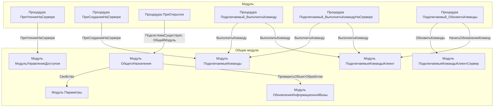

# Граф зависимостей: ФормаДокумента

## Диаграмма

## Статистика

- **Процедур/функций:** 6
- **Экспортируемых:** 0
- **Внешних зависимостей:** 7
- **Внутренних вызовов:** 6

## Детали зависимостей

| Тип | Имя | Использований | Тип использования | Методы |
|-----|-----|---------------|-------------------|--------|
| module | ОбщегоНазначения | 2 | call | ПодсистемаСуществует, ОбщийМодуль |
| module | МодульУправлениеДоступом | 1 | call | ПриЧтенииНаСервере |
| module | ПодключаемыеКомандыКлиентСервер | 2 | call | ОбновитьКоманды |
| module | Параметры | 1 | call | Свойство |
| module | ОбновлениеИнформационнойБазы | 1 | call | ПроверитьОбъектОбработан |
| module | ПодключаемыеКоманды | 2 | call | ПриСозданииНаСервере, ВыполнитьКоманду |
| module | ПодключаемыеКомандыКлиент | 2 | call | НачатьОбновлениеКоманд, ВыполнитьКоманду |

---
*Сгенерировано автоматически: 2026-03-09T02:00:16.930Z*
