# Граф зависимостей: гкс_УстановкаМинимальныхПоказателейПриемки

## Диаграмма

```mermaid
graph TD
    subgraph module["Модуль"]
        Модуль_гкс_УстановкаМинимальныхПоказателейПриемки["Модуль гкс_УстановкаМинимальныхПоказателейПриемки"]
        Процедура_ЗарегистрироватьУчетныеМеханизмы_Экспорт["Процедура ЗарегистрироватьУчетныеМеханизмы Экспорт"]
        Функция_ДанныеДокументаДляПроведения_Экспорт(["Функция ДанныеДокументаДляПроведения Экспорт"])
        Процедура_ЗаполнитьПараметрыИнициализации["Процедура ЗаполнитьПараметрыИнициализации"]
        Процедура_СформироватьТекстЗапросаТаблицаМинимальныеПоказателиКачестваПриемки["Процедура СформироватьТекстЗапросаТаблицаМинимальныеПоказателиКачестваПриемки"]
        Функция_ТекстЗапросаМинимальныеПоказателиКачестваПриемкиПоДокументу(["Функция ТекстЗапросаМинимальныеПоказателиКачестваПриемкиПоДокументу"])
        Функция_ТекстЗапросаМинимальныеПоказателиКачестваПриемки(["Функция ТекстЗапросаМинимальныеПоказателиКачестваПриемки"])
        Процедура_ОбработкаЗаполнения["Процедура ОбработкаЗаполнения"]
        Процедура_ПриКопировании["Процедура ПриКопировании"]
        Процедура_ПередЗаписью["Процедура ПередЗаписью"]
        Процедура_ПриЗаписи["Процедура ПриЗаписи"]
        Процедура_ОбработкаПроведения["Процедура ОбработкаПроведения"]
        Процедура_ОбработкаУдаленияПроведения["Процедура ОбработкаУдаленияПроведения"]
        Процедура_ИнициализироватьДокумент["Процедура ИнициализироватьДокумент"]
        Процедура_ПриЧтенииНаСервере["Процедура ПриЧтенииНаСервере"]
        Процедура_ПриСозданииНаСервере["Процедура ПриСозданииНаСервере"]
        Процедура_ПриОткрытии["Процедура ПриОткрытии"]
        Процедура_Подключаемый_ВыполнитьКоманду["Процедура Подключаемый_ВыполнитьКоманду"]
        Процедура_Подключаемый_ВыполнитьКомандуНаСервере["Процедура Подключаемый_ВыполнитьКомандуНаСервере"]
        Процедура_Подключаемый_ОбновитьКоманды["Процедура Подключаемый_ОбновитьКоманды"]
        Процедура_ПриСозданииНаСервере["Процедура ПриСозданииНаСервере"]
        Процедура_СписокПриАктивизацииСтроки["Процедура СписокПриАктивизацииСтроки"]
        Процедура_Подключаемый_ВыполнитьКоманду["Процедура Подключаемый_ВыполнитьКоманду"]
        Процедура_Подключаемый_ПродолжитьВыполнениеКомандыНаСервере_Экспорт["Процедура Подключаемый_ПродолжитьВыполнениеКомандыНаСервере Экспорт"]
        Процедура_ВыполнитьКомандуНаСервере["Процедура ВыполнитьКомандуНаСервере"]
        Процедура_Подключаемый_ОбновитьКоманды["Процедура Подключаемый_ОбновитьКоманды"]
    end
    subgraph module["Общие модули"]
        Модуль_МеханизмыДокумента["Модуль МеханизмыДокумента"]
        Модуль_гкс_ПроведениеДокументов["Модуль гкс_ПроведениеДокументов"]
        Модуль_ДополнительныеСвойства["Модуль ДополнительныеСвойства"]
        Модуль_ДопПараметры["Модуль ДопПараметры"]
        Модуль_Запрос["Модуль Запрос"]
        Модуль_Пользователи["Модуль Пользователи"]
        Модуль_ОбщегоНазначения["Модуль ОбщегоНазначения"]
        Модуль_ТекстыЗапроса["Модуль ТекстыЗапроса"]
        Модуль_гкс_МинимальныеПоказателиКачестваПриемки["Модуль гкс_МинимальныеПоказателиКачестваПриемки"]
        Модуль_КачественныеПоказатели["Модуль КачественныеПоказатели"]
        Модуль_ОбновлениеИнформационнойБазы["Модуль ОбновлениеИнформационнойБазы"]
        Модуль_МодульУправлениеДоступом["Модуль МодульУправлениеДоступом"]
        Модуль_ПодключаемыеКомандыКлиентСервер["Модуль ПодключаемыеКомандыКлиентСервер"]
        Модуль_Параметры["Модуль Параметры"]
        Модуль_ПодключаемыеКоманды["Модуль ПодключаемыеКоманды"]
        Модуль_ПодключаемыеКомандыКлиент["Модуль ПодключаемыеКомандыКлиент"]
    end
    Модуль_гкс_УстановкаМинимальныхПоказателейПриемки -->|Добавить| Модуль_МеханизмыДокумента
    Модуль_гкс_УстановкаМинимальныхПоказателейПриемки -->|ДопПараметрыИнициализироватьДанныеДокументаДляПроведения, ИнициализироватьДанныеДокументаДляПроведения, ТребуетсяТаблицаДляДвижений...| Модуль_гкс_ПроведениеДокументов
    Модуль_гкс_УстановкаМинимальныхПоказателейПриемки -->|Свойство| Модуль_ДополнительныеСвойства
    Модуль_гкс_УстановкаМинимальныхПоказателейПриемки -->|Свойство| Модуль_ДопПараметры
    Модуль_гкс_УстановкаМинимальныхПоказателейПриемки -->|УстановитьПараметр| Модуль_Запрос
    Модуль_гкс_УстановкаМинимальныхПоказателейПриемки -->|ТекущийПользователь| Модуль_Пользователи
    Модуль_гкс_УстановкаМинимальныхПоказателейПриемки -->|ЗначенияРеквизитовОбъекта, ПодсистемаСуществует, ОбщийМодуль| Модуль_ОбщегоНазначения
    Модуль_гкс_УстановкаМинимальныхПоказателейПриемки -->|Добавить| Модуль_ТекстыЗапроса
    Модуль_гкс_УстановкаМинимальныхПоказателейПриемки -->|СрезПоследних| Модуль_гкс_МинимальныеПоказателиКачестваПриемки
    Модуль_гкс_УстановкаМинимальныхПоказателейПриемки -->|Очистить| Модуль_КачественныеПоказатели
    Модуль_гкс_УстановкаМинимальныхПоказателейПриемки -->|ПроверитьОбъектОбработан| Модуль_ОбновлениеИнформационнойБазы
    Модуль_гкс_УстановкаМинимальныхПоказателейПриемки -->|ПриЧтенииНаСервере| Модуль_МодульУправлениеДоступом
    Модуль_гкс_УстановкаМинимальныхПоказателейПриемки -->|ОбновитьКоманды| Модуль_ПодключаемыеКомандыКлиентСервер
    Модуль_гкс_УстановкаМинимальныхПоказателейПриемки -->|Свойство| Модуль_Параметры
    Модуль_гкс_УстановкаМинимальныхПоказателейПриемки -->|ПриСозданииНаСервере, ВыполнитьКоманду| Модуль_ПодключаемыеКоманды
    Модуль_гкс_УстановкаМинимальныхПоказателейПриемки -->|НачатьОбновлениеКоманд, ВыполнитьКоманду, НачатьВыполнениеКоманды| Модуль_ПодключаемыеКомандыКлиент
```

## Статистика

- **Процедур/функций:** 25
- **Экспортируемых:** 3
- **Внешних зависимостей:** 16
- **Внутренних вызовов:** 22

## Детали зависимостей

| Тип | Имя | Использований | Тип использования | Методы |
|-----|-----|---------------|-------------------|--------|
| module | МеханизмыДокумента | 1 | call | Добавить |
| module | гкс_ПроведениеДокументов | 8 | call | ДопПараметрыИнициализироватьДанныеДокументаДляПроведения, ИнициализироватьДанныеДокументаДляПроведения, ТребуетсяТаблицаДляДвижений, ПередЗаписьюДокумента, ПриЗаписиДокумента... |
| module | ДополнительныеСвойства | 1 | call | Свойство |
| module | ДопПараметры | 1 | call | Свойство |
| module | Запрос | 5 | call | УстановитьПараметр |
| module | Пользователи | 3 | call | ТекущийПользователь |
| module | ОбщегоНазначения | 3 | call | ЗначенияРеквизитовОбъекта, ПодсистемаСуществует, ОбщийМодуль |
| module | ТекстыЗапроса | 1 | call | Добавить |
| module | гкс_МинимальныеПоказателиКачестваПриемки | 1 | call | СрезПоследних |
| module | КачественныеПоказатели | 1 | call | Очистить |
| module | ОбновлениеИнформационнойБазы | 2 | call | ПроверитьОбъектОбработан |
| module | МодульУправлениеДоступом | 1 | call | ПриЧтенииНаСервере |
| module | ПодключаемыеКомандыКлиентСервер | 3 | call | ОбновитьКоманды |
| module | Параметры | 1 | call | Свойство |
| module | ПодключаемыеКоманды | 4 | call | ПриСозданииНаСервере, ВыполнитьКоманду |
| module | ПодключаемыеКомандыКлиент | 4 | call | НачатьОбновлениеКоманд, ВыполнитьКоманду, НачатьВыполнениеКоманды |

---
*Сгенерировано автоматически: 2026-03-09T02:01:31.472Z*
