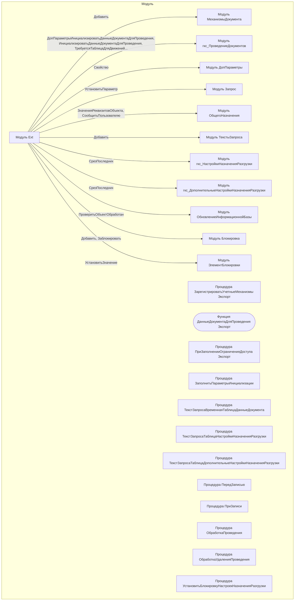

# Граф зависимостей: Ext

## Диаграмма

## Статистика

- **Процедур/функций:** 12
- **Экспортируемых:** 3
- **Внешних зависимостей:** 11
- **Внутренних вызовов:** 12

## Детали зависимостей

| Тип | Имя | Использований | Тип использования | Методы |
|-----|-----|---------------|-------------------|--------|
| module | МеханизмыДокумента | 1 | call | Добавить |
| module | гкс_ПроведениеДокументов | 8 | call | ДопПараметрыИнициализироватьДанныеДокументаДляПроведения, ИнициализироватьДанныеДокументаДляПроведения, ТребуетсяТаблицаДляДвижений, ПередЗаписьюДокумента, ПриЗаписиДокумента... |
| module | ДопПараметры | 1 | call | Свойство |
| module | Запрос | 5 | call | УстановитьПараметр |
| module | ОбщегоНазначения | 2 | call | ЗначенияРеквизитовОбъекта, СообщитьПользователю |
| module | ТекстыЗапроса | 3 | call | Добавить |
| module | гкс_НастройкиНазначенияРазгрузки | 1 | call | СрезПоследних |
| module | гкс_ДополнительныеНастройкиНазначенияРазгрузки | 1 | call | СрезПоследних |
| module | ОбновлениеИнформационнойБазы | 1 | call | ПроверитьОбъектОбработан |
| module | Блокировка | 2 | call | Добавить, Заблокировать |
| module | ЭлементБлокировки | 3 | call | УстановитьЗначение |

---
*Сгенерировано автоматически: 2026-03-09T02:01:20.026Z*
