# Граф зависимостей: Forms

## Диаграмма

```mermaid
graph TD
    subgraph module["Модуль"]
        Модуль_Forms["Модуль Forms"]
        Процедура_ПриСозданииНаСервере["Процедура ПриСозданииНаСервере"]
        Процедура_ПриЧтенииНаСервере["Процедура ПриЧтенииНаСервере"]
        Процедура_ПриОткрытии["Процедура ПриОткрытии"]
        Процедура_ПередЗаписьюНаСервере["Процедура ПередЗаписьюНаСервере"]
        Процедура_ПослеЗаписи["Процедура ПослеЗаписи"]
        Процедура_ПослеЗаписиНаСервере["Процедура ПослеЗаписиНаСервере"]
        Процедура_ОбработкаПроверкиЗаполненияНаСервере["Процедура ОбработкаПроверкиЗаполненияНаСервере"]
        Процедура_НоменклатураПриИзменении["Процедура НоменклатураПриИзменении"]
        Процедура_ВидПеревозкиПриИзменении["Процедура ВидПеревозкиПриИзменении"]
        Процедура_ЗаполнитьТекущимиНастройками["Процедура ЗаполнитьТекущимиНастройками"]
        Процедура_НоменклатураПриИзмененииНаСервере["Процедура НоменклатураПриИзмененииНаСервере"]
        Процедура_Подключаемый_ВыполнитьКоманду["Процедура Подключаемый_ВыполнитьКоманду"]
        Процедура_Подключаемый_ПродолжитьВыполнениеКомандыНаСервере_Экспорт["Процедура Подключаемый_ПродолжитьВыполнениеКомандыНаСервере Экспорт"]
        Процедура_ВыполнитьКомандуНаСервере["Процедура ВыполнитьКомандуНаСервере"]
        Процедура_Подключаемый_ОбновитьКоманды["Процедура Подключаемый_ОбновитьКоманды"]
        Процедура_УстановитьВидимостьДоступностьЭлементовФормы["Процедура УстановитьВидимостьДоступностьЭлементовФормы"]
        Процедура_ОтветЗаполнитьТекущимиНастройками_Экспорт["Процедура ОтветЗаполнитьТекущимиНастройками Экспорт"]
        Процедура_ЗаполнитьТекущимиНастройкамиНаСервере["Процедура ЗаполнитьТекущимиНастройкамиНаСервере"]
        Процедура_УстановитьСписокВыбораСлужебнойНоменклатуры["Процедура УстановитьСписокВыбораСлужебнойНоменклатуры"]
        Процедура_РазделитьНазначенияРазгрузкиДляЖДПеревозки["Процедура РазделитьНазначенияРазгрузкиДляЖДПеревозки"]
        Функция_ТекстЗапросаРазделенияНазначенийРазгрузки(["Функция ТекстЗапросаРазделенияНазначенийРазгрузки"])
        Процедура_ПроверитьЗаполнениеНазначенияРазгрузкиДляЖДПеревозки["Процедура ПроверитьЗаполнениеНазначенияРазгрузкиДляЖДПеревозки"]
        Процедура_ПроверитьСоответствиеСилосовЯмДляЖДПеревозки["Процедура ПроверитьСоответствиеСилосовЯмДляЖДПеревозки"]
        Процедура_ПроверитьСоответствиеПутейЯмДляЖДПеревозки["Процедура ПроверитьСоответствиеПутейЯмДляЖДПеревозки"]
        Процедура_ПриСозданииНаСервере["Процедура ПриСозданииНаСервере"]
        Процедура_СписокПриАктивизацииСтроки["Процедура СписокПриАктивизацииСтроки"]
        Процедура_Подключаемый_ВыполнитьКоманду["Процедура Подключаемый_ВыполнитьКоманду"]
        Процедура_Подключаемый_ПродолжитьВыполнениеКомандыНаСервере_Экспорт["Процедура Подключаемый_ПродолжитьВыполнениеКомандыНаСервере Экспорт"]
        Процедура_ВыполнитьКомандуНаСервере["Процедура ВыполнитьКомандуНаСервере"]
        Процедура_Подключаемый_ОбновитьКоманды["Процедура Подключаемый_ОбновитьКоманды"]
    end
    subgraph module["Общие модули"]
        Модуль_ПодключаемыеКоманды["Модуль ПодключаемыеКоманды"]
        Модуль_ОбщегоНазначения["Модуль ОбщегоНазначения"]
        Модуль_МодульУправлениеДоступом["Модуль МодульУправлениеДоступом"]
        Модуль_ПодключаемыеКомандыКлиентСервер["Модуль ПодключаемыеКомандыКлиентСервер"]
        Модуль_ПодключаемыеКомандыКлиент["Модуль ПодключаемыеКомандыКлиент"]
        Модуль_Пользователи["Модуль Пользователи"]
        Модуль_гкс_ТипыТранспортныхСредствДоставки["Модуль гкс_ТипыТранспортныхСредствДоставки"]
        Модуль_УправлениеДоступом["Модуль УправлениеДоступом"]
        Модуль_НазначенияРазгрузки["Модуль НазначенияРазгрузки"]
        Модуль_Ключ["Модуль Ключ"]
        Модуль_Параметры["Модуль Параметры"]
        Модуль_гкс_НастройкиНазначенияРазгрузки["Модуль гкс_НастройкиНазначенияРазгрузки"]
        Модуль_Запрос["Модуль Запрос"]
        Модуль_РезультатЗапроса["Модуль РезультатЗапроса"]
        Модуль_СписокВыбора["Модуль СписокВыбора"]
        Модуль_ЧастиСообщения["Модуль ЧастиСообщения"]
        Модуль_Выборка["Модуль Выборка"]
    end
    subgraph enum["Перечисления"]
        Перечисление_гкс_ТипыТранспортныхСредствДоставки(["Перечисление гкс_ТипыТранспортныхСредствДоставки"])
    end
    Модуль_Forms -->|ПриСозданииНаСервере, ВыполнитьКоманду| Модуль_ПодключаемыеКоманды
    Модуль_Forms -->|ПодсистемаСуществует, ОбщийМодуль, СообщитьПользователю| Модуль_ОбщегоНазначения
    Модуль_Forms -->|ПриЧтенииНаСервере| Модуль_МодульУправлениеДоступом
    Модуль_Forms -->|ОбновитьКоманды| Модуль_ПодключаемыеКомандыКлиентСервер
    Модуль_Forms -->|НачатьОбновлениеКоманд, ПослеЗаписи, НачатьВыполнениеКоманды| Модуль_ПодключаемыеКомандыКлиент
    Модуль_Forms -->|ТекущийПользователь| Модуль_Пользователи
    Модуль_Forms -->|ЭтоЖДПеревозка| Модуль_гкс_ТипыТранспортныхСредствДоставки
    Модуль_Forms -->|ПослеЗаписиНаСервере| Модуль_УправлениеДоступом
    Модуль_Forms -->|Выгрузить, Очистить, Количество...| Модуль_НазначенияРазгрузки
    Модуль_Forms -->|Пустая| Модуль_Ключ
    Модуль_Forms -->|Свойство| Модуль_Параметры
    Модуль_Forms -->|СрезПоследних| Модуль_гкс_НастройкиНазначенияРазгрузки
    Модуль_Forms -->|УстановитьПараметр, Выполнить| Модуль_Запрос
    Модуль_Forms -->|Пустой, Выгрузить, Выбрать| Модуль_РезультатЗапроса
    Модуль_Forms -->|ЗагрузитьЗначения| Модуль_СписокВыбора
    Модуль_Forms -->|Добавить| Модуль_ЧастиСообщения
    Модуль_Forms -->|Следующий| Модуль_Выборка
    Модуль_Forms -->|ссылка| Перечисление_гкс_ТипыТранспортныхСредствДоставки
```

## Статистика

- **Процедур/функций:** 30
- **Экспортируемых:** 3
- **Внешних зависимостей:** 18
- **Внутренних вызовов:** 25

## Детали зависимостей

| Тип | Имя | Использований | Тип использования | Методы |
|-----|-----|---------------|-------------------|--------|
| module | ПодключаемыеКоманды | 4 | call | ПриСозданииНаСервере, ВыполнитьКоманду |
| module | ОбщегоНазначения | 4 | call | ПодсистемаСуществует, ОбщийМодуль, СообщитьПользователю |
| module | МодульУправлениеДоступом | 1 | call | ПриЧтенииНаСервере |
| module | ПодключаемыеКомандыКлиентСервер | 3 | call | ОбновитьКоманды |
| module | ПодключаемыеКомандыКлиент | 5 | call | НачатьОбновлениеКоманд, ПослеЗаписи, НачатьВыполнениеКоманды |
| module | Пользователи | 1 | call | ТекущийПользователь |
| module | гкс_ТипыТранспортныхСредствДоставки | 2 | call | ЭтоЖДПеревозка |
| module | УправлениеДоступом | 1 | call | ПослеЗаписиНаСервере |
| module | НазначенияРазгрузки | 7 | call | Выгрузить, Очистить, Количество, Загрузить |
| module | Ключ | 1 | call | Пустая |
| module | Параметры | 1 | call | Свойство |
| module | гкс_НастройкиНазначенияРазгрузки | 1 | call | СрезПоследних |
| module | Запрос | 11 | call | УстановитьПараметр, Выполнить |
| module | РезультатЗапроса | 10 | call | Пустой, Выгрузить, Выбрать |
| module | СписокВыбора | 1 | call | ЗагрузитьЗначения |
| module | ЧастиСообщения | 4 | call | Добавить |
| module | Выборка | 2 | call | Следующий |
| enum | гкс_ТипыТранспортныхСредствДоставки | 2 | reference | - |

---
*Сгенерировано автоматически: 2026-03-09T02:01:20.016Z*
