# Граф зависимостей: ФормаДокумента

## Диаграмма

```mermaid
graph TD
    subgraph Модуль
        Процедура_ПриСозданииНаСервере[Процедура ПриСозданииНаСервере]
        Процедура_ПриЧтенииНаСервере[Процедура ПриЧтенииНаСервере]
        Процедура_ПриОткрытии[Процедура ПриОткрытии]
        Процедура_ПередЗаписьюНаСервере[Процедура ПередЗаписьюНаСервере]
        Процедура_ПослеЗаписи[Процедура ПослеЗаписи]
        Процедура_ПослеЗаписиНаСервере[Процедура ПослеЗаписиНаСервере]
        Процедура_ОбработкаПроверкиЗаполненияНаСервере[Процедура ОбработкаПроверкиЗаполненияНаСервере]
        Процедура_НоменклатураПриИзменении[Процедура НоменклатураПриИзменении]
        Процедура_ВидПеревозкиПриИзменении[Процедура ВидПеревозкиПриИзменении]
        Процедура_ЗаполнитьТекущимиНастройками[Процедура ЗаполнитьТекущимиНастройками]
        Процедура_НоменклатураПриИзмененииНаСервере[Процедура НоменклатураПриИзмененииНаСервере]
        Процедура_Подключаемый_ВыполнитьКоманду[Процедура Подключаемый_ВыполнитьКоманду]
        Процедура_Подключаемый_ПродолжитьВыполнениеКомандыНаСервере[Процедура Подключаемый_ПродолжитьВыполнениеКомандыНаСервере]
        Процедура_ВыполнитьКомандуНаСервере[Процедура ВыполнитьКомандуНаСервере]
        Процедура_Подключаемый_ОбновитьКоманды[Процедура Подключаемый_ОбновитьКоманды]
        Процедура_УстановитьВидимостьДоступностьЭлементовФормы[Процедура УстановитьВидимостьДоступностьЭлементовФормы]
        Процедура_ОтветЗаполнитьТекущимиНастройками[Процедура ОтветЗаполнитьТекущимиНастройками]
        Процедура_ЗаполнитьТекущимиНастройкамиНаСервере[Процедура ЗаполнитьТекущимиНастройкамиНаСервере]
        Процедура_УстановитьСписокВыбораСлужебнойНоменклатуры[Процедура УстановитьСписокВыбораСлужебнойНоменклатуры]
        Процедура_РазделитьНазначенияРазгрузкиДляЖДПеревозки[Процедура РазделитьНазначенияРазгрузкиДляЖДПеревозки]
        Функция_ТекстЗапросаРазделенияНазначенийРазгрузки([Функция ТекстЗапросаРазделенияНазначенийРазгрузки])
        Процедура_ПроверитьЗаполнениеНазначенияРазгрузкиДляЖДПеревозки[Процедура ПроверитьЗаполнениеНазначенияРазгрузкиДляЖДПеревозки]
        Процедура_ПроверитьСоответствиеСилосовЯмДляЖДПеревозки[Процедура ПроверитьСоответствиеСилосовЯмДляЖДПеревозки]
        Процедура_ПроверитьСоответствиеПутейЯмДляЖДПеревозки[Процедура ПроверитьСоответствиеПутейЯмДляЖДПеревозки]
    end

    subgraph Общие модули
        Модуль_ПодключаемыеКоманды["Модуль ПодключаемыеКоманды"]
        Модуль_ОбщегоНазначения["Модуль ОбщегоНазначения"]
        Модуль_МодульУправлениеДоступом["Модуль МодульУправлениеДоступом"]
        Модуль_ПодключаемыеКомандыКлиентСервер["Модуль ПодключаемыеКомандыКлиентСервер"]
        Модуль_ПодключаемыеКомандыКлиент["Модуль ПодключаемыеКомандыКлиент"]
        Модуль_Пользователи["Модуль Пользователи"]
        Модуль_гкс_ТипыТранспортныхСредствДоставки["Модуль гкс_ТипыТранспортныхСредствДоставки"]
        Модуль_УправлениеДоступом["Модуль УправлениеДоступом"]
        Модуль_НазначенияРазгрузки["Модуль НазначенияРазгрузки"]
        Модуль_Ключ["Модуль Ключ"]
        Модуль_Параметры["Модуль Параметры"]
        Модуль_гкс_НастройкиНазначенияРазгрузки["Модуль гкс_НастройкиНазначенияРазгрузки"]
        Модуль_Запрос["Модуль Запрос"]
        Модуль_РезультатЗапроса["Модуль РезультатЗапроса"]
        Модуль_СписокВыбора["Модуль СписокВыбора"]
        Модуль_ЧастиСообщения["Модуль ЧастиСообщения"]
        Модуль_Выборка["Модуль Выборка"]
    end

    subgraph Перечисления
        Перечисление_гкс_ТипыТранспортныхСредствДоставки[[Перечисление гкс_ТипыТранспортныхСредствДоставки]]
    end

    Процедура_ПриСозданииНаСервере -->|ПриСозданииНаСервере| Модуль_ПодключаемыеКоманды
    Процедура_ПриСозданииНаСервере -->|ПодсистемаСуществует, ОбщийМодуль| Модуль_ОбщегоНазначения
    Процедура_ПриЧтенииНаСервере -->|ПриЧтенииНаСервере| Модуль_МодульУправлениеДоступом
    Процедура_ПриОткрытии -->|ПодсистемаСуществует, ОбщийМодуль| Модуль_ОбщегоНазначения
    Процедура_ПередЗаписьюНаСервере -->|ПодсистемаСуществует, ОбщийМодуль| Модуль_ОбщегоНазначения
    Процедура_ПослеЗаписи -->|ПослеЗаписи| Модуль_ПодключаемыеКомандыКлиент
    Процедура_ПослеЗаписиНаСервере -->|ПослеЗаписиНаСервере| Модуль_УправлениеДоступом
    Процедура_ОбработкаПроверкиЗаполненияНаСервере -->|ПодсистемаСуществует, ОбщийМодуль| Модуль_ОбщегоНазначения
    Процедура_НоменклатураПриИзменении -->|НоменклатураПриИзменении| Модуль_ПодключаемыеКомандыКлиент
    Процедура_НоменклатураПриИзменении -->|ПодсистемаСуществует, ОбщийМодуль| Модуль_ОбщегоНазначения
    Процедура_ВидПеревозкиПриИзменении -->|ЭтоЖДПеревозка| Модуль_гкс_ТипыТранспортныхСредствДоставки
    Процедура_ВидПеревозкиПриИзменении -->|гкс_ТипыТранспортныхСредствДоставки| Перечисление_гкс_ТипыТранспортныхСредствДоставки
    Процедура_ЗаполнитьТекущимиНастройками -->|ЗаполнитьТекущимиНастройками| Модуль_гкс_НастройкиНазначенияРазгрузки
    Процедура_НоменклатураПриИзмененииНаСервере -->|НоменклатураПриИзмененииНаСервере| Модуль_ПодключаемыеКомандыКлиент
    Процедура_Подключаемый_ВыполнитьКоманду -->|ВыполнитьКоманду| Модуль_ПодключаемыеКоманды
    Процедура_Подключаемый_ПродолжитьВыполнениеКомандыНаСервере -->|ПодсистемаСуществует, ОбщийМодуль| Модуль_ОбщегоНазначения
    Процедура_ВыполнитьКомандуНаСервере -->|ВыполнитьКоманду| Модуль_ПодключаемыеКоманды
    Процедура_Подключаемый_ОбновитьКоманды -->|ОбновитьКоманды| Модуль_ПодключаемыеКомандыКлиентСервер
    Процедура_УстановитьВидимостьДоступностьЭлементовФормы -->|ПодсистемаСуществует, ОбщийМодуль| Модуль_ОбщегоНазначения
    Процедура_ОтветЗаполнитьТекущимиНастройками -->|ПодсистемаСуществует, ОбщийМодуль| Модуль_ОбщегоНазначения
    Процедура_ЗаполнитьТекущимиНастройкамиНаСервере -->|ЗаполнитьТекущимиНастройками| Модуль_гкс_НастройкиНазначенияРазгрузки
    Процедура_УстановитьСписокВыбораСлужебнойНоменклатуры -->|ЗагрузитьЗначения| Модуль_СписокВыбора
    Процедура_РазделитьНазначенияРазгрузкиДляЖДПеревозки -->|Выгрузить, Очистить, Количество, Загрузить| Модуль_НазначенияРазгрузки
    Процедура_РазделитьНазначенияРазгрузкиДляЖДПеревозки -->|Пустая| Модуль_Ключ
    Процедура_РазделитьНазначенияРазгрузкиДляЖДПеревозки -->|Свойство| Модуль_Параметры
    Процедура_РазделитьНазначенияРазгрузкиДляЖДПеревозки -->|СрезПоследних| Модуль_гкс_НастройкиНазначенияРазгрузки
    Процедура_РазделитьНазначенияРазгрузкиДляЖДПеревозки -->|УстановитьПараметр, Выполнить| Модуль_Запрос
    Процедура_РазделитьНазначенияРазгрузкиДляЖДПеревозки -->|Пустой, Выгрузить, Выбрать| Модуль_РезультатЗапроса
    Процедура_РазделитьНазначенияРазгрузкиДляЖДПеревозки -->|Добавить| Модуль_ЧастиСообщения
    Процедура_РазделитьНазначенияРазгрузкиДляЖДПеревозки -->|Следующий| Модуль_Выборка
    Функция_ТекстЗапросаРазделенияНазначенийРазгрузки -->|УстановитьПараметр, Выполнить| Модуль_Запрос
    Функция_ТекстЗапросаРазделенияНазначенийРазгрузки -->|Пустой, Выгрузить, Выбрать| Модуль_РезультатЗапроса
    Процедура_ПроверитьЗаполнениеНазначенияРазгрузкиДляЖДПеревозки -->|ЭтоЖДПеревозка| Модуль_гкс_ТипыТранспортныхСредствДоставки
    Процедура_ПроверитьЗаполнениеНазначенияРазгрузкиДляЖДПеревозки -->|гкс_ТипыТранспортныхСредствДоставки| Перечисление_гкс_ТипыТранспортныхСредствДоставки
    Процедура_ПроверитьЗаполнениеНазначенияРазгрузкиДляЖДПеревозки -->|Выгрузить, Очистить, Количество, Загрузить| Модуль_НазначенияРазгрузки
    Процедура_ПроверитьЗаполнениеНазначенияРазгрузкиДляЖДПеревозки -->|Пустая| Модуль_Ключ
    Процедура_ПроверитьЗаполнениеНазначенияРазгрузкиДляЖДПеревозки -->|Свойство| Модуль_Параметры
    Процедура_ПроверитьЗаполнениеНазначенияРазгрузкиДляЖДПеревозки -->|УстановитьПараметр, Выполнить| Модуль_Запрос
    Процедура_ПроверитьЗаполнениеНазначенияРазгрузкиДляЖДПеревозки -->|Пустой, Выгрузить, Выбрать| Модуль_РезультатЗапроса
    Процедура_ПроверитьЗаполнениеНазначенияРазгрузкиДляЖДПеревозки -->|Добавить| Модуль_ЧастиСообщения
    Процедура_ПроверитьЗаполнениеНазначенияРазгрузкиДляЖДПеревозки -->|Следующий| Модуль_Выборка
    Процедура_ПроверитьСоответствиеСилосовЯмДляЖДПеревозки -->|ЭтоЖДПеревозка| Модуль_гкс_ТипыТранспортныхСредствДоставки
    Процедура_ПроверитьСоответствиеСилосовЯмДляЖДПеревозки -->|гкс_ТипыТранспортныхСредствДоставки| Перечисление_гкс_ТипыТранспортныхСредствДоставки
    Процедура_ПроверитьСоответствиеСилосовЯмДляЖДПеревозки -->|УстановитьПараметр, Выполнить| Модуль_Запрос
    Процедура_ПроверитьСоответствиеСилосовЯмДляЖДПеревозки -->|Пустой, Выгрузить, Выбрать| Модуль_РезультатЗапроса
    Процедура_ПроверитьСоответствиеСилосовЯмДляЖДПеревозки -->|Добавить| Модуль_ЧастиСообщения
    Процедура_ПроверитьСоответствиеСилосовЯмДляЖДПеревозки -->|Следующий| Модуль_Выборка
    Процедура_ПроверитьСоответствиеПутейЯмДляЖДПеревозки -->|ЭтоЖДПеревозка| Модуль_гкс_ТипыТранспортныхСредствДоставки
    Процедура_ПроверитьСоответствиеПутейЯмДляЖДПеревозки -->|гкс_ТипыТранспортныхСредствДоставки| Перечисление_гкс_ТипыТранспортныхСредствДоставки
    Процедура_ПроверитьСоответствиеПутейЯмДляЖДПеревозки -->|УстановитьПараметр, Выполнить| Модуль_Запрос
    Процедура_ПроверитьСоответствиеПутейЯмДляЖДПеревозки -->|Пустой, Выгрузить, Выбрать| Модуль_РезультатЗапроса
    Процедура_ПроверитьСоответствиеПутейЯмДляЖДПеревозки -->|Добавить| Модуль_ЧастиСообщения
    Процедура_ПроверитьСоответствиеПутейЯмДляЖДПеревозки -->|Следующий| Модуль_Выборка
```

## Статистика

- **Процедур/функций:** 24
- **Экспортируемых:** 2
- **Внешних зависимостей:** 18
- **Внутренних вызовов:** 24

## Детали зависимостей

| Тип | Имя | Использований | Тип использования | Методы |
|-----|-----|---------------|-------------------|--------|
| module | ПодключаемыеКоманды | 2 | call | ПриСозданииНаСервере, ВыполнитьКоманду |
| module | ОбщегоНазначения | 4 | call | ПодсистемаСуществует, ОбщийМодуль, СообщитьПользователю |
| module | МодульУправлениеДоступом | 1 | call | ПриЧтенииНаСервере |
| module | ПодключаемыеКомандыКлиентСервер | 2 | call | ОбновитьКоманды |
| module | ПодключаемыеКомандыКлиент | 3 | call | НачатьОбновлениеКоманд, ПослеЗаписи, НачатьВыполнениеКоманды |
| module | Пользователи | 1 | call | ТекущийПользователь |
| module | гкс_ТипыТранспортныхСредствДоставки | 2 | call | ЭтоЖДПеревозка |
| module | УправлениеДоступом | 1 | call | ПослеЗаписиНаСервере |
| module | НазначенияРазгрузки | 7 | call | Выгрузить, Очистить, Количество, Загрузить |
| module | Ключ | 1 | call | Пустая |
| module | Параметры | 1 | call | Свойство |
| module | гкс_НастройкиНазначенияРазгрузки | 1 | call | СрезПоследних |
| module | Запрос | 11 | call | УстановитьПараметр, Выполнить |
| module | РезультатЗапроса | 10 | call | Пустой, Выгрузить, Выбрать |
| module | СписокВыбора | 1 | call | ЗагрузитьЗначения |
| module | ЧастиСообщения | 4 | call | Добавить |
| module | Выборка | 2 | call | Следующий |
| enum | гкс_ТипыТранспортныхСредствДоставки | 2 | reference | - |

---
*Сгенерировано автоматически: 2026-03-09T02:00:34.415Z*
