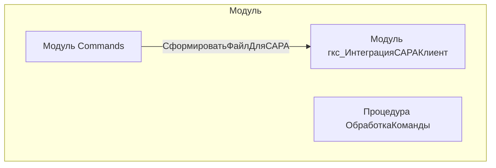

# Граф зависимостей: Commands

## Диаграмма

## Статистика

- **Процедур/функций:** 1
- **Экспортируемых:** 0
- **Внешних зависимостей:** 1
- **Внутренних вызовов:** 1

## Детали зависимостей

| Тип | Имя | Использований | Тип использования | Методы |
|-----|-----|---------------|-------------------|--------|
| module | гкс_ИнтеграцияСАРАКлиент | 1 | call | СформироватьФайлДляСАРА |

---
*Сгенерировано автоматически: 2026-03-09T02:01:22.233Z*
