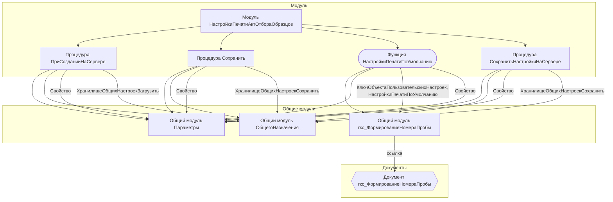

# Граф зависимостей: НастройкиПечатиАктОтбораОбразцов

## Диаграмма

## Статистика

- **Процедур/функций:** 4
- **Экспортируемых:** 0
- **Внешних зависимостей:** 4
- **Внутренних вызовов:** 4

## Детали зависимостей

| Тип | Имя | Использований | Тип использования | Методы |
|-----|-----|---------------|-------------------|--------|
| module | Параметры | 3 | call | Свойство |
| module | гкс_ФормированиеНомераПробы | 2 | call | КлючОбъектаПользовательскихНастроек, НастройкиПечатиПоУмолчанию |
| module | ОбщегоНазначения | 2 | call | ХранилищеОбщихНастроекЗагрузить, ХранилищеОбщихНастроекСохранить |
| document | гкс_ФормированиеНомераПробы | 2 | reference | - |

---
*Сгенерировано автоматически: 2026-03-09T02:00:25.807Z*
