# Граф зависимостей: Ext

## Диаграмма

```mermaid
graph TD
    subgraph "Модуль"
        Процедура_ПриЧтенииНаСервере["Процедура ПриЧтенииНаСервере"]
        Процедура_ПриСозданииНаСервере["Процедура ПриСозданииНаСервере"]
        Процедура_ПриОткрытии["Процедура ПриОткрытии"]
        Процедура_ПослеЗаписиНаСервере["Процедура ПослеЗаписиНаСервере"]
        Процедура_ПослеЗаписи["Процедура ПослеЗаписи"]
        Процедура_ТипПробыПриИзменении["Процедура ТипПробыПриИзменении"]
        Процедура_РегистрацияПриИзменении["Процедура РегистрацияПриИзменении"]
        Процедура_СформироватьЛА["Процедура СформироватьЛА"]
        Процедура_СформироватьНомерПробыИЗакрытьДокумент["Процедура СформироватьНомерПробыИЗакрытьДокумент"]
        Процедура_ЗакрытьДокументЗавершение["Процедура ЗакрытьДокументЗавершение"]
        Процедура_Подключаемый_ВыполнитьКоманду["Процедура Подключаемый_ВыполнитьКоманду"]
        Процедура_Подключаемый_ПродолжитьВыполнениеКомандыНаСервере["Процедура Подключаемый_ПродолжитьВыполнениеКомандыНаСервере"]
        Процедура_ВыполнитьКомандуНаСервере["Процедура ВыполнитьКомандуНаСервере"]
        Процедура_Подключаемый_ОбновитьКоманды["Процедура Подключаемый_ОбновитьКоманды"]
        Процедура_ПроверитьВозможностьСозданияНовогоДокумента["Процедура ПроверитьВозможностьСозданияНовогоДокумента"]
        Процедура_ТипПробыПриИзмененииНаСервере["Процедура ТипПробыПриИзмененииНаСервере"]
        Процедура_РегистрацияПриИзмененииНаКлиенте["Процедура РегистрацияПриИзмененииНаКлиенте"]
        Процедура_РегистрацияПриИзмененииНаСервере["Процедура РегистрацияПриИзмененииНаСервере"]
        Процедура_ИнициализироватьРеквизитыФормы["Процедура ИнициализироватьРеквизитыФормы"]
        Процедура_РассчитатьРольАдминистратораПЛК["Процедура РассчитатьРольАдминистратораПЛК"]
        Процедура_ЗаполнитьТраснпортноеСредствоИзРегистрации["Процедура ЗаполнитьТраснпортноеСредствоИзРегистрации"]
        Процедура_ИнициализироватьЭлементыФормы["Процедура ИнициализироватьЭлементыФормы"]
        Процедура_ИнициализироватьСписокВыбораТочкиМаршрута["Процедура ИнициализироватьСписокВыбораТочкиМаршрута"]
        Процедура_УстановитьВидимостьДоступностьЭлементовФормы["Процедура УстановитьВидимостьДоступностьЭлементовФормы"]
        Процедура_УстановитьВидимостьРеквизитовЗависимыхОтТипаПробы["Процедура УстановитьВидимостьРеквизитовЗависимыхОтТипаПробы"]
        Процедура_УстановитьВидимостьКомандыСформироватьЛабАнализ["Процедура УстановитьВидимостьКомандыСформироватьЛабАнализ"]
        Процедура_УстановитьВидимостьКомандыСформироватьНомерПробы["Процедура УстановитьВидимостьКомандыСформироватьНомерПробы"]
        Процедура_УстановитьСвойствоТолькоПросмотрВЗависимостиОтОтраженностиДокумента["Процедура УстановитьСвойствоТолькоПросмотрВЗависимостиОтОтраженностиДокумента"]
        Процедура_УстановитьВидимостьДат["Процедура УстановитьВидимостьДат"]
        Процедура_СформироватьЛабораторныйАнализНаСервере["Процедура СформироватьЛабораторныйАнализНаСервере"]
        Процедура_ВыполнитьАвтоматическуюПечатьЭтикеток["Процедура ВыполнитьАвтоматическуюПечатьЭтикеток"]
        Процедура_ЗакрытьДокумент["Процедура ЗакрытьДокумент"]
        Функция_ПромежуточныйКомпозитПредыдущейГруппыРегистрацииНеЗавершен([Функция ПромежуточныйКомпозитПредыдущейГруппыРегистрацииНеЗавершен])
    end

    subgraph "Общие модули"
        Модуль_ОбщегоНазначения["ОбщийМодуль ОбщегоНазначения"]
        Модуль_МодульУправлениеДоступом["ОбщийМодуль МодульУправлениеДоступом"]
        Модуль_ПодключаемыеКомандыКлиентСервер["ОбщийМодуль ПодключаемыеКомандыКлиентСервер"]
        Модуль_гкс_УправлениеДоступом["ОбщийМодуль гкс_УправлениеДоступом"]
        Модуль_ПодключаемыеКоманды["ОбщийМодуль ПодключаемыеКоманды"]
        Модуль_ПодключаемыеКомандыКлиент["ОбщийМодуль ПодключаемыеКомандыКлиент"]
        Модуль_УправлениеДоступом["ОбщийМодуль УправлениеДоступом"]
        Модуль_Ключ["ОбщийМодуль Ключ"]
        Модуль_ПараметрыЗаписи["ОбщийМодуль ПараметрыЗаписи"]
        Модуль_Параметры["ОбщийМодуль Параметры"]
        Модуль_Пользователи["ОбщийМодуль Пользователи"]
        Модуль_СписокРегистраций["ОбщийМодуль СписокРегистраций"]
        Модуль_гкс_ПриемкаНаПЛКСервер["ОбщийМодуль гкс_ПриемкаНаПЛКСервер"]
        Модуль_гкс_НастройкиПользователейПриемкаНаПЛК["ОбщийМодуль гкс_НастройкиПользователейПриемкаНаПЛК"]
        Модуль_СписокВыбора["ОбщийМодуль СписокВыбора"]
        Модуль_гкс_ИнтеграцияСАРАВызовСервера["ОбщийМодуль гкс_ИнтеграцияСАРАВызовСервера"]
        Модуль_гкс_ФормированиеНомераПробы["ОбщийМодуль гкс_ФормированиеНомераПробы"]
        Модуль_ПараметрыПечати["ОбщийМодуль ПараметрыПечати"]
        Модуль_ОбщегоНазначенияКлиентСервер["ОбщийМодуль ОбщегоНазначенияКлиентСервер"]
        Модуль_гкс_УправлениеПечатьюКлиент["ОбщийМодуль гкс_УправлениеПечатьюКлиент"]
        Модуль_ПараметрыЗакрытия["ОбщийМодуль ПараметрыЗакрытия"]
        Модуль_гкс_ГруппыТС["ОбщийМодуль гкс_ГруппыТС"]
    end

    subgraph "Документы"
        Документ_гкс_ФормированиеНомераПробы{{Документ гкс_ФормированиеНомераПробы}}
    end

    subgraph "Перечисления"
        Перечисление_гкс_ТипыПроб[[Перечисление гкс_ТипыПроб]]
    end

    subgraph "Регистры"
        Регистр_гкс_НастройкиПользователейПриемкаНаПЛК[(Регистр гкс_НастройкиПользователейПриемкаНаПЛК)]
    end

    subgraph "Справочники"
        Справочник_гкс_ГруппыТС[(Справочник гкс_ГруппыТС)]
    end

    Процедура_ПриЧтенииНаСервере -->|ПриЧтенииНаСервере| Модуль_МодульУправлениеДоступом
    Процедура_ПриСозданииНаСервере -->|ПриСозданииНаСервере| Модуль_ПодключаемыеКоманды
    Процедура_ПриОткрытии -->|ОбщийМодуль| Модуль_ОбщегоНазначения
    Процедура_ПослеЗаписиНаСервере -->|ПослеЗаписиНаСервере| Модуль_УправлениеДоступом
    Процедура_ПослеЗаписи -->|ПослеЗаписи| Модуль_ПодключаемыеКомандыКлиент
    Процедура_ТипПробыПриИзменении -->|гкс_ТипыПроб| Перечисление_гкс_ТипыПроб
    Процедура_РегистрацияПриИзменении -->|СписокРегистраций| Модуль_СписокРегистраций
    Процедура_СформироватьЛА -->|СформироватьЛабораторныйАнализНаСервере| Процедура_СформироватьЛабораторныйАнализНаСервере
    Процедура_СформироватьНомерПробыИЗакрытьДокумент -->|гкс_ФормированиеНомераПробы| Модуль_гкс_ФормированиеНомераПробы
    Процедура_ЗакрытьДокументЗавершение -->|Вставить| Модуль_ПараметрыЗакрытия
    Процедура_Подключаемый_ВыполнитьКоманду -->|ВыполнитьКоманду| Модуль_ПодключаемыеКоманды
    Процедура_Подключаемый_ПродолжитьВыполнениеКомандыНаСервере -->|НачатьВыполнениеКоманды| Модуль_ПодключаемыеКомандыКлиент
    Процедура_ВыполнитьКомандуНаСервере -->|НачатьВыполнениеКоманды| Модуль_ПодключаемыеКомандыКлиент
    Процедура_Подключаемый_ОбновитьКоманды -->|ОбновитьКоманды| Модуль_ПодключаемыеКомандыКлиентСервер
    Процедура_ПроверитьВозможностьСозданияНовогоДокумента -->|ОпределитьДоступностьВозможностьИзмененияДокументаПоРеестру| Модуль_гкс_УправлениеДоступом
    Процедура_ТипПробыПриИзмененииНаСервере -->|гкс_ТипыПроб| Перечисление_гкс_ТипыПроб
    Процедура_РегистрацияПриИзмененииНаКлиенте -->|НачатьОбновлениеКоманды| Модуль_ПодключаемыеКомандыКлиент
    Процедура_РегистрацияПриИзмененииНаСервере -->|НачатьОбновлениеКоманды| Модуль_ПодключаемыеКомандыКлиент
    Процедура_ИнициализироватьРеквизитыФормы -->|ОбщийМодуль| Модуль_ОбщегоНазначения
    Процедура_РассчитатьРольАдминистратораПЛК -->|ЭтоАдминистраторНаПЛК| Модуль_гкс_ПриемкаНаПЛКСервер
    Процедура_ЗаполнитьТраснпортноеСредствоИзРегистрации -->|гкс_ГруппыТС| Справочник_гкс_ГруппыТС
    Процедура_ИнициализироватьЭлементыФормы -->|ОбщийМодуль| Модуль_ОбщегоНазначения
    Процедура_ИнициализироватьСписокВыбораТочкиМаршрута -->|НастроенныеТочкиМаршрутаПользователя| Модуль_гкс_НастройкиПользователейПриемкаНаПЛК
    Процедура_УстановитьВидимостьДоступностьЭлементовФормы -->|ОбщийМодуль| Модуль_ОбщегоНазначения
    Процедура_УстановитьВидимостьРеквизитовЗависимыхОтТипаПробы -->|гкс_ТипыПроб| Перечисление_гкс_ТипыПроб
    Процедура_УстановитьВидимостьКомандыСформироватьЛабАнализ -->|ВозможноФормироватьФайлСАРА| Модуль_гкс_ИнтеграцияСАРАВызовСервера
    Процедура_УстановитьВидимостьКомандыСформироватьНомерПробы -->|гкс_ФормированиеНомераПробы| Модуль_гкс_ФормированиеНомераПробы
    Процедура_УстановитьСвойствоТолькоПросмотрВЗависимостиОтОтраженностиДокумента -->|гкс_ФормированиеНомераПробы| Документ_гкс_ФормированиеНомераПробы
    Процедура_УстановитьВидимостьДат -->|ОбщийМодуль| Модуль_ОбщегоНазначения
    Процедура_СформироватьЛабораторныйАнализНаСервере -->|СформироватьЛабораторныйАнализПоНеобходимости| Модуль_гкс_ФормированиеНомераПробы
    Процедура_ВыполнитьАвтоматическуюПечатьЭтикеток -->|ВыполнитьКомандуПечати_ПФ_MXL_Этикетка| Модуль_гкс_УправлениеПечатьюКлиент
    Процедура_ЗакрытьДокумент -->|Вставить| Модуль_ПараметрыЗакрытия
    Процедура_ЗакрытьДокумент -->|Вставить| Модуль_ПараметрыПечати
    Процедура_ЗакрытьДокумент -->|Вставить| Модуль_ПараметрыЗаписи
    Процедура_ЗакрытьДокумент -->|Пустая| Модуль_Ключ
    Процедура_ЗакрытьДокумент -->|Свойство| Модуль_Параметры
    Процедура_ЗакрытьДокумент -->|ТекущийПользователь| Модуль_Пользователи
    Процедура_ЗакрытьДокумент -->|ЭтоПолноправныйПользователь| Модуль_Пользователи
    Процедура_ЗакрытьДокумент -->|ЗначениеВМассиве| Модуль_ОбщегоНазначенияКлиентСервер
    Процедура_ЗакрытьДокумент -->|Очистить| Модуль_СписокРегистраций
    Процедура_ЗакрытьДокумент -->|Добавить| Модуль_СписокРегистраций
    Процедура_ЗакрытьДокумент -->|Количество| Модуль_СписокРегистраций
    Процедура_ЗакрытьДокумент -->|ЗагрузитьЗначения| Модуль_СписокВыбора
    Процедура_ЗакрытьДокумент -->|гкс_НастройкиПользователейПриемкаНаПЛК| Регистр_гкс_НастройкиПользователейПриемкаНаПЛК
    Процедура_ЗакрытьДокумент -->|гкс_ГруппыТС| Модуль_гкс_ГруппыТС
    Процедура_ЗакрытьДокумент -->|ПромежуточныйКомпозитПредыдущейГруппыРегистрацииНеЗавершен| Функция_ПромежуточныйКомпозитПредыдущейГруппыРегистрацииНеЗавершен
    Процедура_ЗакрытьДокумент -->|гкс_ФормированиеНомераПробы| Документ_гкс_ФормированиеНомераПробы
    Процедура_ЗакрытьДокумент -->|гкс_ТипыПроб| Перечисление_гкс_ТипыПроб
    Процедура_ЗакрытьДокумент -->|СообщитьПользователю| Модуль_ОбщегоНазначения
    Процедура_ЗакрытьДокумент -->|ПодсистемаСуществует| Модуль_ОбщегоНазначения
    Функция_ПромежуточныйКомпозитПредыдущейГруппыРегистрацииНеЗавершен -->|ПромежуточныйКомпозитПредыдущейГруппыРегистрацииНеЗавершен| Модуль_гкс_ГруппыТС
```

## Статистика

- **Процедур/функций:** 33
- **Экспортируемых:** 2
- **Внешних зависимостей:** 26
- **Внутренних вызовов:** 33

## Детали зависимостей

| Тип | Имя | Использований | Тип использования | Методы |
|-----|-----|---------------|-------------------|--------|
| module | ОбщегоНазначения | 3 | call | ПодсистемаСуществует, ОбщийМодуль, СообщитьПользователю |
| module | МодульУправлениеДоступом | 1 | call | ПриЧтенииНаСервере |
| module | ПодключаемыеКомандыКлиентСервер | 2 | call | ОбновитьКоманды |
| module | гкс_УправлениеДоступом | 1 | call | ОпределитьДоступностьВозможностьИзмененияДокументаПоРеестру |
| module | ПодключаемыеКоманды | 2 | call | ПриСозданииНаСервере, ВыполнитьКоманду |
| module | ПодключаемыеКомандыКлиент | 3 | call | НачатьОбновлениеКоманд, ПослеЗаписи, НачатьВыполнениеКоманды |
| module | УправлениеДоступом | 1 | call | ПослеЗаписиНаСервере |
| module | Ключ | 3 | call | Пустая |
| module | ПараметрыЗаписи | 1 | call | Вставить |
| module | Параметры | 1 | call | Свойство |
| module | Пользователи | 4 | call | ЭтоПолноправныйПользователь, ТекущийПользователь |
| module | СписокРегистраций | 3 | call | Очистить, Добавить, Количество |
| module | гкс_ПриемкаНаПЛКСервер | 1 | call | ЭтоАдминистраторНаПЛК |
| module | гкс_НастройкиПользователейПриемкаНаПЛК | 1 | call | НастроенныеТочкиМаршрутаПользователя |
| module | СписокВыбора | 1 | call | ЗагрузитьЗначения |
| module | гкс_ИнтеграцияСАРАВызовСервера | 2 | call | ВозможноФормироватьФайлСАРА |
| module | гкс_ФормированиеНомераПробы | 1 | call | СформироватьЛабораторныйАнализПоНеобходимости |
| module | ПараметрыПечати | 3 | call | Вставить |
| module | ОбщегоНазначенияКлиентСервер | 1 | call | ЗначениеВМассиве |
| module | гкс_УправлениеПечатьюКлиент | 1 | call | ВыполнитьКомандуПечати_ПФ_MXL_Этикетка |
| module | ПараметрыЗакрытия | 2 | call | Вставить |
| module | гкс_ГруппыТС | 1 | call | ПромежуточныйКомпозитПредыдущейГруппыРегистрацииНеЗавершен |
| document | гкс_ФормированиеНомераПробы | 2 | reference | - |
| enum | гкс_ТипыПроб | 2 | reference | - |
| register | гкс_НастройкиПользователейПриемкаНаПЛК | 1 | reference | - |
| catalog | гкс_ГруппыТС | 1 | reference | - |

---
*Сгенерировано автоматически: 2026-03-09T01:58:24.525Z*
