# Граф зависимостей: ФормаСписка

## Диаграмма

```mermaid
graph TD
    subgraph Модуль
        ФормаСписка["Модуль ФормаСписка"]
        Процедура_ПриСозданииНаСервере["Процедура ПриСозданииНаСервере"]
        Процедура_СписокПриАктивизацииСтроки["Процедура СписокПриАктивизацииСтроки"]
        Процедура_Подключаемый_ОбновитьКоманды["Процедура Подключаемый_ОбновитьКоманды"]
        Процедура_Подключаемый_ВыполнитьКоманду["Процедура Подключаемый_ВыполнитьКоманду"]
        Процедура_ВыполнитьКомандуНаСервере["Процедура ВыполнитьКомандуНаСервере"]
        Процедура_Подключаемый_ПродолжитьВыполнениеКомандыНаСервере["Процедура Подключаемый_ПродолжитьВыполнениеКомандыНаСервере"]
        Процедура_УстановитьВидимостьКомандыФормированиеФайлаСАРА["Процедура УстановитьВидимостьКомандыФормированиеФайлаСАРА"]
    end

    subgraph Общие модули
        Модуль_Параметры["Модуль Параметры"]
        Модуль_ПодключаемыеКоманды["Модуль ПодключаемыеКоманды"]
        Модуль_ПодключаемыеКомандыКлиент["Модуль ПодключаемыеКомандыКлиент"]
        Модуль_ПодключаемыеКомандыКлиентСервер["Модуль ПодключаемыеКомандыКлиентСервер"]
        Модуль_гкс_ИнтеграцияСАРАВызовСервера["Модуль гкс_ИнтеграцияСАРАВызовСервера"]
    end

    ФормаСписка --> Процедура_ПриСозданииНаСервере
    ФормаСписка --> Процедура_СписокПриАктивизацииСтроки
    ФормаСписка --> Процедура_Подключаемый_ОбновитьКоманды
    ФормаСписка --> Процедура_Подключаемый_ВыполнитьКоманду
    ФормаСписка --> Процедура_ВыполнитьКомандуНаСервере
    ФормаСписка --> Процедура_Подключаемый_ПродолжитьВыполнениеКомандыНаСервере
    ФормаСписка --> Процедура_УстановитьВидимостьКомандыФормированиеФайлаСАРА

    Процедура_ПриСозданииНаСервере -->|Свойство| Модуль_Параметры
    Процедура_ПриСозданииНаСервере -->|ПриСозданииНаСервере| Модуль_ПодключаемыеКоманды
    Процедура_ПриСозданииНаСервере -->|НачатьОбновлениеКоманд| Модуль_ПодключаемыеКомандыКлиент

    Процедура_Подключаемый_ОбновитьКоманды -->|ОбновитьКоманды| Модуль_ПодключаемыеКомандыКлиентСервер

    Процедура_Подключаемый_ВыполнитьКоманду -->|ВыполнитьКоманду| Модуль_ПодключаемыеКоманды
    Процедура_Подключаемый_ВыполнитьКоманду -->|НачатьВыполнениеКоманды| Модуль_ПодключаемыеКомандыКлиент

    Процедура_ВыполнитьКомандуНаСервере -->|ПродолжитьВыполнениеКомандыНаСервере| Модуль_ПодключаемыеКомандыКлиентСервер

    Процедура_УстановитьВидимостьКомандыФормированиеФайлаСАРА -->|ВозможноФормироватьФайлСАРА| Модуль_гкс_ИнтеграцияСАРАВызовСервера
```

## Статистика

- **Процедур/функций:** 7
- **Экспортируемых:** 1
- **Внешних зависимостей:** 5
- **Внутренних вызовов:** 7

## Детали зависимостей

| Тип | Имя | Использований | Тип использования | Методы |
|-----|-----|---------------|-------------------|--------|
| module | Параметры | 1 | call | Свойство |
| module | ПодключаемыеКоманды | 2 | call | ПриСозданииНаСервере, ВыполнитьКоманду |
| module | ПодключаемыеКомандыКлиент | 2 | call | НачатьОбновлениеКоманд, НачатьВыполнениеКоманды |
| module | ПодключаемыеКомандыКлиентСервер | 1 | call | ОбновитьКоманды |
| module | гкс_ИнтеграцияСАРАВызовСервера | 1 | call | ВозможноФормироватьФайлСАРА |

---
*Сгенерировано автоматически: 2026-03-09T02:00:40.376Z*
